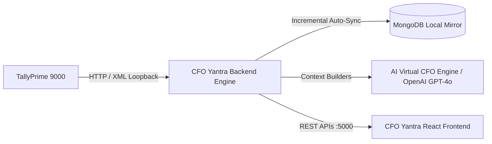
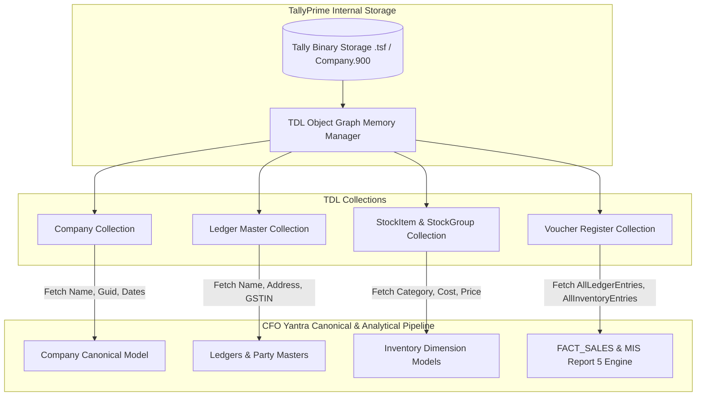

# 🏛️ CFO Yantra – Enterprise Backend Engine & Financial Intelligence Service

[](https://nodejs.org/)
[](https://expressjs.com/)
[](https://www.mongodb.com/)
[](https://openai.com/)
[]()
[]()

> **Master Technical & Project Management Documentation**  
> Comprehensive guide to system architecture, data ingestion pipelines, canonical models, financial mathematics, multi-dimensional analytics algorithms, and REST APIs.

---

## 📑 Table of Contents

1. [Executive Overview & Project Objectives](#1-executive-overview--project-objectives)
2. [High-Level Architecture & Design Principles](#2-high-level-architecture--design-principles)
3. [Data Extraction & Ingestion Pipeline](#3-data-extraction--ingestion-pipeline)
   - [Where Data Comes From (TallyPrime Source)](#where-data-comes-from-tallyprime-source)
   - [How Data Is Extracted (TDL & XML Protocol)](#how-data-is-extracted-tdl--xml-protocol)
   - [Safety Gates & Read-Only Barrier](#safety-gates--read-only-barrier)
   - [Incremental Sync, Hashing & Tombstoning](#incremental-sync-hashing--tombstoning)
   - [Dual-Read Path (DB-First Local Mirror + Live Fallback)](#dual-read-path-db-first-local-mirror--live-fallback)
   - [3.1 TallyPrime Internal Data Origin & Low-Level Source Mapping](#31--tallyprime-internal-data-origin--low-level-source-mapping)
4. [Data Normalization & Canonical Schema Engine](#4-data-normalization--canonical-schema-engine)
5. [Financial Mathematics & Analytical Formulas](#5-financial-mathematics--analytical-formulas)
   - [High-Precision Financial Arithmetic (`decimal.js`)](#high-precision-financial-arithmetic-decimaljs)
   - [Voucher Ledger Breakdown & Tax Reconciliation](#voucher-ledger-breakdown--tax-reconciliation)
   - [MIS Report 5: The 16 Strategic Decision Matrix Filters](#mis-report-5-the-16-strategic-decision-matrix-filters)
   - [Cost of Inaction (COI) & Consecutive Decline Streak Formula](#cost-of-inaction-coi--consecutive-decline-streak-formula)
   - [Herfindahl-Hirschman Index (HHI) Concentration Formula](#herfindahl-hirschman-index-hhi-concentration-formula)
   - [AI Virtual CFO Scorecard Scoring Algorithm](#ai-virtual-cfo-scorecard-scoring-algorithm)
6. [Modular Codebase Organization](#6-modular-codebase-organization)
7. [Complete REST API Reference (43 Endpoints)](#7-complete-rest-api-reference-43-endpoints)
8. [Configuration & Environment (.env)](#8-configuration--environment-env)
9. [Verification, Testing & Deployment](#9-verification-testing--deployment)

---

## 1. Executive Overview & Project Objectives

**CFO Yantra** is an autonomous, read-only Financial Intelligence & Virtual CFO Platform designed for SMEs and mid-market enterprises running on **TallyPrime**.



### Key Capabilities:
- **Zero-Latency Data Extraction**: Communicates directly with local TallyPrime via native XML/TDL loopback.
- **Strict Read-Only Guarantee**: Impossible for the application to alter, write, delete, or mutate accounting data in Tally.
- **Local MongoDB Mirror**: Real-time asynchronous mirror engine that isolates analytical query load from Tally.
- **Arbitrary Precision Math**: Zero floating-point drift across millions of transactions using `decimal.js`.
- **MIS Report 5 Matrix**: 16 institutional-grade filters providing product, city, month, and margin cross-analysis.
- **Autonomous AI Virtual CFO**: Synthesizes 50+ year veteran CFO boardroom audits, detecting cash leaks, concentration traps, and decline streaks.

---

## 2. High-Level Architecture & Design Principles

### Strict Function-Based Modular Architecture
The backend strictly adheres to a **pure function-based modular architecture** (no unnecessary classes or stateful OOP abstractions):
- **Controllers** (`src/controllers/`): Validate inputs via `zod`, resolve company tenant scopes, invoke services, and shape standard HTTP envelopes.
- **Routes** (`src/routes/`): Express routers defining endpoint paths and HTTP verbs.
- **Models** (`src/models/`): Mongoose schema declarations for MongoDB local mirroring with indexed search fields.
- **Services** (`src/services/`): Pure business logic, caching layers, extraction orchestrators, and analytics aggregators.
- **Integrations** (`src/integrations/`): Low-level protocol drivers, XML builders, and canonical schema normalizers.

---

## 3. Data Extraction & Ingestion Pipeline

### Where Data Comes From (TallyPrime Source)
- **Source System**: TallyPrime (or Tally.ERP 9) running on the local Windows machine / LAN server.
- **Interface**: HTTP / XML Server listening on `http://127.0.0.1:9000`.
- **Target Data**:
  - **Company Master Identity**: GUID, Name, Starting Date, Books From Date.
  - **Accounting Masters**: Ledgers, Groups, Voucher Types, Currencies.
  - **Inventory Masters**: Stock Items, Stock Groups, Stock Categories, Units, Godowns.
  - **Cost Centers & Dimensions**: Cost Categories, Cost Centres.
  - **Transactions**: Sales Vouchers, Purchase Vouchers, Receipts, Payments, Journals, Bill Allocations, and Inventory Entries.

### How Data Is Extracted (TDL & XML Protocol)
Requests are dispatched as TDL-compliant XML payloads:
```xml
<ENVELOPE>
  <HEADER>
    <VERSION>1</VERSION>
    <TALLYREQUEST>Export</TALLYREQUEST>
    <TYPE>Collection</TYPE>
    <ID>CFO_Vouchers_Extract</ID>
  </HEADER>
  <BODY>
    <DESC>
      <STATICVARIABLES>
        <SVCURRENTCOMPANY>Acme Corp</SVCURRENTCOMPANY>
        <SVFROMDATE>20240401</SVFROMDATE>
        <SVTODATE>20250331</SVTODATE>
      </STATICVARIABLES>
      <TDL>
        <TDLMESSAGE>
          <COLLECTION NAME="CFO_Vouchers_Extract" ISMODIFY="No">
            <TYPE>Voucher</TYPE>
            <FETCH>DATE, VOUCHERNUMBER, VOUCHERTYPENAME, PARTYLEDGERNAME, AMOUNT, ALLLEDGERENTRIES.LIST, ALLINVENTORYENTRIES.LIST</FETCH>
          </COLLECTION>
        </TDLMESSAGE>
      </TDL>
    </DESC>
  </BODY>
</ENVELOPE>
```

### Safety Gates & Read-Only Barrier
1. **Hard Read-Only Assertion Gate** (`validateReadOnlyXml`):
   - Regex and structural parser inspects every outgoing payload.
   - Drops any request containing `<TALLYREQUEST>Import</TALLYREQUEST>`, `<IMPORTDATA>`, or modification tags.
2. **Company Safety Gate** (`isCompanyStillOpen`):
   - Sending `SVCURRENTCOMPANY` for a closed company crashes TallyPrime. The engine checks active company status before firing queries.
3. **Circuit Breaker** (`tally.breaker.js`):
   - Automatically pauses requests when Tally is unresponsive or overloaded, preventing cascading backend timeouts.

### Incremental Sync, Hashing & Tombstoning
```mermaid
flowchart TD
    T[Tally Live Extraction] --> N[Canonical Normalizer]
    N --> H[Compute SHA-256 Content Hash (Ignoring Volatile Fields)]
    H --> C{Hash == Existing Mirror Record?}
    C -->|Yes| S[Skip Disk Write]
    C -->|No| U[Upsert Record + Update syncedAt]
    T --> D{Record Missing in Tally?}
    D -->|Yes| TM[Mark isDeleted: true & Set deletedAt]
```

### Dual-Read Path (DB-First Local Mirror + Live Fallback)
1. **Primary Read Path (Local Mirror)**: Ultra-fast read ($< 15\text{ms}$ - $300\text{ms}$) from local MongoDB collection. Resolves vouchers, line items, and dimensions without touching TallyPrime's single-threaded event loop.
2. **Secondary Read Path (Live Fallback)**: If mirror is not yet populated, queries are executed live against TallyPrime with in-memory caching.
3. **100+ Multi-Company Concurrency Guard**:
   - **Tally Single-Thread Isolation**: TallyPrime runs a single-threaded desktop loop on `127.0.0.1:9000`. Direct concurrent live queries across 10-100 companies serialize and queue, triggering HTTP timeouts.
   - **Asynchronous Sync Engine**: Background jobs pre-ingest data into MongoDB using AlterID/SHA-256 change detection.
   - **Adaptive Timeout Budgets**: 60s frontend timeout budget + 30s Tally gateway timeout budget to ensure zero `REQUEST_TIMEOUT` drops.

---

## 3.1 🔍 TallyPrime Internal Data Origin & Low-Level Source Mapping

This section provides an exact, field-by-field breakdown of **where inside TallyPrime every data element originates**, how Tally stores it internally, which TDL collections are queried, and how raw Tally objects map to our Canonical and Analytics layers.



### 1. TallyPrime Internal Storage Architecture
- **Physical Storage**: In TallyPrime, accounting data is stored in proprietary, indexed binary files (`Data/<Company_Number>/`, e.g., `Data/10000/Company.900`, `Manager.900`, `*.tsf`).
- **TDL Runtime Object Memory**: When a company is opened in TallyPrime, the TDL (Tally Definition Language) engine loads the binary tables into an in-memory hierarchical object graph.
- **Access Protocol**: External applications cannot directly read `.tsf` files; data must be extracted by requesting TDL Object Collections through Tally's loopback XML gateway (`http://127.0.0.1:9000`).

---

### 2. Tally Collections Queried & Method Mapping

| Entity / Dimension | TDL Collection Name | Tally Internal Object Type | Tally Internal Fields Extracted (`<FETCH>` / `<NATIVEMETHOD>`) | Target CFO Yantra Model / Metric |
| :--- | :--- | :--- | :--- | :--- |
| **Company Profile** | `CompanyCollection` / `CompanyDetailedCollection` | `Company` | `$Name`, `$Guid`, `$StartingFrom`, `$BooksFrom`, `$MasterId`, `$AlterId`, `$GstRegNo`, `$PanCardNo`, `$StateName`, `$CountryName` | `Company` model, Multi-company tenant scoping |
| **Chart of Accounts (Ledgers)** | `LedgerCollection` / `SalesLedgerCollection` | `Ledger` | `$Name`, `$Parent`, `$OpeningBalance`, `$ClosingBalance`, `$LedStateName`, `$Address.List`, `$PinCode`, `$PartyGSTIN`, `$TaxType`, `$GstType`, `$MailingName` | `Ledger` master, Sundry Debtors (Customers), Sundry Creditors (Suppliers), Party Address/State |
| **Account Groups** | `GroupCollection` | `Group` | `$Name`, `$Parent`, `$IsRevenue`, `$IsDeemedPositive`, `$AffectsGrossProfit`, `$SortPosition` | `Group` master, P&L / Balance Sheet classification |
| **Inventory Items** | `StockItemCollection` / `SalesStockItemCollection` | `StockItem` | `$Name`, `$Parent`, `$Category`, `$BaseUnits`, `$OpeningBalance`, `$OpeningValue`, `$OpeningRate`, `$CostingMethod`, `$ValuationMethod`, `$HsnCode` | `StockItem` master, SubCategory hierarchy, Standard cost & pricing |
| **Inventory Groups** | `StockGroupCollection` | `StockGroup` | `$Name`, `$Parent`, `$IsAddable`, `$BaseUnits` | `StockGroup` tree, Category dimension |
| **Inventory Categories** | `StockCategoryCollection` | `StockCategory` | `$Name`, `$Parent` | `StockCategory` model |
| **Warehouses / Locations** | `GodownCollection` | `Godown` | `$Name`, `$Parent`, `$Address`, `$PinCode` | `Godown` dimension (Physical logistics) |
| **Measurement Units** | `UnitCollection` | `Unit` | `$Name`, `$OriginalName`, `$IsSimpleUnit`, `$DecimalPlaces` | `Unit` dimension & quantity normalization |
| **Cost Centres / Salesmen** | `CostCentreCollection` / `SalesCostCentreCollection` | `CostCentre` | `$Name`, `$Parent`, `$Category` | Salesman dimension, Departmental allocation |
| **Cost Categories** | `CostCategoryCollection` | `CostCategory` | `$Name`, `$AllocateRevenue`, `$AllocateNonRevenue` | Cost category mapping |
| **Voucher Types** | `VoucherTypeCollection` | `VoucherType` | `$Name`, `$Parent`, `$Abbreviation`, `$NumberingMethod`, `$CoreVoucherType`, `$IsActive` | Voucher classification (`Sales`, `Purchase`, `Receipt`, `Payment`, `Journal`) |
| **Financial Vouchers (Headers)** | `VoucherRegisterCollection` / `SalesVoucherCollection` | `Voucher` | `$Date`, `$Guid`, `$MasterId`, `$AlterId`, `$VoucherTypeName`, `$VoucherNumber`, `$PartyLedgerName`, `$Narration`, `$Amount`, `$IsCancelled`, `$IsOptional` | Transaction Header, Period bounds, Reconciliation register |
| **Voucher Accounting Lines** | `ALLLEDGERENTRIES.LIST` | `LedgerEntry` (Child of `Voucher`) | `$LedgerName`, `$Amount`, `$IsDeemedPositive`, `$BillAllocations.List` (`$Name`, `$BillType`, `$Amount`), `$InterestCollection.List` | Tax lines (CGST/SGST/IGST), Round-offs, Additional charges, Trade discounts |
| **Voucher Inventory Lines** | `ALLINVENTORYENTRIES.LIST` | `InventoryEntry` (Child of `Voucher`) | `$StockItemName`, `$ActualQty`, `$BilledQty`, `$Rate`, `$Amount`, `$Discount`, `$BatchAllocations.List` (`$GodownName`, `$BatchName`, `$Amount`, `$ActualQty`), `$AccountingAllocations.List` | Product SKU lines, Invoiced quantities, Unit prices, Line discounts |

---

### 3. Field-by-Field Derivation in Analytics & MIS Report 5

| Analytics Field | Tally Origin & Derivation Path | Extraction Rule & Transformation Logic |
| :--- | :--- | :--- |
| **Customer Name** | `$PartyLedgerName` on `Voucher` (or first Debtor entry in `$AllLedgerEntries`) | Trimmed string, mapped against `Ledger` master for parent classification (`Sundry Debtors`). |
| **City** | `$Address.List` or `$LedStateName` on `Ledger` Master | Extracted via `city.parser.js` using multi-line address regex + dictionary matching against Indian cities and PIN code centroids. |
| **State** | `$LedStateName` / `$StateName` on `Ledger` | Normalized to standard 36 Indian States/UTs. |
| **Product / SubCategory** | `$StockItemName` from `$AllInventoryEntries` $\rightarrow$ `$Parent` on `StockItem` | Each inventory line item links to its Stock Item master and resolves its parent Stock Group (SubCategory). |
| **Taxable Sales Base** | `$AllInventoryEntries.Amount` or Base Ledger Line | Sum of individual SKU line amounts excluding GST entries. |
| **GST (CGST/SGST/IGST)** | `$AllLedgerEntries` where parent group is `Duties & Taxes` | Filtered by ledger name regex (`CGST`, `SGST`, `IGST`, `OUTPUT GST`) with exact `decimal.js` summation. |
| **Additional Charges / Freight** | `$AllLedgerEntries` where parent group is `Direct Expenses` / `Indirect Expenses` | Identified as auxiliary line items (freight, packaging, insurance). |
| **Trade Discounts** | `$AllInventoryEntries.Discount` or Negative Ledger entries (`Discount Allowed`) | Extracted as explicit deductions from gross invoice value. |
| **Invoice Total** | `$Amount` on `Voucher` envelope | Tally header total amount, signed negative for Credit sales, converted to positive magnitude for reporting. |
| **Voucher Date** | `$Date` on `Voucher` (Format: `YYYYMMDD`) | Converted to ISO `YYYY-MM-DD` and indexed for time-series / monthly trend aggregation. |

---

## 4. Data Normalization & Canonical Schema Engine

Raw Tally XML uses inconsistent structures (e.g. `$NAME`, nested lists, signed negative credit amounts). The canonical engine transforms raw data into standardized JSON contracts:

### Canonical Entity Models:
- **Canonical Company**: `{ companyId, name, legalName, formalName, guid, masterId, alterId, startingFrom, booksFrom, baseCurrency, country, state, pinCode, email, phone, mobile, gstin, pan, cin, features: { billWise, costCentres, inventory, multiCurrency, payroll, gstApplicable, tdsApplicable, tcsApplicable, batchEnabled, godownEnabled, bomEnabled }, isOpen, lastSeenAt, checksum }`
- **Canonical Ledger**: `{ companyId, sourceObjectId, name, parent, openingBalance, closingBalance, isParty, isDebtor, isCreditor, address, gstin }`
- **Canonical Stock Item**: `{ companyId, sourceObjectId, name, parent, category, baseUnit, openingBalance, openingValue, standardCost, standardSellingPrice }`
- **Canonical Voucher**: `{ companyId, sourceVoucherId, sourceVoucherNumber, voucherType, voucherDate, partyLedgerName, amount, amountIsCredit, isCancelled, ledgerEntries: [...], inventoryEntries: [...] }`

---

## 5. Financial Mathematics & Analytical Formulas

### High-Precision Financial Arithmetic (`decimal.js`)
All monetary calculations use `decimal.js` with rounding mode `ROUND_HALF_UP` (Banker's rounding) to ensure exact zero-balance balancing:

```javascript
const Decimal = require("decimal.js");
Decimal.set({ precision: 28, rounding: Decimal.ROUND_HALF_UP });
```

---

### Voucher Ledger Breakdown & Tax Reconciliation
Every voucher is parsed to separate its taxable turnover, tax components, round-offs, and discounts:

$$\text{Total Invoice Amount} = \text{Taxable Turnover} + \text{CGST} + \text{SGST} + \text{IGST} + \text{Charges} + \text{Round Off} - \text{Discount}$$

$$\Delta_{\text{Reconciliation}} = \left| \text{Header Total} - \sum_{i=1}^n \text{Ledger Line Amount}_i \right| \equiv 0.00$$

---

### MIS Report 5: The 16 Strategic Decision Matrix Filters

| Filter ID | Filter Name | Mathematical Formula / Algorithm | Strategic CFO Insight |
| :--- | :--- | :--- | :--- |
| **Filter 1** | **SubCategory Concentration** | $\text{Share}_{\text{Prod}} = \frac{\text{Sales}_{\text{Product, City}}}{\text{Total Sales}_{\text{City}}} \times 100$ | Identifies single-product dominance in specific regional markets. |
| **Filter 2** | **City Concentration** | $\text{Share}_{\text{City}} = \frac{\text{Sales}_{\text{Product, City}}}{\text{Total Sales}_{\text{Product}}} \times 100$ | Detects reliance of a product on a single geographic hub. |
| **Filter 3** | **HHI Concentration** | $\text{HHI} = \sum_{i=1}^N \left(\frac{S_i}{S_{\text{total}}}\right)^2 \quad (\text{Flag if } \text{HHI} \ge 0.80)$ | Measures market concentration risk ($0.0 \le \text{HHI} \le 1.0$). |
| **Filter 4** | **Seasonality Volatility** | $\text{Seasonality Index} = \frac{\text{Sales}_{\text{Month}}}{\bar{S}_{\text{Monthly}}}, \quad \text{CV} = \frac{\sigma}{\mu}$ | Highlights seasonal billing spikes vs structural run-rate demand. |
| **Filter 5** | **Gross Margin Spread** | $\text{Margin Spread} \% = \frac{\text{Selling Price} - \text{Unit Cost}}{\text{Selling Price}} \times 100$ | Identifies margin erosion across customer categories. |
| **Filter 6** | **Pareto 80/20 Rule** | Cumulative Revenue curve ranking: Top $20\%$ combos driving $80\%$ turnover. | Guides working capital reallocation from tail SKUs to top lines. |
| **Filter 7** | **Decline Streak & COI** | **Linear Regression Slope** $m < 0$ for $\ge 3$ consecutive months. | Quantifies recoverable cash bleeding from declining markets. |
| **Filter 8** | **Cross-Market Whitespace** | Matrix delta: $\text{Product } X \text{ sold in City } A \text{ but } 0 \text{ in City } B$. | Direct roadmap for regional sales expansion. |
| **Filter 9** | **Top Combo Turnover** | $\text{Combo Share} = \frac{\text{Turnover}_{\text{Product } \times \text{ City}}}{\text{Total Enterprise Revenue}} \times 100$ | Highlights vital core revenue pillars. |
| **Filter 10** | **Product Matrix A vs B** | Correlation & divergence: $\Delta \% = \frac{\text{Sales}_A - \text{Sales}_B}{\text{Sales}_A + \text{Sales}_B} \times 100$ | Compares product substitution and cannibalization. |
| **Filter 11** | **Month Divergence (MoM)** | $\text{MoM Growth} \% = \left(\frac{\text{Sales}_{M2} - \text{Sales}_{M1}}{\text{Sales}_{M1}}\right) \times 100$ | Detects immediate monthly sales trajectory shifts. |
| **Filter 12** | **City Growth Velocity** | Second derivative of monthly sales: $v = \frac{\Delta \text{Growth}}{\Delta t}$ | Tracks accelerating vs decelerating markets. |
| **Filter 13** | **Tail SKU Drag** | SKUs contributing $< 1\%$ cumulative turnover with high holding cost. | Candidates for inventory pruning. |
| **Filter 14** | **Dealer Concentration** | $\text{Top 3 Debtors Share} = \frac{\sum_{i=1}^3 \text{Sales}_{\text{Debtor } i}}{\text{Total Turnover}} \times 100$ | Enforces accounts receivable credit limits. |
| **Filter 15** | **Discount Leakage** | $\text{Discount Ratio} = \frac{\text{Total Discounts Allowed}}{\text{Gross Invoiced Value}} \times 100$ | Plugs unauthorized distributor discount leaks. |
| **Filter 16** | **Tax Compliance Split** | $\text{Tax Integrity} = \frac{\text{IGST} + \text{CGST} + \text{SGST}}{\text{Taxable Turnover}} \times 100$ | Validates GST statutory rate adherence across all states. |

---

### Cost of Inaction (COI) & Consecutive Decline Streak Formula
When a market exhibits consecutive monthly volume decline, the **Cost of Inaction** represents the lost revenue compared to peak run-rate:

$$\text{Linear Slope } m = \frac{n \sum (t \cdot S_t) - \sum t \sum S_t}{n \sum t^2 - (\sum t)^2}$$

$$\text{Cost of Inaction (COI)} = \sum_{t=1}^k \left( \max_{1 \le i \le N}(S_i) - S_t \right)$$

---

### Herfindahl-Hirschman Index (HHI) Concentration Formula

$$\text{HHI} = \sum_{i=1}^k s_i^2 \quad \text{where } s_i = \frac{\text{Turnover}_i}{\text{Total Market Turnover}}$$

- $\text{HHI} < 0.15$: Diversified / Low Risk
- $0.15 \le \text{HHI} \le 0.25$: Moderate Concentration
- $\text{HHI} > 0.25$: Highly Concentrated
- $\text{HHI} \ge 0.80$: **Critical Single-Month / Single-Buyer Red Flag**

---

### AI Virtual CFO Scorecard Scoring Algorithm
The deterministic scorecard calculates an enterprise health grade ($A, B+, B, C$) based on quantified operational metrics:

$$\text{Grade Score} = 100 - (10 \times \text{Decline Streaks Count}) - (0.5 \times \text{Top Combo Share}) - \text{Penalty}_{\text{HHI}}$$

- **Grade A** ($\ge 90$): No decline streaks, top combo share $< 20\%$.
- **Grade B+** ($80 - 89$): Healthy volume, moderate concentration ($< 40\%$).
- **Grade B** ($70 - 79$): $\ge 3$ declining markets or top combo $> 40\%$.
- **Grade C** ($< 70$): Severe multi-market decline, heavy concentration ($> 60\%$).

---

## 6. Modular Codebase Organization

```text
backend/
├── src/
│   ├── ai/                          # AI Virtual CFO & OpenAI Integration
│   │   ├── formatters/              # Financial context builders for LLM
│   │   ├── prompts/                 # Executive CFO & MIS Report 5 prompts
│   │   ├── services/
│   │   │   └── aiAnalysis.service.js# Function-based AI Audit & Chat engine
│   │   └── openai.client.js         # Function-based OpenAI HTTP Client
│   │
│   ├── config/                      # Environment variables & MongoDB connection
│   │   ├── db.js
│   │   └── env.js
│   │
│   ├── constants/                   # Failure codes & domain enumerations
│   │   └── domain.constants.js
│   │
│   ├── controllers/                 # Function-based HTTP Controllers
│   │   ├── aiController.js
│   │   ├── cloudController.js
│   │   ├── companiesController.js
│   │   ├── diagnosticsController.js
│   │   ├── experimentsController.js
│   │   ├── factSalesController.js
│   │   ├── syncController.js
│   │   ├── tallyController.js
│   │   └── index.js
│   │
│   ├── integrations/                # Tally Loopback & Protocol Drivers
│   │   └── tally/
│   │       ├── canonical/           # Schema converters & reconciliation engine
│   │       ├── sales/               # FactSales pipeline & City parser
│   │       └── transports/          # XML, JSON, JSONEx drivers
│   │
│   ├── jobs/                        # Auto-sync background loops
│   │   └── tallySync.job.js
│   │
│   ├── models/                      # Dedicated Mongoose Mirror Models
│   │   ├── companyModel.js
│   │   ├── syncStateModel.js
│   │   ├── voucherModel.js
│   │   ├── ledgerModel.js
│   │   ├── groupModel.js
│   │   ├── stockItemModel.js
│   │   ├── stockGroupModel.js
│   │   ├── stockCategoryModel.js
│   │   ├── unitModel.js
│   │   ├── godownModel.js
│   │   ├── costCentreModel.js
│   │   ├── costCategoryModel.js
│   │   ├── voucherTypeModel.js
│   │   ├── currencyModel.js
│   │   ├── mirrorModel.factory.js
│   │   └── index.js
│   │
│   ├── routes/                      # Express Router Modules
│   │   ├── aiRoutes.js
│   │   ├── cloudRoutes.js
│   │   ├── companiesRoutes.js
│   │   ├── diagnosticsRoutes.js
│   │   ├── experimentsRoutes.js
│   │   ├── syncRoutes.js
│   │   ├── tallyRoutes.js
│   │   └── index.js
│   │
│   ├── services/                    # Function-Based Business Logic
│   │   ├── aiAnalysisService.js
│   │   ├── companyDataService.js
│   │   ├── companyScopeService.js
│   │   ├── dashboardService.js
│   │   ├── diagnosticsService.js
│   │   ├── mirrorService.js
│   │   ├── syncEngineService.js
│   │   ├── tallyClientService.js
│   │   ├── tallyProbeService.js
│   │   ├── spoolService.js
│   │   ├── spoolCryptoService.js
│   │   └── index.js
│   │
│   ├── utils/                       # Precision Math, Checksums, Logger
│   │   ├── financialDecimal.js
│   │   ├── checksum.js
│   │   └── logger.js
│   │
│   └── server.js                    # Express bootstrap & process guards
│
├── tests/                           # 24 Jest test suites (339 tests)
├── package.json
└── README.md
```

---

## 7. Complete REST API Reference (43 Endpoints)

### 1. Root & System Health
- `GET /` — API root manifest & target Tally endpoint info
- `GET /api/health` — Backend service health & uptime

### 2. Tally Integration & Discovery (`/api/tally`)
- `GET /api/tally/health` — Probe TallyPrime HTTP port
- `GET /api/tally/status` — Tally latency and active company status
- `GET /api/tally/capabilities` — Protocol support matrix (XML, JSON, JSONEx)
- `GET /api/tally/company` — Discovered loaded companies in Tally
- `GET /api/tally/masters` — Diagnostic full master extraction
- `GET /api/tally/transport` — Current active transport mode
- `GET /api/factsales` — Read-only FACT_SALES ingestion pipeline

### 3. Company Data Explorer & Masters (`/api/companies`)
- `GET /api/companies` — List all open & mirrored companies (`?force=1` for live refresh)
- `GET /api/companies/:companyId` — Detailed company metadata & capability map
- `GET /api/companies/:companyId/overview` — Summary counts (ledgers, stock items, vouchers)
- `GET /api/companies/:companyId/readiness` — Readiness tier assessment (T0 to T4)
- `GET /api/companies/:companyId/ledgers` — Paginated ledger master list
- `GET /api/companies/:companyId/ledgers/:ledgerId` — Single ledger details
- `GET /api/companies/:companyId/groups` — Account groups
- `GET /api/companies/:companyId/stock-items` — Inventory item masters
- `GET /api/companies/:companyId/stock-items/:stockItemId` — Single stock item details
- `GET /api/companies/:companyId/stock-groups` — Hierarchical stock group tree
- `GET /api/companies/:companyId/cost-centres` — Cost centres
- `GET /api/companies/:companyId/godowns` — Godowns / Warehouses
- `GET /api/companies/:companyId/units` — Measurement units
- `GET /api/companies/:companyId/voucher-types` — Voucher types
- `GET /api/companies/:companyId/customers` — Sundry Debtors (Customers)
- `GET /api/companies/:companyId/suppliers` — Sundry Creditors (Suppliers)

### 4. Transactions & Analysis (`/api/companies/:companyId`)
- `GET /api/companies/:companyId/vouchers` — Paginated vouchers with inventory breakdown
- `GET /api/companies/:companyId/vouchers/:voucherId` — Full voucher line entries
- `GET /api/companies/:companyId/sales-analysis` — Multi-dimensional sales analysis
- `GET /api/companies/:companyId/purchase-analysis` — Procurement analysis
- `GET /api/companies/:companyId/dashboard` — Aggregated executive dashboard KPIs
- `GET /api/companies/:companyId/reconciliation-report` — Tally Trial Balance reconciliation
- `GET /api/companies/:companyId/reports/report5` — MIS Report 5 (16 Filter Matrix Engine)
- `GET /api/companies/:companyId/mis-report-5` — Alias for Report 5

### 5. AI Virtual CFO (`/api/companies/:companyId/ai`)
- `GET /api/companies/:companyId/ai/status` — OpenAI integration status & mode
- `POST /api/companies/:companyId/ai/analyze` — Generate 50+ Year Veteran CFO Boardroom Audit
- `POST /api/companies/:companyId/ai/chat` — Interactive Virtual CFO Q&A chat

### 6. Diagnostics & System Self-Test (`/api/diagnostics`)
- `GET /api/diagnostics` — Full integration diagnostic test suite
- `GET /api/diagnostics/logs` — In-memory diagnostic event stream

### 7. MongoDB Mirror Sync (`/api/sync`)
- `GET /api/sync/status` — Auto-sync loop state, tick stats, and domain outcomes
- `POST /api/sync/run` — Trigger immediate manual sync cycle
- `GET /api/sync/companies` — Mirrored companies in MongoDB
- `GET /api/sync/:companyId/counts` — Record counts per mirrored collection

### 8. Cloud Synchronization (`/api/cloud`)
- `GET /api/cloud/status` — Cloud hub sync readiness

---

## 8. Configuration & Environment (.env)

```ini
PORT=5000
NODE_ENV=development

# TallyPrime Bridge Target
TALLY_HOST=127.0.0.1
TALLY_PORT=9000
TALLY_TIMEOUT_MS=10000

# MongoDB Local Mirror
MONGODB_ENABLED=true
MONGODB_URI=mongodb://127.0.0.1:27017/cfo_yantra

# Background Auto-Sync Daemon
SYNC_ENABLED=true
SYNC_INTERVAL_MS=60000
SYNC_VOUCHERS=true

# OpenAI Financial Advisory Engine
OPENAI_API_KEY=your_openai_api_key_here
OPENAI_MODEL=gpt-4o-mini

# Logging
LOG_LEVEL=info
```

---

## 9. Verification, Testing & Deployment

### Run All Automated Tests
```powershell
npm test
```
- **Test Coverage**: 24 Test Suites, 339 Tests covering Canonical Parsers, Financial Decimal Math, Reconciliation, AI Engine, FactSales Pipeline, and Mirror Synchronization.

### Test Server Startup
```powershell
node -e "const app = require('./src/server'); console.log('Server loaded successfully'); process.exit(0);"
```

### Start Development Server
```powershell
npm run dev
```

---

**© 2026 CFO Yantra Platforms.** Built with zero-compromise precision engineering for enterprise financial intelligence.