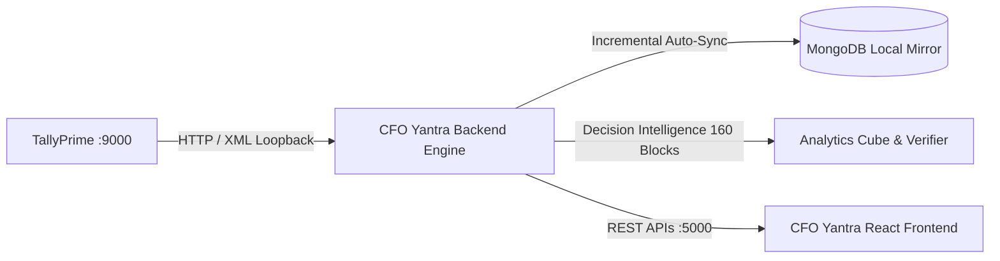

# 🏛️ CFO Yantra – Enterprise Backend Engine & Financial Intelligence Service

[](https://nodejs.org/)
[](https://expressjs.com/)
[](https://www.mongodb.com/)
[]()
[-blue.svg)]()
[]()

> **Master Technical & Architectural Documentation**  
> Comprehensive guide to system architecture, TallyPrime ingestion pipelines, canonical models, high-precision financial arithmetic, the 18 Analytical Lenses (160 Decision Intelligence Analyses), automated cross-verification matrices (CV01–CV16), role-based dashboards, and REST API contracts.

---

## 📑 Table of Contents

1. [Executive Overview & Core Tenets](#1-executive-overview--core-tenets)
2. [High-Level System Architecture](#2-high-level-system-architecture)
3. [Data Extraction & Ingestion Pipeline](#3-data-extraction--ingestion-pipeline)
   - [Where Data Comes From (TallyPrime Source)](#where-data-comes-from-tallyprime-source)
   - [How Data Is Extracted (TDL & XML Protocol)](#how-data-is-extracted-tdl--xml-protocol)
   - [Safety Gates & Read-Only Barrier](#safety-gates--read-only-barrier)
   - [Incremental Sync, SHA-256 Hashing & Tombstoning](#incremental-sync-sha-256-hashing--tombstoning)
   - [Dual-Read Path (DB-First Local Mirror + Live Fallback)](#dual-read-path-db-first-local-mirror--live-fallback)
   - [3.1 TallyPrime Internal Data Origin & Low-Level Source Mapping](#31--tallyprime-internal-data-origin--low-level-source-mapping)
4. [Data Normalization & Canonical Schema Engine](#4-data-normalization--canonical-schema-engine)
5. [Financial Mathematics & Analytical Algorithms](#5-financial-mathematics--analytical-algorithms)
   - [Arbitrary-Precision Arithmetic (`decimal.js`)](#arbitrary-precision-arithmetic-decimaljs)
   - [Voucher Ledger Breakdown & Tax Reconciliation](#voucher-ledger-breakdown--tax-reconciliation)
   - [The 18 Analytical Lenses & Decision Intelligence Suite (160 Analyses)](#the-18-analytical-lenses--decision-intelligence-suite-160-analyses)
   - [Standard Analysis Block Contract](#standard-analysis-block-contract)
   - [Cross-Verification Matrix (CV01–CV16)](#cross-verification-matrix-cv01cv16)
   - [Cost of Inaction (COI) & Trend Formulas](#cost-of-inaction-coi--trend-formulas)
   - [Concentration & Volatility Indices (HHI, Peak/Trough)](#concentration--volatility-indices-hhi-peaktrough)
   - [AI Virtual CFO Scorecard Scoring Algorithm](#ai-virtual-cfo-scorecard-scoring-algorithm)
6. [Modular Codebase Organization](#6-modular-codebase-organization)
7. [Complete REST API Reference (50+ Endpoints)](#7-complete-rest-api-reference-50-endpoints)
8. [Configuration & Environment Variables (.env)](#8-configuration--environment-variables-env)
9. [Verification, Testing & Diagnostics](#9-verification-testing--diagnostics)

---

## 1. Executive Overview & Core Tenets

**CFO Yantra** is an autonomous, read-only Financial Intelligence & Virtual CFO Engine built specifically for SMEs and mid-market enterprises running on **TallyPrime**.



### Core Tenets & Capabilities:
- **Zero-Latency Ingestion**: Communicates directly with local TallyPrime via native XML/TDL loopback.
- **Strict Read-Only Guarantee**: Impossible for the engine to modify, write, insert, or delete any record in TallyPrime.
- **Local MongoDB Mirror**: Real-time asynchronous background mirror engine that offloads heavy analytical compute from Tally's single-threaded runtime.
- **28-Digit Arbitrary Precision Math**: Zero floating-point drift across millions of transactions using `decimal.js` and Banker's rounding (`ROUND_HALF_UP`).
- **18 Analytical Lenses & 160 Decision Blocks**: Institutional-grade decision intelligence covering revenue trends, geographic penetration, product portfolios, concentration risks, waterfall attributions, volatility, and prescriptive management action protocols.
- **Deterministic Cross-Verification (CV01–CV16)**: Real-time mathematical proof guaranteeing zero discrepancy between report figures and Tally DayBook totals.

---

## 2. High-Level System Architecture

### Pure Function-Based Modular Architecture
The backend strictly adheres to a **pure function-based modular architecture** (eliminating stateful OOP abstractions and unnecessary classes):
- **Controllers** (`src/controllers/`): Validate input payloads, resolve company tenant scopes, orchestrate service calls, and shape standard HTTP envelopes.
- **Routes** (`src/routes/`): Modular Express routers defining endpoint paths, query validations, and HTTP verbs.
- **Models** (`src/models/`): Mongoose schema declarations for MongoDB mirroring with indexed search keys and checksum tracking.
- **Services** (`src/services/`): Pure business logic, caching layers, extraction orchestrators, and analytics aggregators.
- **Analytics Engine** (`src/analytics/`): In-memory 3D analytical cube builder, 18 lens compute modules, 160 analysis blocks, role-based dashboards, and cross-verification engine.
- **Integrations** (`src/integrations/`): Low-level protocol drivers, XML builders, and canonical schema normalizers.

---

## 3. Data Extraction & Ingestion Pipeline

### Where Data Comes From (TallyPrime Source)
- **Source System**: TallyPrime (or Tally.ERP 9) running locally on Windows or LAN server (`http://127.0.0.1:9000`).
- **Target Data**:
  - **Company Identity**: GUID, Formal Name, Financial Year Bounds, Books Date, AlterId.
  - **Accounting Masters**: Ledgers, Groups, Voucher Types, Currencies.
  - **Inventory Masters**: Stock Items, Stock Groups, Stock Categories, Units, Godowns.
  - **Dimensions**: Cost Categories, Cost Centres.
  - **Transactions**: Sales Vouchers, Purchase Vouchers, Receipts, Payments, Journals, Bill Allocations, and Inventory Entries.

### How Data Is Extracted (TDL & XML Protocol)
Requests are dispatched as TDL-compliant XML payloads:
```xml
<ENVELOPE>
  <HEADER>
    <VERSION>1</VERSION>
    <TALLYREQUEST>Export</TALLYREQUEST>
    <TYPE>Collection</TYPE>
    <ID>CFO_Vouchers_Extract</ID>
  </HEADER>
  <BODY>
    <DESC>
      <STATICVARIABLES>
        <SVCURRENTCOMPANY>Acme Corp</SVCURRENTCOMPANY>
        <SVFROMDATE>20240401</SVFROMDATE>
        <SVTODATE>20250331</SVTODATE>
      </STATICVARIABLES>
      <TDL>
        <TDLMESSAGE>
          <COLLECTION NAME="CFO_Vouchers_Extract" ISMODIFY="No">
            <TYPE>Voucher</TYPE>
            <FETCH>DATE, VOUCHERNUMBER, VOUCHERTYPENAME, PARTYLEDGERNAME, AMOUNT, ALLLEDGERENTRIES.LIST, ALLINVENTORYENTRIES.LIST</FETCH>
          </COLLECTION>
        </TDLMESSAGE>
      </TDL>
    </DESC>
  </BODY>
</ENVELOPE>
```

### Safety Gates & Read-Only Barrier
1. **Hard Read-Only Assertion Gate** (`validateReadOnlyXml`):
   - Regex and structural parser inspects every outgoing payload.
   - Rejects any payload containing `<TALLYREQUEST>Import</TALLYREQUEST>`, `<IMPORTDATA>`, or mutation tags.
2. **Company Safety Gate** (`isCompanyStillOpen`):
   - Sending `SVCURRENTCOMPANY` for a closed company can crash TallyPrime. The engine verifies open company status prior to dispatching queries.
3. **Circuit Breaker** (`tally.breaker.js`):
   - Automatically pauses requests when Tally is unresponsive or overloaded, preventing cascading backend timeouts.

### Incremental Sync, SHA-256 Hashing & Tombstoning
```mermaid
flowchart TD
    T[Tally Live Extraction] --> N[Canonical Normalizer]
    N --> H[Compute SHA-256 Content Hash (Ignoring Volatile Fields)]
    H --> C{Hash == Existing Mirror Record?}
    C -->|Yes| S[Skip Disk Write]
    C -->|No| U[Upsert Record + Update syncedAt]
    T --> D{Record Missing in Tally?}
    D -->|Yes| TM[Mark isDeleted: true & Set deletedAt]
```

### Dual-Read Path (DB-First Local Mirror + Live Fallback)
1. **Primary Read Path (Local Mirror)**: Ultra-fast read ($< 15\text{ms}$ - $300\text{ms}$) from local MongoDB collection. Resolves vouchers, line items, and dimensions without touching TallyPrime's single-threaded event loop.
2. **Secondary Read Path (Live Fallback)**: If mirror is not yet populated, queries are executed live against TallyPrime with in-memory caching.
3. **Multi-Company Concurrency Guard**:
   - **Tally Single-Thread Isolation**: TallyPrime executes queries on a single-threaded desktop event loop. Direct concurrent queries across companies are queued and serialized.
   - **Asynchronous Sync Engine**: Background workers pre-ingest data into MongoDB using AlterID/SHA-256 change detection.
   - **Adaptive Timeout Budgets**: 60s frontend timeout budget + 30s Tally gateway timeout budget to ensure zero `REQUEST_TIMEOUT` drops.

---

## 3.1 🔍 TallyPrime Internal Data Origin & Low-Level Source Mapping

| Entity / Dimension | TDL Collection Name | Tally Internal Object Type | Tally Internal Fields Extracted (`<FETCH>` / `<NATIVEMETHOD>`) | Target CFO Yantra Model / Metric |
| :--- | :--- | :--- | :--- | :--- |
| **Company Profile** | `CompanyCollection` / `CompanyDetailedCollection` | `Company` | `$Name`, `$Guid`, `$StartingFrom`, `$BooksFrom`, `$MasterId`, `$AlterId`, `$GstRegNo`, `$PanCardNo`, `$StateName`, `$CountryName` | `Company` model, Multi-company tenant scoping |
| **Chart of Accounts (Ledgers)** | `LedgerCollection` / `SalesLedgerCollection` | `Ledger` | `$Name`, `$Parent`, `$OpeningBalance`, `$ClosingBalance`, `$LedStateName`, `$Address.List`, `$PinCode`, `$PartyGSTIN`, `$TaxType`, `$GstType`, `$MailingName` | `Ledger` master, Sundry Debtors (Customers), Sundry Creditors (Suppliers), Party Address/State |
| **Account Groups** | `GroupCollection` | `Group` | `$Name`, `$Parent`, `$IsRevenue`, `$IsDeemedPositive`, `$AffectsGrossProfit`, `$SortPosition` | `Group` master, P&L / Balance Sheet classification |
| **Inventory Items** | `StockItemCollection` / `SalesStockItemCollection` | `StockItem` | `$Name`, `$Parent`, `$Category`, `$BaseUnits`, `$OpeningBalance`, `$OpeningValue`, `$OpeningRate`, `$CostingMethod`, `$ValuationMethod`, `$HsnCode` | `StockItem` master, SubCategory hierarchy, Standard cost & pricing |
| **Inventory Groups** | `StockGroupCollection` | `StockGroup` | `$Name`, `$Parent`, `$IsAddable`, `$BaseUnits` | `StockGroup` tree, Category dimension |
| **Inventory Categories** | `StockCategoryCollection` | `StockCategory` | `$Name`, `$Parent` | `StockCategory` model |
| **Warehouses / Locations** | `GodownCollection` | `Godown` | `$Name`, `$Parent`, `$Address`, `$PinCode` | `Godown` dimension (Physical logistics) |
| **Measurement Units** | `UnitCollection` | `Unit` | `$Name`, `$OriginalName`, `$IsSimpleUnit`, `$DecimalPlaces` | `Unit` dimension & quantity normalization |
| **Cost Centres / Salesmen** | `CostCentreCollection` / `SalesCostCentreCollection` | `CostCentre` | `$Name`, `$Parent`, `$Category` | Salesman dimension, Departmental allocation |
| **Cost Categories** | `CostCategoryCollection` | `CostCategory` | `$Name`, `$AllocateRevenue`, `$AllocateNonRevenue` | Cost category mapping |
| **Voucher Types** | `VoucherTypeCollection` | `VoucherType` | `$Name`, `$Parent`, `$Abbreviation`, `$NumberingMethod`, `$CoreVoucherType`, `$IsActive` | Voucher classification (`Sales`, `Purchase`, `Receipt`, `Payment`, `Journal`) |
| **Financial Vouchers (Headers)** | `VoucherRegisterCollection` / `SalesVoucherCollection` | `Voucher` | `$Date`, `$Guid`, `$MasterId`, `$AlterId`, `$VoucherTypeName`, `$VoucherNumber`, `$PartyLedgerName`, `$Narration`, `$Amount`, `$IsCancelled`, `$IsOptional` | Transaction Header, Period bounds, Reconciliation register |
| **Voucher Accounting Lines** | `ALLLEDGERENTRIES.LIST` | `LedgerEntry` (Child of `Voucher`) | `$LedgerName`, `$Amount`, `$IsDeemedPositive`, `$BillAllocations.List` (`$Name`, `$BillType`, `$Amount`), `$InterestCollection.List` | Tax lines (CGST/SGST/IGST), Round-offs, Additional charges, Trade discounts |
| **Voucher Inventory Lines** | `ALLINVENTORYENTRIES.LIST` | `InventoryEntry` (Child of `Voucher`) | `$StockItemName`, `$ActualQty`, `$BilledQty`, `$Rate`, `$Amount`, `$Discount`, `$BatchAllocations.List` (`$GodownName`, `$BatchName`, `$Amount`, `$ActualQty`), `$AccountingAllocations.List` | Product SKU lines, Invoiced quantities, Unit prices, Line discounts |

---

## 4. Data Normalization & Canonical Schema Engine

Raw Tally XML structures are transformed into standardized JSON contracts:

### Canonical Entity Models:
- **Canonical Company**: `{ companyId, name, legalName, formalName, guid, masterId, alterId, startingFrom, booksFrom, baseCurrency, country, state, pinCode, email, phone, mobile, gstin, pan, cin, features: { billWise, costCentres, inventory, multiCurrency, payroll, gstApplicable, tdsApplicable, tcsApplicable, batchEnabled, godownEnabled, bomEnabled }, isOpen, lastSeenAt, checksum }`
- **Canonical Ledger**: `{ companyId, sourceObjectId, name, parent, openingBalance, closingBalance, isParty, isDebtor, isCreditor, address, gstin }`
- **Canonical Stock Item**: `{ companyId, sourceObjectId, name, parent, category, baseUnit, openingBalance, openingValue, standardCost, standardSellingPrice }`
- **Canonical Voucher**: `{ companyId, sourceVoucherId, sourceVoucherNumber, voucherType, voucherDate, partyLedgerName, amount, amountIsCredit, isCancelled, ledgerEntries: [...], inventoryEntries: [...] }`

---

## 5. Financial Mathematics & Analytical Algorithms

### Arbitrary-Precision Arithmetic (`decimal.js`)
All monetary and percentage computations use `decimal.js` configured with 28-digit precision and Banker's rounding (`ROUND_HALF_UP`) to guarantee zero balance sheet drift:

```javascript
const Decimal = require("decimal.js");
Decimal.set({ precision: 28, rounding: Decimal.ROUND_HALF_UP });
```

---

### Voucher Ledger Breakdown & Tax Reconciliation
Every voucher is decomposed into its taxable turnover, tax lines, auxiliary charges, and discounts:

$$\text{Total Invoice Amount} = \text{Taxable Turnover} + \text{CGST} + \text{SGST} + \text{IGST} + \text{Charges} + \text{Round Off} - \text{Discount}$$

$$\Delta_{\text{Reconciliation}} = \left| \text{Header Total} - \sum_{i=1}^n \text{Ledger Line Amount}_i \right| \equiv 0.00$$

---

### The 18 Analytical Lenses & Decision Intelligence Suite (160 Analyses)

The backend features an analytics engine computing **18 Analytical Lenses** comprising **160 deterministic decision blocks** without LLM halluncination:

| Lens ID | Lens Name | Key Analyses Computed | Core Formulas & Algorithms | Strategic Insight |
| :---: | :--- | :--- | :--- | :--- |
| **Lens 0** | **Executive Overview** | L0.A01–L0.A04 | Composite Health Score (0–100), 3M Momentum %, Run-Rate | High-level 360° health overview and board-ready KPIs. |
| **Lens 1** | **City Revenue Trend** | L1.A01–L1.A10 | Linear Regression Slope $m$, Consecutive Decline Streak, Peak Run-Rate Gap | Detects multi-month territory volume and revenue decline streaks. |
| **Lens 2** | **City Totals Reference** | L2.A01–L2.A10 | $\text{Share}_C = \frac{\text{Rev}_C}{\text{Total}} \times 100$, Equal-Share Benchmark $\frac{100}{N}\%$ | Identifies geographic surplus vs underserved territory segments. |
| **Lens 3** | **Product Totals by City** | L3.A01–L3.A10 | 2D Cross-Tab $\sum \text{Rev}(P, C)$, Dependency Ratio $\frac{\text{Top Product}}{\text{City Total}}$ | Surfaces single-product vulnerability in regional markets (>75%). |
| **Lens 4** | **Product Contribution Share** | L4.A01–L4.A10 | Pareto Analysis, Top 3 & Top 5 SKU Contribution Cumulative % | Evaluates portfolio concentration and reliance on flagship SKUs. |
| **Lens 5** | **Company-Wide Monthly Trend** | L5.A01–L5.A10 | MoM Growth %, Quarterly Velocity, Zero-Month Preservation | Tracks overall company trajectory and inflection points. |
| **Lens 6** | **Product Month Mix & Momentum** | L6.A01–L6.A10 | 100% Stacked Monthly Mix, Seasonality Index $\frac{\text{Month Rev}}{\text{Avg Monthly Rev}}$ | Classifies seasonal vs evergreen product performance. |
| **Lens 7** | **Product Head-to-Head (A vs B)** | L7.A01–L7.A10 | Pairwise Delta ($\Delta$), Advantage %, City-by-City Win Count | Direct competitive comparison between any two product lines. |
| **Lens 8** | **Product Market Power Ranking** | L8.A01–L8.A10 | Dense Rank within city + Market Power Classification (`DOMINANT`/`COMPETITIVE`/`NICHE`) | Evaluates cross-territory product market dominance. |
| **Lens 9** | **Concentration Risk (Dual HHI)** | L9.A01–L9.A10 | $\text{HHI}_{\text{prod}} = \sum s_p^2, \ \text{HHI}_{\text{city}} = \sum s_c^2, \ \text{HHI}_{\text{month}}$ | Company-wide product, geographic, and monthly concentration risks. |
| **Lens 10** | **Top Combos (Pareto 80/20)** | L10.A01–L10.A10 | $\text{Combo Share} = \frac{\text{Turnover}_{P \times C}}{\text{Total Revenue}} \times 100$, Cumulative 80/20 | Identifies critical revenue pillars (Top 1 > 15%, Top 3 > 40%). |
| **Lens 11** | **Product Contribution Bridge** | L11.A01–L11.A10 | Waterfall Attribution: $\Delta \text{Prod}_i / \|\Delta \text{Total}\| \times 100$ | Product-level root cause of start-to-end period revenue changes. |
| **Lens 12** | **Monthly Contribution Distribution**| L12.A01–L12.A10 | Month-over-Month Waterfall Bridges across consecutive calendar months | Pinpoints exact monthly drivers of revenue expansions or contractions. |
| **Lens 13** | **Month vs Month Head-to-Head** | L13.A01–L13.A10 | Pairwise Month Delta ($\Delta$) and Growth Multipliers | Direct comparative analysis between any two reporting months. |
| **Lens 14** | **Monthly Consistency Ranking** | L14.A01–L14.A10 | Borda Count / Average Cross-Market Rank per month | Evaluates which calendar months perform consistently nationwide. |
| **Lens 15** | **Peak & Trough Volatility** | L15.A01–L15.A10 | $\text{Ratio} = \frac{\text{Peak}}{\text{Trough}}$ (RED $\ge 3.0$x, AMBER $\ge 2.0$x), Reliability Gap | Quantifies SKU demand volatility and supply-chain risk gaps. |
| **Lens 16** | **Management Action Protocols** | L16.A01–L16.A10 | 18 automated protocols (5 RED, 5 AMBER, 8 GREEN) | Prescribes prioritized executive action items with ₹ exposure. |
| **Lens 17** | **Dictionary, Filters & Audit** | L17.A01–L17.A10 | $\text{Variance} = \text{Tally DayBook Total} - \text{Cube Total} \equiv 0.00$ | Mathematical proof guaranteeing 100% reconciliation against Tally. |

---

### Standard Analysis Block Contract

Every single one of the 160 analyses adheres to a strict canonical JSON schema:

```json
{
  "id": "L01.A01",
  "lensId": 1,
  "slot": 1,
  "title": "City Revenue Trend Analysis",
  "status": "RED | AMBER | GREEN | INFO",
  "severity": "CRITICAL | HIGH | MEDIUM | LOW | NONE",
  "priority": 1,
  "headline": {
    "label": "Steepest Monthly Decline",
    "value": -24.5,
    "unit": "%",
    "formatted": "-24.5%"
  },
  "trigger": {
    "rule": "Consecutive decline >= 3 months or Slope < 0",
    "evaluated": "Decline streak of 4 months detected in Mumbai",
    "fired": true
  },
  "redFlag": "RED FLAG — Mumbai (4-month streak on City Revenue Trend)",
  "narrative": "Mumbai has suffered 4 consecutive months of decline, losing ₹14,20,000 from peak.",
  "table": {
    "columns": [
      { "key": "city", "label": "City", "format": "text" },
      { "key": "trend", "label": "Trend Direction", "format": "status" },
      { "key": "slope", "label": "Slope (₹/mo)", "format": "currency" },
      { "key": "streak", "label": "Decline Streak", "format": "number" },
      { "key": "coi", "label": "Cost of Inaction", "format": "currency" }
    ],
    "rows": [...]
  },
  "costOfInaction": {
    "amount": 1420000,
    "formatted": "₹14.20 L",
    "basis": "Peak run-rate minus actual sales across streak months",
    "horizonMonths": 6
  },
  "actions": {
    "owner": "Reallocate field sales rep and review regional distributor terms.",
    "salesManager": "Schedule on-site account reviews with top 5 Mumbai dealers."
  },
  "provenance": {
    "periodsUsed": 12,
    "rowsConsidered": 340
  }
}
```

---

### Cross-Verification Matrix (CV01–CV16)

The engine executes **16 automated mathematical verification checks** across all partitions of the 3D data cube:

- **CV01 (Grand Identity):** $\sum \text{Fact Table} \equiv \text{Tally DayBook Net Total}$
- **CV02–CV05 (Partition Sums):** $\sum \text{City Totals} = \sum \text{Product Totals} = \sum \text{Monthly Totals} = \sum \text{Combo Totals} \equiv \text{Total Revenue}$
- **CV06–CV08 (Cross-Tab Integrity):** Row sums and column sums in the 2D product-city matrix reconcile to individual dimension totals.
- **CV09–CV11 (Share Sums):** $\sum \text{Product Shares} = \sum \text{City Shares} = \sum \text{Monthly Mix Shares} \equiv 100.00\%$
- **CV12–CV14 (Waterfall Bridge):** $\sum \Delta \text{Product}_i \equiv \Delta \text{Total}$ (Zero-variance bridge conservation).
- **CV15 (Non-Negativity):** Turnover values satisfy non-negativity constraints after credit note netting.
- **CV16 (Voucher Count):** Fact table transaction count strictly equals Tally DayBook voucher count.

---

### Cost of Inaction (COI) & Trend Formulas

When a market exhibits consecutive monthly volume decline, the **Cost of Inaction** represents lost revenue compared to peak run-rate:

$$\text{Linear Slope } m = \frac{n \sum (t \cdot S_t) - \sum t \sum S_t}{n \sum t^2 - (\sum t)^2}$$

$$\text{Cost of Inaction (COI)} = \sum_{t=1}^k \left( \max_{1 \le i \le N}(S_i) - S_t \right)$$

---

### Concentration & Volatility Indices (HHI, Peak/Trough)

$$\text{HHI} = \sum_{i=1}^k s_i^2 \quad \text{where } s_i = \frac{\text{Turnover}_i}{\text{Total Market Turnover}}$$

- $\text{HHI} < 0.15$: Diversified / Healthy
- $0.15 \le \text{HHI} \le 0.25$: Moderate Concentration
- $\text{HHI} > 0.25$: High Concentration Alert
- $\text{HHI} \ge 0.80$: **Critical Single-Product / Single-Territory Dependency**

$$\text{Peak-to-Trough Volatility Ratio} = \frac{\max_{m \in M} (\text{Turnover}_m)}{\min_{m \in M} (\text{Turnover}_m)}$$

---

### AI Virtual CFO Scorecard Scoring Algorithm

$$\text{Grade Score} = 100 - (10 \times \text{Decline Streaks}) - (0.5 \times \text{Top Combo Share}) - \text{Penalty}_{\text{HHI}}$$

- **Grade A** ($\ge 90$): Zero decline streaks, top combo share $< 20\%$.
- **Grade B+** ($80 - 89$): Healthy revenue velocity, moderate concentration ($< 40\%$).
- **Grade B** ($70 - 79$): $\ge 3$ declining markets or top combo $> 40\%$.
- **Grade C** ($< 70$): Severe multi-market decline, heavy concentration ($> 60\%$).

---

## 6. Modular Codebase Organization

```text
backend/
├── src/
│   ├── analytics/                       # Decision Intelligence Suite (160 Analyses)
│   │   ├── compute/                     # 18 Lens calculation engines
│   │   │   ├── comparison/              # Lens 7, 8, 13 (Head-to-head & ranks)
│   │   │   ├── concentration/           # Lens 4, 9, 10 (HHI & Pareto 80/20)
│   │   │   ├── contribution/            # Lens 11, 12 (Waterfall bridges)
│   │   │   ├── coverage/                # Lens 2, 3 (Geographic reference)
│   │   │   ├── shared/                  # 3D Analytics Cube builder & CV01-CV16
│   │   │   ├── trend/                   # Lens 0, 1, 5, 6, 14 (Slopes & momentum)
│   │   │   └── volatility/              # Lens 15, 16, 17 (Peak/Trough & Actions)
│   │   ├── dashboards/                  # Role-tailored views (Owner, Sales Mgr)
│   │   ├── engine/                      # Registry, Catalog, Evaluator, Runner
│   │   ├── models/                      # Standard Analysis Block schema contracts
│   │   ├── prescriptive/                # Prescriptive action protocols
│   │   └── index.js                     # Analytics public API barrel
│   │
│   ├── config/                          # Environment variables & DB connection
│   │   ├── db.js
│   │   └── env.js
│   │
│   ├── constants/                       # Failure codes, enums, trigger bands
│   │   └── domain.constants.js
│   │
│   ├── controllers/                     # Pure Function-Based HTTP Controllers
│   │   ├── authController.js            # User authentication & OTP verification
│   │   ├── cloudController.js           # Cloud hub synchronization
│   │   ├── companiesController.js       # Company masters, registers & analytics
│   │   ├── diagnosticsController.js     # Health probe & live diagnostics
│   │   ├── experimentsController.js     # Protocol & payload test experiments
│   │   ├── factSalesController.js       # FactSales pipeline controller
│   │   ├── settingsController.js        # Dynamic Tally endpoint configuration
│   │   ├── syncController.js            # MongoDB local mirror sync triggers
│   │   ├── tallyController.js           # Tally gateway controller
│   │   └── index.js
│   │
│   ├── errors/                          # Domain error hierarchy
│   │   └── index.js
│   │
│   ├── integrations/                    # Tally Loopback & Protocol Drivers
│   │   └── tally/
│   │       ├── canonical/               # Schema converters & reconciliation engine
│   │       ├── sales/                   # FactSales pipeline & City parser
│   │       └── transports/              # XML, JSON, JSONEx drivers
│   │
│   ├── jobs/                            # Auto-sync background daemons
│   │   └── tallySync.job.js
│   │
│   ├── models/                          # Dedicated Mongoose Mirror Models
│   │   ├── companyModel.js
│   │   ├── syncStateModel.js
│   │   ├── voucherModel.js
│   │   ├── ledgerModel.js
│   │   ├── groupModel.js
│   │   ├── stockItemModel.js
│   │   ├── stockGroupModel.js
│   │   ├── stockCategoryModel.js
│   │   ├── unitModel.js
│   │   ├── godownModel.js
│   │   ├── costCentreModel.js
│   │   ├── costCategoryModel.js
│   │   ├── voucherTypeModel.js
│   │   ├── currencyModel.js
│   │   ├── mirrorModel.factory.js
│   │   └── index.js
│   │
│   ├── routes/                          # Express Router Modules
│   │   ├── authRoutes.js
│   │   ├── cloudRoutes.js
│   │   ├── companiesRoutes.js
│   │   ├── diagnosticsRoutes.js
│   │   ├── experimentsRoutes.js
│   │   ├── settingsRoutes.js
│   │   ├── syncRoutes.js
│   │   ├── tallyRoutes.js
│   │   └── index.js
│   │
│   ├── services/                        # Function-Based Business Services
│   │   ├── companyDataService.js
│   │   ├── companyScopeService.js
│   │   ├── dashboardService.js
│   │   ├── diagnosticsService.js
│   │   ├── mirrorService.js
│   │   ├── syncEngineService.js
│   │   ├── tallyClientService.js
│   │   ├── tallyProbeService.js
│   │   ├── spoolService.js
│   │   ├── spoolCryptoService.js
│   │   └── index.js
│   │
│   ├── utils/                           # Precision Math, Checksums, Logger
│   │   ├── financialDecimal.js
│   │   ├── checksum.js
│   │   └── logger.js
│   │
│   ├── validations/                     # Zod runtime payload validators
│   │   └── index.js
│   │
│   └── server.js                        # Express bootstrap & process lifecycle guards
│
├── tests/                               # 32 Jest Test Suites (1,086 Tests Passed)
├── package.json
└── README.md
```

---

## 7. Complete REST API Reference (50+ Endpoints)

### 1. Root & System Health
- `GET /` — Root API manifest, operational status & target Tally host/port
- `GET /api/health` — Backend service health, version, and server timestamp

### 2. Authentication & Profile (`/api/auth`)
- `POST /api/auth/send-otp` — Request 6-digit OTP for email/phone login
- `POST /api/auth/verify-otp` — Verify OTP and issue JWT session token
- `POST /api/auth/register` — Register a new enterprise user organization
- `GET /api/auth/me` — Current authenticated user profile
- `POST /api/auth/logout` — Revoke session token

### 3. Tally Integration & Gateway (`/api/tally`)
- `GET /api/tally/health` — Probe TallyPrime HTTP port reachability
- `GET /api/tally/status` — Tally latency and active company status
- `GET /api/tally/capabilities` — Protocol support matrix (XML, JSON, JSONEx)
- `GET /api/tally/company` — Discovered loaded companies in TallyPrime
- `GET /api/tally/masters` — Full master extraction test
- `GET /api/tally/transport` — Active transport protocol mode
- `GET /api/factsales` — Read-only FACT_SALES ingestion pipeline test

### 4. Settings & Tally Endpoint Config (`/api/settings`)
- `GET /api/settings/tally` — Current configured Tally host, port, and connection flags
- `POST /api/settings/tally` — Update Tally connection target settings
- `POST /api/settings/tally/test` — Test connectivity to specified host:port

### 5. Company Explorer & Masters (`/api/companies`)
- `GET /api/companies` — List all open & mirrored companies (`?force=1` for live refresh)
- `GET /api/companies/:companyId` — Detailed company metadata & capability map
- `GET /api/companies/:companyId/overview` — Summary counts (ledgers, stock items, vouchers)
- `GET /api/companies/:companyId/readiness` — Readiness assessment tier (T0 to T4)
- `GET /api/companies/:companyId/ledgers` — Paginated ledger master list
- `GET /api/companies/:companyId/ledgers/:ledgerId` — Single ledger details
- `GET /api/companies/:companyId/groups` — Account groups hierarchy
- `GET /api/companies/:companyId/stock-items` — Inventory item masters
- `GET /api/companies/:companyId/stock-items/:stockItemId` — Single stock item details
- `GET /api/companies/:companyId/stock-groups` — Hierarchical stock group tree
- `GET /api/companies/:companyId/cost-centres` — Cost centres & sales reps
- `GET /api/companies/:companyId/godowns` — Warehouses & Godowns
- `GET /api/companies/:companyId/units` — Measurement units
- `GET /api/companies/:companyId/voucher-types` — Voucher types
- `GET /api/companies/:companyId/customers` — Sundry Debtors (Customers)
- `GET /api/companies/:companyId/suppliers` — Sundry Creditors (Suppliers)

### 6. Transactions & Core Financial Analysis (`/api/companies/:companyId`)
- `GET /api/companies/:companyId/vouchers` — Paginated vouchers with line items
- `GET /api/companies/:companyId/vouchers/:voucherId` — Full voucher line entries
- `GET /api/companies/:companyId/sales-analysis` — Multi-dimensional sales analysis
- `GET /api/companies/:companyId/purchase-analysis` — Procurement analysis
- `GET /api/companies/:companyId/dashboard` — Aggregated executive dashboard KPIs
- `GET /api/companies/:companyId/reconciliation-report` — Tally Trial Balance reconciliation
- `GET /api/companies/:companyId/reports/report5` — MIS Report 5 (18 Lens Matrix Engine)
- `GET /api/companies/:companyId/mis-report-5` — Alias for Report 5

### 7. Decision Intelligence Layer (160 Analyses)
- `GET /api/companies/reports/report5/analytics/catalog` — Complete metadata index of all 160 analyses
- `GET /api/companies/:companyId/reports/report5/analytics/catalog` — Company-scoped catalog index
- `GET /api/companies/:companyId/reports/report5/analytics/dashboards` — Role-tailored dashboards (`ownerTop5`, `salesManagerTop10`, etc.)
- `GET /api/companies/:companyId/reports/report5/analytics/verification` — Automated CV01–CV16 cross-verification report
- `GET /api/companies/:companyId/reports/report5/analytics` — Run all 18 lenses / 160 analyses with status filters (`?lens=1`, `?status=RED`)

### 8. Diagnostics & System Self-Test (`/api/diagnostics`)
- `GET /api/diagnostics` — Full integration diagnostic test suite
- `GET /api/diagnostics/logs` — In-memory diagnostic event stream

### 9. MongoDB Local Mirror Sync (`/api/sync`)
- `GET /api/sync/status` — Auto-sync loop state, tick statistics, and collection sync outcomes
- `POST /api/sync/run` — Trigger immediate manual sync cycle
- `GET /api/sync/companies` — Mirrored companies in MongoDB
- `GET /api/sync/:companyId/counts` — Record counts per mirrored collection

### 10. Cloud Synchronization (`/api/cloud`)
- `GET /api/cloud/status` — Cloud hub sync readiness & spool state

---

## 8. Configuration & Environment Variables (.env)

```ini
PORT=5000
NODE_ENV=development

# TallyPrime Bridge Target
TALLY_HOST=127.0.0.1
TALLY_PORT=9000
TALLY_TIMEOUT_MS=10000

# MongoDB Local Mirror
MONGODB_ENABLED=true
MONGODB_URI=mongodb://127.0.0.1:27017/cfo_yantra

# Background Auto-Sync Daemon
SYNC_ENABLED=true
SYNC_INTERVAL_MS=60000
SYNC_VOUCHERS=true

# Logging
LOG_LEVEL=info
```

---

## 9. Verification, Testing & Diagnostics

### Run All Automated Tests
```powershell
npm test
```
- **Test Suite Results**: **32 Test Suites, 1,086 Tests Passed (100% Pass Rate)**
- **Coverage**:
  - Canonical Master Parsers & Normalizers
  - High-Precision Decimal Math & Rounding
  - Full Voucher Deconstruction & Tax Reconciliation
  - In-Memory 3D Analytics Cube Builder
  - 18 Analytical Lenses & 160 Decision Intelligence Blocks
  - CV01–CV16 Mathematical Cross-Verification Matrix
  - MongoDB Local Mirror Sync, SHA-256 Hashing & Tombstoning
  - Multi-Company Tenant Scoping & Fallback Resilience

### Test Server Startup
```powershell
node -e "const app = require('./src/server'); console.log('Server loaded successfully'); process.exit(0);"
```

### Start Development Server
```powershell
npm run dev
```

---

**© 2026 CFO Yantra Platforms.** Built with zero-compromise precision engineering for enterprise financial intelligence.