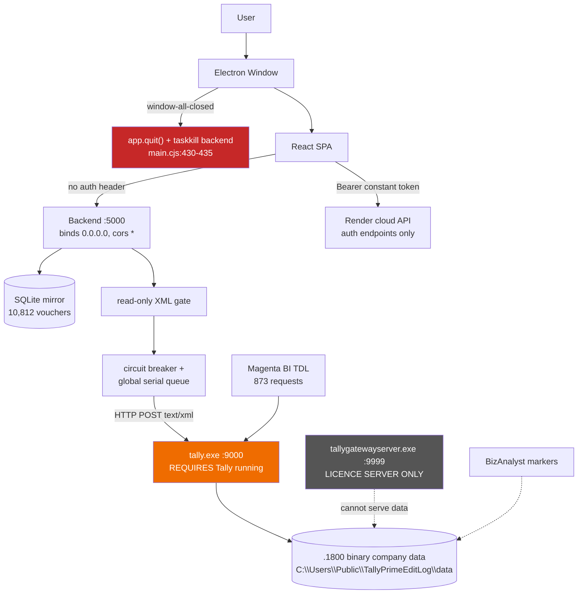

# Tally B+C Complete Technical Audit

**Audit date:** 18 September 2026
**Auditor role:** Principal Software Architect / Tally Integration / Backend / Security / DevOps
**Subject:** CFO Yantra (`backend/` + `frontend/`)
**Mode:** AUDIT ONLY — no source modified, no fixes applied, no packages installed, no configuration changed.

**Evidence convention used throughout:**

| Tag | Meaning |
|---|---|
| `[CODE]` | Verified by reading the actual source in this repository |
| `[MACHINE]` | Verified by read-only inspection of this Windows host (processes, ports, files, logs) |
| `[DOC]` | Verified against Tally Solutions official documentation |
| `[INFER]` | Engineering inference, clearly reasoned from the above |
| `[UNKNOWN]` | Could not be verified — stated as unknown, never guessed |

**Severity:** CRITICAL (data loss / security breach / makes B+C impossible) · HIGH · MEDIUM · LOW · INFO

---

## 1. Executive Summary

**Requirement B — "TallyPrime UI must not need to be manually opened" — is NOT met, and cannot be met by changing this codebase alone.**

Every byte of Tally data this product consumes arrives over one mechanism: an HTTP POST to `http://<host>:<port>` (default `127.0.0.1:9000`), built in `src/integrations/tally/tally.client.js:134`. That endpoint is served by `tally.exe` itself. When `tally.exe` is not running, the endpoint does not exist. There is no file reader, no database driver, no process launcher, and no Tally SDK anywhere in the project. Tally's own documentation states the requirement plainly: TallyPrime must be running on a port, and at least one company must be loaded `[DOC]`.

**Requirement C — "access Tally data when TallyPrime is not installed or not running" — is NOT implemented, and is not feasible through supported means.**

The company data on this machine is 1.75 GB of `.1800` binary files in `C:\Users\Public\TallyPrimeEditLog\data` `[MACHINE]`. The format is proprietary and not publicly documented. No reader exists in this codebase — verified four independent ways (§12). Knowing the directory path does **not** imply the data can be read.

**Three findings materially change the picture beyond the B+C question:**

1. **The desktop app is a worse constraint than Tally is.** `frontend/electron/main.cjs:430-435` kills the backend and quits the moment the window is closed. There is no tray icon and no auto-start. So today, unattended sync requires *both* Tally open *and* the CFO Yantra window open. Requirement B is blocked by our own shell before Tally is even reached. — **CRITICAL**

2. **The product has no authentication at all.** 55 mounted endpoints, zero protected (§19). `src/controllers/authController.js:24-30` returns a hardcoded token for any input. The server binds `0.0.0.0` with `cors({origin:"*"})`. Any device on the LAN — and any website the user visits — can read every company's complete financial dataset, repoint the Tally target host (SSRF), and tombstone vouchers via a GET request. — **CRITICAL**

3. **Parts of the UI display fabricated financial figures as if they were Tally data.** Receivables, payables and overdue invoices on the executive dashboard are invented from fixed ratios (`Dashboard.jsx:200-214`); a Tally-look-alike Day Book modal synthesizes vouchers with hardcoded party names (`TallyDayBookModal.jsx:76-213`); and the reconciliation endpoint hardcodes `salesDifference: "0.00"` so it reports perfect parity on any dataset (`accountingAnalysis.engine.js:1053-1055`). — **CRITICAL**

**The one genuine positive for B on this machine:** `tally.ini` is configured with `Default Companies=Yes` and `Load=100000` `[MACHINE]`, so Tally auto-loads its company on launch. That eliminates the manual *company-selection* step — a real, if partial, step toward B. The remaining gap is launching and keeping `tally.exe` alive.

**Current operational reality:** the mirror holds 10,812 vouchers and 5,186 ledgers from two companies, but `header` and `entries` are NULL on **all 10,812** voucher rows, cost centres and units are empty, one company's last sync status is `PARTIAL`, and at audit time both GET and POST to port 9000 **time out** while Tally simultaneously serves 873 requests to a competing integration (§10).

---

## 2. Audit Scope

**In scope:** the complete `CFO PROJECT` tree — `backend/` (Node/Express/Sequelize) and `frontend/` (React/Vite/Electron) — plus read-only inspection of the Windows host, the running Tally processes, Tally's configuration and log files, and the live SQLite mirror.

**Method:** source reading; read-only filesystem and process inspection; two live read-only HTTP probes against Tally ports 9000 and 9999; one read-only SQL query against the mirror; official Tally documentation research.

**Explicitly not done:** no code changes, no refactoring, no bug fixes, no dependency installation or upgrade, no schema change, no configuration change, no deletion or renaming of any file, no reverse engineering of Tally's proprietary data format, no `npm audit` (would require network install actions).

---

## 3. Files / Directories Inspected

| Area | Path |
|---|---|
| Backend entry & wiring | `backend/src/server.js`, `src/routes/index.js`, all `src/routes/*.js` |
| Tally bridge | `src/integrations/tally/tally.client.js`, `tally.requests.js`, `tally.parser.js`, `tally.readonly.js`, `tally.breaker.js`, `tally.health.js`, `tally.masters.js`, `tally.capabilities.js`, `transports/*`, `parsers/*`, `requests/*`, `catalog/*`, `tally_webhook.tdl` |
| Canonical layer | `src/integrations/tally/canonical/*` (16 modules), `sales/*` |
| Sync | `src/services/sync/{syncEngine,cdcEngine,mirror,deletionDetector}.service.js`, `src/jobs/tallySync.job.js` |
| Persistence | `src/config/db.js`, `src/models/*` (16 models incl. `mirrorModel.factory.js`, `sqlModelCompat.js`) |
| Auth / security | `src/controllers/authController.js`, `src/services/{authService,otpService}.js`, `src/constants/authConstants.js`, `src/services/spool/*`, `src/utils/{encryption,secrets,deviceIdentity,logger}.js` |
| Config | `src/config/env.js`, `src/validations/*`, `backend/.env.example`, `frontend/.env`, `frontend/.env.example` |
| Frontend | `frontend/src/**` (pages, components, services, hooks, context), `frontend/electron/{main.cjs,preload.cjs,prebuild.cjs}`, `frontend/package.json`, `vite.config.mjs` |
| Tests | all 35 suites in `backend/tests/` |
| Host (read-only) | `C:\Program Files\TallyPrimeEditLog (1)\{tally.ini, tallygateway.ini, tallyhttp.log, tallyerr.log}`, `C:\Users\Public\TallyPrimeEditLog\data\**` (names/sizes only), `backend/data/cfo_yantra.sqlite` |

## 4. Files Explicitly Ignored

Per instruction, **all `README.md` files were excluded as a source of truth**: `backend/README.md`, `docs/README.md`, root `README.md`, `frontend` readmes. `backend/README.md` had been read before the instruction was issued; it is quarantined from the evidence base and referenced **only** in §29 (PP-16) to record where its claims contradict the code.

Also skipped: `node_modules/`, `.git/`, `dist/`, `dist-electron/`, `package-lock.json`.

---

## 5. Actual Architecture

Reconstructed from code, not documentation.

```
Electron main process (frontend/electron/main.cjs)
  ├── spawns → Node backend child process (backend/src/server.js) on port 5000
  └── opens  → BrowserWindow → React SPA (HashRouter, file:// in prod)
                   │
                   ├── tallyBridgeClient  → http://127.0.0.1:5000/api/v1   (~30 calls, NO auth header)
                   ├── apiClient (cloud)  → https://cfo-yantra-saas-be.onrender.com/api/v1 (auth calls only)
                   └── socket.io          → http://localhost:5000
                                 │
Express app (no auth middleware; cors *; binds 0.0.0.0)
                                 │
   Controllers → Services → { mirror.service (SQL-first)  ←→  Sequelize/SQLite }
                          → { companyScope.service → tally.client.sendXml }
                                 │
                     tally.readonly gate → breaker.runExclusive (global serial queue)
                                 │
                          axios POST text/xml
                                 │
                   http://127.0.0.1:9000  ← served by tally.exe ONLY
                                 │
                   TallyPrime Edit Log 7.1.0, company loaded from
                   C:\Users\Public\TallyPrimeEditLog\data  (.1800 binary)
```

**Two background loops start automatically at boot** `[CODE: server.js:126-131]`:
- `tallySyncJob` — full pass every `SYNC_INTERVAL_MS` (60 s default) after a 5 s delay
- `cdcEngine` — AlterID delta every 15 s, full GUID deletion scan every 8th tick

**Dual naming throughout:** ~10 pairs such as `syncController.js` / `sync.controller.js` exist, where the dotted file is a 3-line re-export shim. `routes/index.js` wires the originals. `[CODE]` INFO

## 6. Architecture Diagram



---

## 7. Frontend Audit

**Stack** `[CODE]`: React 19 + Vite 8 + Tailwind 4, `HashRouter`, dev port 5001 (`vite.config.mjs:8-11`), packaged by electron-builder into NSIS + portable x64 (`frontend/package.json:53-101`).

### 7.1 Tally-related UI surfaces

| Surface | File | Real or not |
|---|---|---|
| Tally status page | `pages/Tally.jsx` | **Real** (`GET /tally/status`); transport spec rows `:124-128` are literals |
| Connection card | `components/ConnectionCard.jsx` | **Partly** — host `:35` and port `:36` **hardcoded**, ignores saved settings |
| Tally settings (host/port/protocol/company) | `pages/Settings.jsx:395-653` | **Real**, contract matches backend |
| Test connection | `pages/Settings.jsx:154-186` | **Real**, returns live company names |
| Company picker / scope | `components/CompanyPicker.jsx`, `hooks/useCompanyScope.jsx` | **Real**, cached in `sessionStorage` |
| Sync page + Sync now | `pages/Sync.jsx` | **Real** (`GET /sync/status` 15 s poll, `POST /sync/run`) |
| Bridge pipeline card | `components/BridgeStatusCard.jsx` | **Static** — `:46` hardcoded `127.0.0.1:9000`; `:49-50` "Disconnected (Phase 5)" |
| Capability pipeline | `components/CapabilityCard.jsx:90-95` | **Static** — always renders "3. XML (Selected)" |
| Security guarantees card | `components/SecurityCard.jsx:6-13` | **Static**, six unverified claims |
| Day Book modal | `components/tally/TallyDayBookModal.jsx` | **Real with fabricated fallback** — see §7.3 |
| Login / Register / OTP | `pages/auth/*`, `components/auth/*` | **Dead** — `App.jsx:187-188` redirects to `/` |
| Experiments pages | `pages/Experiments.jsx`, `Experiment01.jsx` | **Dead** — call `api.experiments.*` which does not exist; also unrouted |

### 7.2 Does the frontend require the user to open TallyPrime? — YES

`pages/Settings.jsx:676-721` ships a mandatory one-time setup accordion `[CODE]`:

```
:682  Open TallyPrime on the machine where your company data is stored.
:691  Press F1 (Help) > Settings > Connectivity.
:701  Set Client/Server configuration to Both.
:710  Set Port to 9000 and accept changes.
:719  Restart TallyPrime and select your company.
```

Plus 13 further user-facing strings, e.g. `services/apiClient.js:140` *"Open TallyPrime and ensure company is loaded."*, `pages/Company.jsx:232-235` *"No Company Currently Loaded in TallyPrime"*, `pages/Sync.jsx:377` *"TallyPrime has no push channel, so the bridge polls"*. **The product's own UI states the B requirement is unmet.** — **HIGH**

### 7.3 Fabricated financial data — CRITICAL

```
Finding:  Working-capital figures on the executive dashboard are invented from
          fixed ratios and labelled as ledger facts.
File:     frontend/src/pages/Dashboard.jsx
Lines:    200, 207, 213, 214
Observed: receivables   = max(round(grossSales * 0.22), grossSales - receipts)
          payables      = max(round(grossPurchases * 0.18), ...)
          overdueAmount = round(receivables * 0.26)
          overdueCount  = max(1, round(salesCount * 0.14))
          Rendered at :718-771 as "Receivables (A/R) · Sundry Debtors",
          "Payables (A/P) · Sundry Creditors" and "Overdue Invoices · {n}
          invoices past 30-day terms" with tone="critical".
          No A/R or A/P ledger is ever fetched.
```

Further instances `[CODE]`:
- `Dashboard.jsx:393-414` — invents sales vouchers `INV/1100+idx`, incl. a credit note with literal amount `873495`
- `Dashboard.jsx:431-435` — relabels arbitrary vouchers alternately "Receipt"/"Payment" when no cash vouchers exist
- `Dashboard.jsx:1235` — company name falls back to `"Marshal Engineers"`
- `TallyDayBookModal.jsx:76-213` — `synthesizeDayBookFromMis()` fabricates a register using 12 hardcoded party names (`:88-101`), quantity `amt/450`, GST `amt*0.18`, displayed inside pixel-accurate "Tally Prime GOLD" chrome (`:521-591`)
- `Report5MIS.jsx:7061,7067` — `Math.random()` for HHI and top-month percentage; `:7022-7027` "simulated" month HHI derived from array index

## 8. Backend Audit

| Endpoint group | Controller | Tally? | DB? | Auth | Validation |
|---|---|---|---|---|---|
| `/auth/*` (5) | `authController.js` | no | no | **none** | none (stub ignores input) |
| `/settings/tally` (3) | `settingsController.js` | yes | yes | **none** | port only, host unvalidated |
| `/tally/*` (7) | `tallyController.js` | yes | yes | **none** | partial |
| `/companies/*` (29) | `companiesController.js` | yes | yes | **none** | Zod via `parseQuery` |
| `/diagnostics/*` (2) | `diagnosticsController.js` | yes | no | **none** | none |
| `/sync/*` (6) | `syncController.js` | yes | yes | **none** | none |
| `/cloud/status` (1) | `cloudController.js` | no | no | **none** | n/a — static stub |

`experimentsRoutes.js` defines 11 routes but is **never mounted** in `routes/index.js:24-30` `[CODE]` — unreachable (INFO, and mildly positive).

**Zod is genuinely used** for query validation via a local `parseQuery` helper (`companiesController.js:48-59`, applied at 10 call sites) with real bounds `[CODE]`. But `src/validations/validate.middleware.js` is **dead code** — no route imports it — so `companyParamsSchema` and all of `auth.validation.js` are unused. — MEDIUM

## 9. Tally Bridge Audit

| Property | Value | Evidence |
|---|---|---|
| Bridge type | In-process HTTP client (not a separate service) | `[CODE]` |
| Technology | axios → `POST` `Content-Type: text/xml` | `tally.client.js:134` |
| Entry point | `sendXml(xml, options)` | `tally.client.js:109` |
| Startup | Starts with the backend; no independent lifecycle | `server.js:126-131` |
| Port / protocol | `${protocol}://${host}:${port}`, default `http://127.0.0.1:9000` | `tally.client.js:23-29` |
| Authentication to Tally | **None** — Tally's gateway is unauthenticated by design | `[CODE]`+`[DOC]` |
| Read-only gate | `assertReadOnlyXml` blocks `<import`, `action=create/alter/delete`; `TALLYREQUEST` must be `Export` | `tally.readonly.js:10-45`, enforced `tally.client.js:117` |
| Circuit breaker | Cooldown ladder `[5s,10s,20s,30s]`; only transport faults open it | `tally.breaker.js:30,95` |
| Serialization | **One request at a time globally** — Tally is single-threaded | `tally.breaker.js:208` `runExclusive` |
| Retry | No per-request retry; recovery is temporal (next tick) | `[CODE]` |

**Well-engineered aspects worth preserving** `[CODE]`: the read-only gate is fail-closed; `tally.requests.js:18,30` documents that date static variables need `TYPE="Date"` or Tally silently serves only the current period (8 vouchers vs 432); `tally.requests.js:83-88` documents that a bare `<ID>CompanyCollection</ID>` raises a TDL modal that blocks the gateway until a human clicks OK; `companyScope.service.js:53-60` documents that targeting a closed company **crashes TallyPrime**.

**Security gap:** the `json`, `jsonex` and `tallyJson` transports (`transports/*.js`) call axios directly and **bypass the read-only gate, the breaker and the serial queue** `[CODE]`. The read-only guarantee holds only for `sendXml`. Currently latent because those transports are unwired from production. — MEDIUM

---

## 10. Tally Process Dependency

The decisive section for Requirement B.

| Dependency | Required? | Evidence |
|---|---|---|
| TallyPrime **UI window** visible/focused | **NO** | Gateway answers while minimised `[INFER]` |
| TallyPrime **process** (`tally.exe`) running | **YES** | Port 9000 is owned by PID 13716 = `tally.exe` `[MACHINE]`; no other process serves it |
| A separate Tally **service** sufficient | **NO** | See §10.1 |
| Tally **gateway (HTTP server)** enabled | **YES** | `tally.ini`: `Client Server=Both`, `ServerPort=9000` `[MACHINE]` |
| A **company loaded** | **YES** | `[DOC]`; enforced in code by `isCompanyStillOpen` / `resolveCompany` |
| **Specific** company opened manually | **NO** on this host | `tally.ini`: `Default Companies=Yes`, `Load=100000` auto-loads `[MACHINE]` |
| Specific port | Configurable | `ServerPort=9000`; backend default matches |
| Specific Windows **user session** | **YES** | `tally.exe` is an interactive desktop app, not a service `[INFER]` |

### 10.1 The Tally Gateway Server is a LICENCE server — this path is closed

This was the most promising lead for B and it does not hold.

```
Finding:  "Tally Gateway Server 11.0" runs as an Automatic Windows service under
          LocalSystem, but it is a LICENCE server. It cannot serve company data.
Evidence: [MACHINE] Get-CimInstance Win32_Service →
            Name: Tally Gateway Server 11.0 | State: Running | StartMode: Auto
            PathName: C:\Program Files\TallyPrimeEditLog (1)\tallygatewayserver.exe
            StartName: LocalSystem
          [MACHINE] tallygateway.ini →
            LicServerPort=9999
            LicServiceName=Tally Gateway Server 11.0
          [MACHINE] Live read-only HTTP GET to 127.0.0.1:9999 → HTTP 200:
            "License server is Running
             Gateway Version: 11.0 | Gateway Release: 7.1.0 (29327)
             Product: TallyPrime | Serial number: 7689209xx
             License state: Permanent License"
          [MACHINE] tally.ini → "Tally Gateway Server=DESKTOP-70BVNA5:9999"
          [DOC] Port 9999 is reserved for the Tally licence server and should
                not be used for ODBC/data connections.
```

**Conclusion:** the presence of a running, automatic Tally Windows service does **not** provide a headless data path. It manages licensing only. — **CRITICAL for B** (closes the most attractive option)

### 10.2 Live probe results at audit time

```
[MACHINE] Port 9000 — GET  /            → TIMEOUT after 10 s, then ECONNRESET
[MACHINE] Port 9000 — POST buildProbeXml() (the product's own read-only probe)
                                        → ECONNABORTED after 15 s
[MACHINE] Socket state on 127.0.0.1:9000 (PID 13716):
             19 × CloseWait, 3 × Established, 2 × Listen
```

Tally is **listening but not servicing** our client. The `CloseWait` pile-up indicates connections opened and abandoned without a clean close. This is exactly the `RUNNING_BUT_BLOCKED` state `tally.health.js:119` anticipates. — **HIGH**

### 10.3 Contention: three integrations share one single-threaded Tally

```
[MACHINE] tally.ini → User TDL=Yes
                      TDL=D:\Magenta Bi Setup\mSync64\MagentaSyncv2.tcp
[MACHINE] tallyhttp.log (2,047,012 bytes, 05-09-2026 → 18-09-2026 12:08:53)
          1,003 logged requests. REPORTNAME histogram:
             MJXMLTagRpt               873    ← Magenta BI
             Ledvchdetrpt               50
             MJXMLBankEntRep            49
             mjxml* master reports      12
             GodownItemReport            1
             mLedCloBalReport2           1
          984 occurrences of mcplAlterIDS (Magenta's AlterID window cursor,
          500-ID windows, SVCURRENTCOMPANY=RAVI ENGINEERING CO.2024-26)
[MACHINE] Zero-byte marker files "*_bizanalyst" in two company data folders
          → a third integration (BizAnalyst) also touches this data
```

Because `tally.breaker.js:208` serialises *our* requests but cannot serialise *other products'* requests, CFO Yantra competes for a single-threaded resource it does not control. — **HIGH**

### 10.4 Tally instability under integration load

```
[MACHINE] tallyerr.log:
            'Collection:Voucher'  Could not find description!
            - - - - - - * E R R O R * - - - - - - - - -
            16-09-2026 18:32:32, PID: 7928
            Internal Error. Contact Tally Solutions.
            Software Exception c0000005 (Memory Access Violation)
[MACHINE] Crash dumps present: tally1.dmp (289 KB, 16-09 13:58),
                               tally2.dmp (375 KB, 16-09 18:32)
```

`'Collection:Voucher' Could not find description!` is a TDL fault of exactly the class this codebase's comments warn about (`tally.requests.js:367-372`). Attribution of the crash to a specific integration is **`[UNKNOWN]`** — three tools were active. — **HIGH**

---

## 11. Tally Data Path Audit

| Capability | Present? | Evidence |
|---|---|---|
| Detects Tally installation | **NO** | No `isTallyInstalled`/registry/`Program Files` scan anywhere `[CODE]` |
| Detects Tally data directory | **NO** | No such function `[CODE]` |
| Detects company directories | **NO** | Companies are *discovered over HTTP*, never from disk `[CODE]` |
| Hardcoded paths (backend) | **NONE** | Every path is `path.resolve(process.cwd(),…)` or `path.resolve(__dirname,…)` `[CODE]` |
| Hardcoded paths (frontend) | **3** | see below |
| Asks user for a Tally path | **NO** | Settings collects host/port only `[CODE]` |
| Scans default locations | **NO** | `[CODE]` |

**Hardcoded paths found (all frontend, all cosmetic fallbacks):**

| File:Line | Value | Assessment |
|---|---|---|
| `pages/Settings.jsx:111` | `C:\Users\User\AppData\Roaming\com.cfoyantra.desktop` | Fictitious username shown to the user — LOW |
| `pages/Settings.jsx:105`, `:343` | `%APPDATA%\com.cfoyantra.desktop\data\cfo_yantra.db` | **Factually wrong** — real DB is `sqlite:./data/cfo_yantra.sqlite` resolved against `process.cwd()` (`config/db.js:45`), different name *and* extension — LOW |

The remaining `tally.exe` string matches in the backend are **human-readable error text only** (`constants/failureCodes.js:32`, `tally.breaker.js:65`), e.g. *"check Task Manager for a second tally.exe holding the port."* — INFO

**Actual Tally data path on this host** `[MACHINE]`, discovered from `tally.ini` — not from any product code:
```
Data=C:\Users\Public\TallyPrimeEditLog\data
```

## 12. Direct Data Access Audit

> **No direct Tally-data reader was found in the audited implementation.**

Verified four independent ways `[CODE]`:

1. **No process spawning.** `child_process`, `spawn`, `exec`, `execSync`, `execFile`, `fork` — **zero occurrences in all of `backend/src`**. The only `child_process` usage in the project is `frontend/electron/main.cjs:105` (spawns `process.execPath` on our own `server.js`), `:155` (`taskkill` on our own backend PID), and `prebuild.cjs:27,74` (`taskkill` on our own Electron). **Nothing spawns, launches or terminates TallyPrime.**
2. **No Tally installation/data detection.** No registry reads, no `winreg`, no directory probing.
3. **Every `fs` call accounted for, none touching Tally.** `config/db.js:47-48` (SQLite parent dir); `spool/spool.service.js:12-13,39` (local `.spool`, dead code); `jobs/spool.cleanup.js` (same, dead); `experimentsController.js:37-38` (fixed whitelist map, no traversal, router unmounted); `src/scripts/*` (repo codemods). **No `.1800`, `.900`, `.TSF` or `Tally.ini` read anywhere.**
4. **All Tally access is HTTP.** Six axios call sites, all to `${protocol}://${host}:${port}`.

**No third-party Tally library** is present in `backend/package.json` — no ODBC driver, no Tally SDK, no binary parser. `[CODE]`

## 13. Tally Data Coverage

### 13.1 On-disk format (observation only — no parsing performed)

```
[MACHINE] C:\Users\Public\TallyPrimeEditLog\data
   Company folders: 100000 100001 100002 100003 100004 100005
                    "RAVI ENGINEERING"  "SATTHAYU AYURVEDAV - DONE"
   Extension census:  .1800 → 134 files, 1,747.14 MB
                      .TSF  →  70 files,     0.63 MB
                      .rar  →   1 file,    112.32 MB  (100001.rar)
                      .001  →   1 file,      2.32 MB  (TDBK1800_100000.001 — Tally backup)
   Largest company: RAVI ENGINEERING\BANK STATEMENT\100001\100001 → 1,454.7 MB
        ExtMngr.1800   235,826,688    Index.1800     183,369,728
        LinkMgr.1800    74,616,320    Manager.1800    64,637,440
        Aggr.1800       34,242,560    SecTran.1800    20,046,848
        StatStatus.1800 12,708,864    Company.1800        63,488
        CmpSave.1800        63,488    AddlCmp.1800        35,328
```

`[DOC]` Tally does not use a relational database; it uses a proprietary flat-file binary store whose structure "is controlled internally by Tally and not publicly documented", and the files "can only be opened through Tally software". `[INFER]` `.1800` is the TallyPrime-era successor to the documented `.900` format — same closed family. **Scenario D artifacts (`TDBK1800_*.001` backups) are the same proprietary format and confer no additional access.**

### 13.2 What the product can actually retrieve (over HTTP)

| Entity | Request builder | Normalizer | Mirror table | API | Frontend | Status |
|---|---|---|---|---|---|---|
| Company | ✅ | ✅ | `companies` | ✅ | ✅ | **WORKING** |
| Group | ✅ | ✅ | `groups` (33 rows) | ✅ | ✅ | **WORKING** |
| Ledger | ✅ | ✅ | `ledgers` (5,186) | ✅ | ✅ | **PARTIAL** — `OpeningBalance` never fetched (§13.3) |
| Stock Item | ✅ | ✅ | `stockitems` (253) | ✅ | ✅ | **PARTIAL** — closing stock discarded |
| Stock Group | ✅ | ✅ | `stockgroups` (10) | ✅ | ✅ | WORKING |
| Voucher Type | ✅ | ✅ | `vouchertypes` (29) | ✅ | ✅ | WORKING |
| Godown | ✅ | ✅ | `godowns` (1) | ✅ | ✅ | WORKING |
| **Cost Centre** | ✅ | ✅ | `costcentres` (**0**) | ✅ | ✅ | **NO DATA** |
| **Cost Category** | ✅ | ✅ | `costcategories` (1) | ✅ | ✅ | NEAR-EMPTY |
| **Unit** | ✅ | ✅ | `units` (**0**) | ✅ | ✅ | **NO DATA** |
| Stock Category | ✅ | ✅ | `stockcategories` (0) | ✅ | ✅ | NO DATA |
| Currency | ✅ | ✅ | `currencies` (1) | ✅ | ✅ | WORKING |
| Sales / Purchase / Receipt / Payment / Journal / Contra | ✅ | ✅ | `vouchers` (10,812) | ✅ | ✅ | **PARTIAL** (§13.3) |
| Credit / Debit Note | ✅ (generic) | ✅ | `vouchers` | ✅ | ✅ | PARTIAL |
| Orders / Delivery / Receipt Notes | ✅ (generic) | ✅ | `vouchers` | ✅ | — | UNVERIFIED |
| **Employee / Payroll** | ❌ | ❌ | ❌ | ❌ | ❌ | **NOT IMPLEMENTED** |
| Trial Balance | ✅ builder | ✅ normalizer | ❌ | ❌ | ❌ | **BUILT, NOT WIRED** — script-only |
| **Profit & Loss** | JSON only | dump, no head mapping | ❌ | ❌ | ❌ | **NOT IMPLEMENTED** |
| **Balance Sheet** | JSON only | partial parser, unwired | ❌ | ❌ | ❌ | **NOT IMPLEMENTED** |
| Outstanding AR/AP | ✅ builder | ✅ | ❌ | ❌ | ❌ | BUILT, NOT WIRED |
| **Stock Summary** | ❌ | ❌ | ❌ | ❌ | ❌ | **NOT IMPLEMENTED** |
| GST / tax data | ❌ per-voucher fetch | derived by **ledger-name regex** | in `data` JSON | ✅ | ✅ | **INFERRED, NOT SOURCED** |

### 13.3 Verified data defects in the live mirror

```
[MACHINE] Read-only query of backend/data/cfo_yantra.sqlite (34 MB):

companies      2   Marshal Engineers (24-27) R  isOpen=0  synced 2026-09-16
                   RAVI ENGINEERING CO.2024-26  isOpen=1  synced 2026-09-18

sync_states        Marshal  status=SUCCESS  runCount=15  totalRecords=12,260
                   RAVI     status=PARTIAL  runCount= 1  totalRecords= 4,066

vouchers      10,812 rows | isDeleted=0 on all | dates 2024-04-01 → 2026-06-23
              header  IS NULL on 10,812 / 10,812   ← 100%
              entries IS NULL on 10,812 / 10,812   ← 100%

masters       ledgers 5,186 | groups 33 | stockitems 253 | vouchertypes 29
              costcentres 0 | units 0 | godowns 1
```

**Consequences:**
- `header` NULL on every row means `deletionDetector.service.js:54-56` (`doc.header || doc.data.header`) **always** falls through to `sourceObjectId` matching — GUID-based deletion detection is silently degraded. — **HIGH**
- `costcentres = 0` and `units = 0` mean cost-centre/salesperson dimensional analysis has **no source data**. — HIGH
- `ledger.openingBalance` is `"0.00"` on all 5,186 rows: the sync path wires `ledgers` to `buildSalesLedgerRequest` (`companyData.service.js:130`), which fetches `ClosingBalance` but **not** `OpeningBalance` (`sales.requests.js:16-28`). The general `buildLedgersRequest` fetches both but is never called by sync. Any Trial Balance built from the mirror would have every opening at zero. — **HIGH**
- `.env` sets `SYNC_VOUCHER_ENTRIES=false` with a comment recording that entries-on hit the 120 s timeout and returned 0 records. Entries in the mirror arrived via CDC, not the full pass. — MEDIUM

---

## 14. Database Audit

**Sequelize 6.37.8; SQLite default, Postgres/MySQL supported** (`config/db.js:26-56`). Schema created by `sequelize.sync()` (`config/db.js:98`) on **every boot** — **there are no migrations**, so column changes never apply to an existing database. — **HIGH**

**16 tables.** All 11 master tables are generated from one factory (`mirrorModel.factory.js:14-93`) sharing one envelope:

`id · companyId · sourceObjectId · objectType · name · parent · checksum · contentHash · isDeleted · deletedAt · syncedAt · lastRunId · data (JSON)`

Unique index `(companyId, sourceObjectId)`; plus `(companyId, isDeleted)` and `(companyId, name)`.

| Schema capability | Supported? |
|---|---|
| Multiple companies | **YES** — every table keyed by `companyId`; two coexist today `[MACHINE]` |
| Incremental sync | Partially — checksums yes, **AlterID cursor not persisted** (§15) |
| Duplicate prevention / idempotency | **YES** — unique `(companyId, sourceObjectId)` + content hash |
| Soft deletion | **YES** — `isDeleted` + `deletedAt`, rows never destroyed |
| Audit trail | **NO** — no history table, no change log |
| Sync checkpoints | Partial — `sync_states` per company, but no AlterID column |
| Multiple Tally versions | **NO** — no version column anywhere |
| Foreign keys / associations | **NONE** — `models/index.js:42-62` declares no associations |

**Everything domain-specific lives inside an unindexed `data` JSON blob**; `voucherDate` is a STRING, not a DATE. — MEDIUM

**`sqlModelCompat.js` grafts a Mongoose-shaped API onto Sequelize.** Three defects `[CODE]`:
- `:127-130` — `deleteMany({})` becomes `destroy({truncate:true})`: an empty/unrecognised filter **silently truncates the table**. — **HIGH** (not currently HTTP-reachable)
- `:15-34` — unsupported Mongo operators (`$regex`, `$not`, `$elemMatch`) are **silently dropped**, leaving an empty condition that **matches everything** — a narrowing filter becomes a widening one. — **HIGH**
- `:71-75` — `select`/`sort`/`skip`/`limit` are chainable **no-ops**; `limit()` silently not applying is a memory/DoS hazard. — MEDIUM

## 15. Synchronization Audit

**Both full and incremental exist, in two separate engines** `[CODE]`.

| Mechanism | Implementation | Status |
|---|---|---|
| Full pass | `tallySync.job.js:68` → `syncEngine.service.js:149` every 60 s | Working |
| Incremental (AlterID) | `cdcEngine.service.js`, 15 s, `buildIncrementalSyncRequest` | **Broken cursor** — below |
| Deletion detection | `deletionDetector.service.js:19`, GUID diff every 8th tick | Degraded — §13.3 |
| Change detection | SHA-256 content hash excluding volatile fields (`mirror.service.js:47`) | **Working well** |
| Push/webhook | `tally_webhook.tdl` → `POST /sync/tally-event` | Optional, insecure (§17) |
| Resume after failure | Temporal only — next tick retries | Partial |

```
Finding:  The AlterID incremental cursor resets to 0 on every process restart.
Files:    src/services/sync/cdcEngine.service.js:29, :52-67, :126
Observed: Cursors live in a process-local `const companyCursors = new Map()`.
          On restart the cursor is rebuilt by scanning `data.alterId` over the
          last 50 voucher rows. But only the CDC engine ever stamps `alterId`
          (:126); the full sync never does — and `mirror.service.js:47` lists
          alterId as a volatile field excluded from the content hash.
          `sync_states` has no `lastAlterId` column.
Impact:   Every restart re-initialises the cursor to 0.
```
— **HIGH**

**Two genuinely well-engineered safety mechanisms** worth preserving `[CODE]`:
- `mirror.service.js:190-199` — mass-tombstone circuit breaker (`MAX_TOMBSTONE_RATIO = 0.15`, floor 10); the comment records that passing a CDC batch through the default path once struck off 2,412 live vouchers.
- `mirror.service.js:295-325` — `readDomain` returns `null` (never `[]`) when the mirror is empty: *"An empty mirror is not an answer — it means 'not synced yet'."*

**Loopholes** `[CODE]`:
- `upsertRecords` writes **one row at a time in a loop** (`:201-205`) — no `bulkCreate`, no transaction. A crash mid-loop leaves a partially-applied pass. — **HIGH**
- Deletion detector returns `deletedCount: 0` when the breaker trips, indistinguishable from "nothing deleted" to callers. — MEDIUM
- No `lastRunId`-based rollback; a partial pass is never reverted. — MEDIUM

## 16. Failure & Recovery Audit

| Failure | Current handling | Gap |
|---|---|---|
| Tally unavailable | Breaker opens, cooldown ladder, serves mirror | **Good** |
| Tally blocked/modal | `RUNNING_BUT_BLOCKED` reported (`tally.health.js:119`) | Good detection, no remedy |
| Tally company closed | `isCompanyStillOpen` guard (prevents a Tally crash) | **Good** |
| Internet disconnected | Irrelevant — Tally is loopback; cloud path carries auth only | n/a |
| Company locked / invalid | 404 via `resolveCompany` | Adequate |
| Corrupt data | **None** | No checksum validation of Tally payloads — MEDIUM |
| Large company / volume | Breaker + 120 s timeout | **No pagination or streaming** — HIGH |
| Duplicate sync | Non-overlapping tick guard + unique index | **Good** |
| Partial sync | `status: PARTIAL` recorded (RAVI today) | **No resume, no rollback** — HIGH |
| Server/API timeout | axios timeout → breaker | Adequate |
| Bridge crash | Process guards swallow faults to stay alive (`server.js:88-97`) | **Can continue in a corrupted state** — MEDIUM |
| Computer / app restart | Sync resumes; **AlterID cursor resets to 0** | **HIGH** — §15 |
| Power failure | No transactions in the upsert loop | **HIGH** |
| Database failure | Fail-soft; degrades to live Tally | **Good** |
| Auth expiry | n/a — no auth exists | — |
| Unhandled rejection in a handler | Logged, **request never answered** | `syncController.js:109` has no try/catch → **connection hangs forever** — **HIGH** |

## 17. Security Audit

### CRITICAL-1 — No authentication on any endpoint

```
File:     backend/src/server.js:16-23
Observed: app.use(cors({ origin: "*" }));
          app.use(express.json());
          app.use("/api/v1", apiVersionMiddleware());   // version stamping only
          app.use("/api/v1", apiRoutes);
          No auth middleware exists in the project. routes/index.js:24-30
          mounts every router bare. 55 endpoints, 0 protected.

File:     backend/src/controllers/authController.js:24-30
Observed: handleVerifyOtp returns { token: "standalone-desktop-token",
          user: DEFAULT_USER (role "Owner") } for ANY body — no OTP check,
          no mobile check, no database read.
```
The real HMAC token implementation in `authService.js:17-31` is **dead code** — imported by nothing. `AUTH_SECRET` has a hardcoded fallback (`authConstants.js:15`) that is absent from the env schema and `.env.example`, so it is always the effective key. OTP `"5555"` is accepted **unconditionally** (`otpService.js:120`).

### CRITICAL-2 — Binds all interfaces with wildcard CORS and no auth

```
File:     backend/src/server.js:134
Observed: httpServer.listen(PORT, () => {...})   // no host argument
          → Node binds 0.0.0.0, not 127.0.0.1
```
Combined with `cors({origin:"*"})` and zero auth: **any device on the LAN, and any website the user visits, can `fetch("http://127.0.0.1:5000/api/v1/companies")` and read the complete financial dataset.** The UI meanwhile claims *"Strict Local Loopback 127.0.0.1 (No public port exposure)"* (`SecurityCard.jsx:8`) — the opposite of what the code does.

### CRITICAL-3 — Unauthenticated SSRF that repoints the data source

```
File:     backend/src/services/tallyConfig.service.js:85-87
Observed: if (updates.tallyHost !== undefined && typeof updates.tallyHost === "string"
              && updates.tallyHost.trim()) { patch.tallyHost = updates.tallyHost.trim(); }
          Any host string accepted (port range IS validated; host is NOT).
          Persisted to DB (:120-125), hot-reloaded into memory (:128-131).
          tally.client.js:23-29 builds every outbound request from it.
```
An unauthenticated caller repoints the bridge at an arbitrary internal host; the sync and CDC loops then POST to it every 15–60 s. `POST /settings/tally/test` returns status code, response time and company list — a convenient **SSRF oracle**.

### CRITICAL-4 — CSRF-able state change via GET

```
File:     backend/src/routes/syncRoutes.js:10  (GET /sync/tally-event)
          backend/src/controllers/syncController.js:110, :133-136
Observed: const { action, guid, ... } = req.body || req.query || {};
          if (action === "DELETE" && guid) {
            await Voucher.updateMany({ companyId, "header.guid": guid },
                                     { $set: { isDeleted: true, ... } });
          }
          No auth, no signature, no shared secret.
          Triggerable from any web page via:
          
```
Secondary defect: `"header.guid"` is passed to `translateWhere` as a literal column name (`sqlModelCompat.js:34`) but is not a real column, so Sequelize most likely **throws**; with no try/catch the request **never receives a response** (resource exhaustion). Either outcome is a defect. Also `:125` — if no `companyId` matches, it silently targets **an arbitrary other company**.

### Other findings

| ID | Severity | Finding | Evidence |
|---|---|---|---|
| S-5 | HIGH | No helmet, rate limiting, CSRF, security headers, or request signing | `package.json:44-58` — none present |
| S-6 | HIGH | Socket.IO unauthenticated, `origin:"*"`, and `io.emit` broadcasts **every company's** vouchers globally regardless of room | `realtimeSocket.service.js:11-18, :64, :80, :98` |
| S-7 | HIGH | HTTP only; no TLS anywhere, no reverse proxy or terminator in the repo | `server.js:117-118` |
| S-8 | HIGH | `POST /sync/run` forces a full extraction — DoS amplification against a single-threaded Tally | `syncController.js:67-81` |
| S-9 | MEDIUM | Spool stores a **cleartext SHA-256 of the plaintext** beside the ciphertext, enabling offline confirmation of financial chunk contents | `spool/spool.crypto.js:8-16` |
| S-10 | MEDIUM | Spool has **no key management at all** — no generation, derivation, storage or rotation; `encryptionKey` is an unfulfilled parameter | `spool/spool.service.js:22`; `utils/secrets.js`, `utils/deviceIdentity.js` unused |
| S-11 | MEDIUM | Internal `err.message` returned to anonymous callers | `server.js:68`, `companiesController.js:42` |
| S-12 | MEDIUM | SQLite mirror (34 MB of financial data) **unencrypted at rest**; no SQLCipher | `[MACHINE]` |
| S-13 | MEDIUM | `.env.bak.1787401386` is **tracked in git** (verified to contain no credentials, but the pattern is unsafe); `.gitignore:7` covers only `.env` | `git ls-files` |
| S-14 | LOW | `ALLOWED_TALLY_REQUESTS` includes `"import"`, contradicting the enforced blocklist (regex blocks first, so the gate holds) | `tally.readonly.js:20` vs `:17` |

**SQL injection: none found.** `sequelize.query` is never called; all `raw: true` hits are result-shape flags. `translateWhere` maps to symbol-keyed `Op.*` constants that cannot be injected from a string. `[CODE]` — a genuine positive.

**Done well and worth preserving:** fail-closed read-only Tally XML gate; correct AES-256-GCM construction (`utils/encryption.js:10-28`); DB-URI redaction (`config/db.js:21-23`); correct graceful shutdown (`server.js:145-156`); strong Electron renderer hardening (`main.cjs:203-208` — `contextIsolation`, `sandbox`, no `nodeIntegration`); `.env` never committed.

## 18. Multi-Tenant Audit

```
Finding:  There is NO link between a user and a company anywhere in the system.
Evidence: src/models/userModel.js:4-48   — no companyId field
          src/models/index.js:42-62      — no Sequelize associations declared
          no UserCompany model exists
          src/controllers/companiesController.js:30-45:
              const scope = await resolveCompany(req.params.companyId);
          src/services/companyScope.service.js:241-253 — the only rejection is
              "Company is not open in TallyPrime or does not exist"
Observed: companyId is taken straight from the URL. Ownership is never consulted,
          because no authenticated subject exists to own anything.
```

**IDOR is not even a guessing problem:** `GET /api/v1/companies` is unauthenticated and enumerates every company with `companyId`, `gstin`, `pan`, `cin`, `email`, `phone` (`companiesController.js:98-121`). Each ID then unlocks all 28 scoped routes. — **CRITICAL**

`GET /sync/:companyId/counts` passes the param straight to `mirror.countsForCompany` with no resolution at all (`syncController.js:97-104`). — HIGH

**Note on a misleading comment:** `companyScope.service.js:1-8` asserts it is *"the single chokepoint that prevents cross-company access."* It is not. It prevents targeting a **closed** company (whose actual purpose, per `:53-60`, is avoiding a TallyPrime crash). It cannot prevent cross-*user* access because no user concept reaches it. — MEDIUM (documentation defect with security consequences)

**The storage layer itself is correctly scoped** — every mirror read filters on `companyId` `[CODE]`. The failure is entirely at the perimeter.

## 19. Authentication & Authorization

```
User → Frontend:  AuthContext.jsx:22-25 login() ignores mobile and OTP and
                  returns a synthetic session; :42 isAuthenticated is a literal
                  `true`; :6-11 a DEFAULT_USER is always present.
                  ProtectedRoute.jsx:3-5 is `return children;` — a passthrough.
Frontend → API:   apiClient.js:33-42 attaches Bearer only on the CLOUD client.
                  The bridge client (apiClient.js:78-84) has NO interceptor,
                  so all ~30 Tally/company/sync/settings calls are anonymous.
Token:            localStorage keys cfo_auth_token / cfo_auth_user;
                  value is the constant "standalone-desktop-token" or
                  "local-standalone-token". Lifetime: none. Refresh: none.
API → Bridge:     no authentication of any kind.
Bridge → Tally:   no authentication (Tally's gateway is unauthenticated by design).
RBAC:             `role` is written and echoed but NEVER read for an
                  authorization decision. `req.user` is never set or read.
```

Login UI is unreachable — `App.jsx:187-188` redirects `/auth/login` and `/auth/register` to `/`. A hardcoded OTP (`Dev Test Code: 5555`) is rendered on screen at `OtpVerification.jsx:144-149`. — **CRITICAL**

## 20. Performance Audit

| Scale | Expected behaviour | Evidence |
|---|---|---|
| 1 company, ~10 k vouchers | Works today (10,812 rows) | `[MACHINE]` |
| Voucher **entries** enabled | **Fails** — 120 s timeout, 0 records returned | `.env` comment; `SYNC_VOUCHER_ENTRIES=false` |
| 100 k vouchers | **Untested; likely fails** | No pagination in any builder |
| 1 M+ records | **Will fail** | See bottlenecks |

**Bottlenecks** `[CODE]`:
1. **No pagination or streaming anywhere.** Every builder requests a full collection; the entire response is parsed into memory (`tally.parser.js:341`). — **HIGH**
2. **Row-by-row upserts** — `mirror.service.js:201-205` loops `model.upsert(item)`; no `bulkCreate`, no transaction. — **HIGH**
3. **Global serialization** — `breaker.runExclusive` permits exactly one Tally request at a time (correct for Tally's single thread, but caps throughput). Queue wait capped at 15 s → `ETALLYBUSY`. — INFO
4. **`limit()` is a no-op** in the compat layer (`sqlModelCompat.js:71-75`) — unbounded result sets. — HIGH
5. **Only 5 indexed columns**; all domain fields sit in an unindexed `data` JSON blob. — MEDIUM
6. **Contention with two other integrations** for the same single-threaded Tally (§10.3). — HIGH

## 21. Desktop / Local Connector Audit

| Aspect | Finding |
|---|---|
| Type | Electron 44 desktop app that spawns the backend as a child Node process |
| Startup | `app.whenReady()` → `startEmbeddedBackend()` → `createMainWindow()` (`main.cjs:181-188`) |
| Backend spawn | `spawn(process.execPath, [backendEntry], { PORT:"5000", ELECTRON_RUN_AS_NODE:"1", windowsHide:true })` (`:105-110`) |
| Health gate | Hardcoded `http://127.0.0.1:5000/api/v1/health`, polled 20 s (`:58, :131-137`) |
| **Auto-start** | **NONE** — no `setLoginItemSettings`, no `openAtLogin` |
| **Tray** | **NONE** — no `Tray` anywhere |
| **Shutdown** | **`window-all-closed` → `stopEmbeddedBackend()` + `app.quit()` (`:430-435`)** |
| Update mechanism | **NONE** — no electron-updater |
| Crash recovery | **NONE** — `backendProcess.on("exit")` only logs and nulls the handle (`:124-127`); no restart |
| Logging | `%APPDATA%/<app>/logs/backend.log`, **no rotation or size cap** (`:91-95`) |
| Uninstall | NSIS default |
| Security | **Good** — `contextIsolation:true`, `nodeIntegration:false`, `sandbox:true`, narrow preload, external links to OS browser, single-instance lock |

```
Finding:  The desktop shell makes unattended operation impossible, independently
          of Tally.
File:     frontend/electron/main.cjs:430-435
Observed: app.on("window-all-closed", () => {
            stopEmbeddedBackend();
            if (process.platform !== "darwin") { app.quit(); }
          });
Impact:   Closing the window kills the backend and ends all syncing. With no
          tray and no auto-start, the user must keep the CFO Yantra window open
          AND keep TallyPrime open.
```
— **CRITICAL for Requirement B**

## 22. Windows Environment Audit

| Item | Finding |
|---|---|
| Windows services used by us | **None** — we install none |
| Tally services present | `Tally Gateway Server 11.0` (licence, port 9999), `Tally Scheduler 1.0` (port 10089) — both Auto/LocalSystem `[MACHINE]` |
| Registry dependencies | **None** in our code |
| Startup tasks | **None** |
| Path handling | Backend fully portable (`path.resolve`); frontend has 3 cosmetic hardcoded paths (§11) |
| Architecture | x64 only (`package.json:82-84, :89-91`) |
| Native dependencies | `sqlite3` (prebuilt binary) — shipped inside the installer |
| UAC | Not required — NSIS `oneClick:false`, per-user install |
| Firewall | **Not handled.** Binding `0.0.0.0:5000` will prompt/expose on first run |
| `taskkill` usage | `main.cjs:155` (own backend), `prebuild.cjs:27,74` (own Electron). Never Tally |
| Notable | `prebuild.cjs:89-90` **stops the Windows Search Indexer service** during build — surprising for a build script — MEDIUM |

`[INFER]` Because `tally.exe` is an interactive desktop application rather than a service, it requires a logged-in Windows session. Any unattended deployment must therefore keep a user session alive (auto-logon + locked console, or a dedicated always-on host) — a real operational constraint for B.

## 23. Environment Configuration Audit

No secret values are reproduced — names, requirement status and code-side defaults only.

| Variable | Purpose | Required | Default in code | Note |
|---|---|---|---|---|
| `NODE_ENV` | Runtime mode | No | `development` | |
| `PORT` | Backend port | No | `5000` | |
| `TALLY_HOST` | Tally host | No | `127.0.0.1` | |
| `TALLY_PORT` | Tally port | No | `9000` | |
| `TALLY_TIMEOUT_MS` | Request timeout | No | `30000` | `.env` sets `120000` |
| `TALLY_PROBE_TIMEOUT_MS` | Probe timeout | No | `4000` | |
| `TALLY_COMPANY_NAME` | Optional company context | No | — | |
| `LOG_LEVEL` | Pino level | No | `info` | |
| `DB_ENABLED` | Enable mirror | No | `true` | |
| `DATABASE_URL` | Sequelize URL | No | `sqlite:./data/cfo_yantra.sqlite` | **Relative** → resolves against `cwd` |
| `DB_DIALECT` / `DB_LOGGING` / `DB_CONNECT_TIMEOUT_MS` | DB config | No | inferred / `false` / `5000` | |
| `SYNC_ENABLED` / `SYNC_INTERVAL_MS` / `SYNC_START_DELAY_MS` | Sync loop | No | `true` / `60000` / `5000` | |
| `SYNC_VOUCHERS` / `SYNC_VOUCHER_ENTRIES` | Sync scope | No | `true` / **`true`** | Schema default contradicts `.env.example:44` ("off by default") — LOW |
| **`AUTH_SECRET`** | Token signing | **No** | **hardcoded fallback** | **Not in schema, not in `.env.example`** — HIGH |
| `VITE_API_BASE_URL` (frontend) | Cloud API | No | Render URL fallback | `.env` points it at localhost |
| **`VITE_TALLY_BRIDGE_URL`** | Bridge URL | — | `http://127.0.0.1:5000/api/v1` | **Never set anywhere** → effectively hardcoded — MEDIUM |
| **`VITE_TALLY_WS_URL`** | WebSocket | — | `http://localhost:5000` | **Never set** — MEDIUM |

**Every backend variable is optional** — the app boots with a zero-byte `.env`. `config/env.js:9-28` validates and hard-exits on failure with a non-leaking error path — done well.

**Four independently hardcoded copies of the backend host** exist: `apiClient.js:15`, `useTallyRealtime.js:5`, `main.cjs:58`, `Settings.jsx:32`. The bridge URL cannot be reconfigured without a rebuild. — MEDIUM

## 24. Dependency Audit

**Backend** — `axios`, `cors`, `decimal.js`, `dotenv`, `express` 4, `fast-xml-parser` 5, `pg`, `pg-hstore`, `pino`, `sequelize` 6, `socket.io`, `sqlite3`, `uuid`, `zod`. Dev: `eslint`, `jest`, `nodemon`.

**Frontend** — `axios`, `lucide-react`, `react` 19, `react-dom`, `react-router-dom` 7, `socket.io-client`. Dev: `electron` 44, `electron-builder`, `vite` 8, `tailwindcss` 4.

**Findings:**
- **No Tally-specific package of any kind** — no ODBC driver, no Tally SDK, no binary parser. Consistent with §12. `[CODE]` INFO
- **Missing security middleware**: no `helmet`, `express-rate-limit`, `csurf`, `jsonwebtoken`. — HIGH (see §17)
- **`pg`/`pg-hstore` shipped but SQLite is used** — unnecessary surface in the desktop installer. — LOW
- **The installer bundles `backend/node_modules` wholesale** (`frontend/package.json:69-71`), baking the full dev dependency tree and any transitive vulnerabilities into the 130 MB NSIS output with no pruning. — MEDIUM
- **`postinstall` auto-runs PowerShell** to patch a binary inside `node_modules` (`frontend/package.json:18` → `patch-icon.ps1`) — a supply-chain-unfriendly pattern. — MEDIUM
- `[UNKNOWN]` **CVE status not assessed** — `npm audit` was not run, per the no-install constraint.

## 25. API Contract Audit

| # | Mismatch | Evidence | Severity |
|---|---|---|---|
| 1 | **Double-prefixed URL → guaranteed 404.** `baseURL` already ends `/api/v1`, so this resolves to `/api/v1/api/reports/...`, which exists at no prefix. `catch` at `:129` silently returns `DEFAULT_CATEGORY_TABS`. | `services/analyticsService.js:124` | HIGH |
| 2 | **`/cms/content` does not exist** — silent fallback to a default | `services/cmsService.js:15` | MEDIUM |
| 3 | **`/admin/rules` does not exist** — alert thresholds are permanently the hardcoded `DEFAULT_SYSTEM_RULES` | `services/rulesService.js:22` | **HIGH** |
| 4 | **`/users/me/navigation` does not exist** — called on every mount; the entire sidebar is always `DEFAULT_NAVIGATION_SECTIONS` | `services/navigationService.js:39`, `Sidebar.jsx:45` | MEDIUM |
| 5 | **`api.experiments` is undefined → TypeError, not 404.** Backend `experimentsRoutes.js` is also never mounted; pages are unrouted | `pages/Experiments.jsx:40` | LOW (dead) |
| 6 | **Field drift:** frontend reads `cloudStatus?.mongoDbAtlas`; backend returns `cloudSql` / `targetDatabase: "Cloud SQL / PostgreSQL"`. Row always renders "DISCONNECTED" labelled "MongoDB Atlas" | `Sync.jsx:404-405` vs `cloudController.js:4-11` | MEDIUM |
| 7 | **Wrong client for two calls:** `/cloud/status` and `/health` are served by the *local* bridge but requested via the *Render* client. Works only because dev `.env` points both at localhost | `cloudService.js:3`, `api.js:18` | **HIGH in production** |
| 8 | Error payload shape differs between success and failure (`statusCode: null`, `responseSize` omitted) | `tally.health.js:110-126` vs `Tally.jsx:80,146` | LOW |

**All four silent failures (#1–#4) use bare `catch {}` with a hardcoded fallback**, so the UI looks fully functional while several features are permanently inert. — **HIGH** as a class.

**Verified as matching** (no action needed): settings get/save/test; `/sync/status`; diagnostics keys; capabilities; companies `stale`/`staleAt`; all four Socket.IO event names.

## 26. Testing Audit

**35 suites.** Jest config is 5 lines in `package.json:28-32`; `tests/setupTestEnv.js:16-19` pins `DATABASE_URL=sqlite::memory:` — a genuinely good isolation fix (its header records that the suite once wiped the developer's live mirror).

| Class | Count | Note |
|---|---|---|
| Pure unit, inline data | 32 | |
| Fixture-driven | 6 (`tests/analytics/*`) | Fixtures are from an **Excel workbook**, not Tally |
| Real DB (in-memory SQLite) | **1** (`mirrorSync.test.js`) | |
| **Require live Tally** | **0** | |

**Coverage gaps that matter** `[CODE]`:
- **No captured Tally XML/JSON fixture exists anywhere.** `experiments/EXP-01-transport/response.xml` is **0 bytes**; `EXP-02/result.json` is `{"status":"BLOCKED","reason":"TALLY_UNREACHABLE"}`. — **HIGH**
- **No mock Tally server** — no `nock`/`msw`/`axios-mock-adapter`. All isolation is module-boundary `jest.mock`.
- **Nothing tests `header`/`entries`/`alterId` persistence** — which is precisely why all three are 100% NULL in production (§13.3, §15). — **HIGH**
- `tests/salesPurchaseTallyConsistency.test.js:415-459` asserts `salesDifference === "0.00"` — the value **hardcoded** in the engine. The test cannot fail. Despite its header claiming "100% parity between TallyPrime source data and CFO Yantra", **both sides are authored in the test**. — **HIGH**
- `mirrorSync.test.js:58` — `const itDb = () => test;` reads like a DB-availability guard but unconditionally returns `test`. Misleading vestige. — LOW
- **No CI of any kind** — no `.github/`, no Jenkinsfile, no `.husky/`. Nothing chains `lint` and `test`. — **HIGH**

## 27. Logging & Observability

| Aspect | Status |
|---|---|
| Structured logging | **YES** — Pino, ISO timestamps, static base fields (`utils/logger.js:4-26`) |
| Redaction | Partial — exact keys + **one-level** wildcards; `a.b.token` is **not** redacted |
| **HTTP request logging** | **NONE** — no `pino-http`, no morgan, no middleware |
| **Correlation IDs** | **NONE** — `createChildLogger` exists but is never called |
| Metrics | None |
| Health checks | `GET /api/v1/health`, `/diagnostics`, `/tally/health` — good |
| Log rotation | **None** — `backend.log` in `%APPDATA%` grows unbounded |

```
Finding:  For an API with no authentication, there is no record of who read
          what financial data.
Evidence: No request logging middleware exists in src/server.js.
Impact:   No audit trail. Post-incident attribution is impossible.
```
— **HIGH**

Financial identifiers (voucher numbers, GUIDs) are logged at `info` (`realtimeSocket.service.js:65, :81, :99`) into that unrotated plaintext file. No monetary amounts or party names are logged — metadata leakage, not full disclosure. — MEDIUM

## 28. Deployment Audit

**There is essentially no deployment machinery.** Searched the whole project for `Dockerfile*`, `docker-compose*`, `*.service`, `nginx*`, `ecosystem.config*`, `nssm`, `winsw`, `*.iss`, `*.nsi`, `*.wxs`, `Procfile`, CI workflows: **none present.**

What exists:

| Artifact | Role |
|---|---|
| electron-builder config (`frontend/package.json:53-101`) | NSIS installer + portable x64 |
| `extraResources` (`:63-76`) | Copies `backend/src`, **`backend/node_modules`**, `backend/package.json` into the installer |
| `electron/prebuild.cjs` | `taskkill` prior instances; also stops Windows Search Indexer |
| `electron/patch-icon.ps1` | `rcedit` via `postinstall` |
| `frontend/vercel.json` | SPA rewrite — implies a parallel web deploy, redundant under `HashRouter` |

**Production process model:** Electron spawns the backend as a child Node process. There is **no supervisor, no service, no restart-on-crash, and no update mechanism.** — **HIGH**

## 29. Production Readiness

| Area | Verdict | Basis |
|---|---|---|
| Architecture | **PARTIALLY READY** | Clean layering, good breaker/queue design; but no auth layer and no service model |
| Security | **NOT READY** | 4 CRITICAL findings (§17) |
| Reliability | **NOT READY** | No transactions, no resume, cursor resets, no crash recovery |
| Scalability | **NOT READY** | No pagination/streaming; row-by-row upserts; `limit()` a no-op |
| Data integrity | **NOT READY** | `header`/`entries` NULL on 100% of rows; fabricated UI figures; self-comparing reconciliation |
| Observability | **NOT READY** | No request logging, no correlation IDs, no audit trail |
| Recovery | **PARTIALLY READY** | Good breaker + mass-tombstone guards; no transactional rollback |
| Compatibility | **UNKNOWN** | No Tally version matrix; tested against one build only |
| Maintainability | **PARTIALLY READY** | Excellent explanatory comments; undermined by pervasive dual-naming and dead code |
| Testing | **NOT READY** | No CI, no Tally fixtures, tautological parity tests |
| Deployment | **NOT READY** | No supervisor, no updater, no CI |

## 30. Pain Points

| ID | Category | Problem | Evidence | Impact | Root cause | Recommended direction (NOT implemented) |
|---|---|---|---|---|---|---|
| PP-01 | Tally Integration | Sync requires `tally.exe` running with a company loaded | `tally.client.js:134`; `[DOC]` | B unmet | Tally serves its gateway from the GUI process | Evaluate TallyPrime Server; auto-launch + session strategy |
| PP-02 | Architecture | Desktop shell kills the backend on window close | `main.cjs:430-435` | B unmet even if Tally were solved | No tray/service model | Tray + background mode, or a Windows service |
| PP-03 | Data Access | No reader for Tally's on-disk format | §12 | C unmet | Format proprietary/undocumented | Treat C as out of scope pending Tally's position |
| PP-04 | Security | No authentication on 55 endpoints | `server.js:16-23` | Full data exposure | "Standalone desktop" assumption | Auth middleware + bind 127.0.0.1 |
| PP-05 | Security | SSRF repoints the data source | `tallyConfig.service.js:85-87` | Data redirection | Host not validated | Allowlist + auth |
| PP-06 | Data Integrity | Fabricated financials shown as real | `Dashboard.jsx:200-214` | Misleads decisions | Demo scaffolding left in | Remove or label unmistakably |
| PP-07 | Data Integrity | Reconciliation hardcodes `"0.00"` | `accountingAnalysis.engine.js:1053-1055` | False assurance | Placeholder never completed | Compare against a real Tally-side total |
| PP-08 | Sync | AlterID cursor resets to 0 on restart | `cdcEngine.service.js:29,52-67` | Repeated full scans | Cursor not persisted | Persist cursor in `sync_states` |
| PP-09 | Data Integrity | `header`/`entries` NULL on 100% of rows | `[MACHINE]`; `mirror.service.js:157` | Degrades deletion detection | Shape mismatch between normalizer and writer | Align shapes; add a test |
| PP-10 | Data Coverage | Ledger `OpeningBalance` never fetched | `sales.requests.js:16-28` vs `companyData.service.js:130` | No valid Trial Balance | Wrong builder wired | Use `buildLedgersRequest` for the ledger domain |
| PP-11 | Performance | No pagination; row-by-row upserts | `mirror.service.js:201-205` | Fails at scale | — | Batch + transaction |
| PP-12 | Reliability | Competing integrations contend for one Tally | §10.3 | Timeouts, instability | Single-threaded Tally, shared host | Coordinate windows; detect contention |
| PP-13 | Frontend | 4 silent 404s with hardcoded fallbacks | §25 | Features permanently inert | Bare `catch {}` | Surface failures |
| PP-14 | Observability | No request logging or correlation IDs | §27 | No audit trail | — | Add `pino-http` + request IDs |
| PP-15 | Deployment | No CI, no supervisor, no updater | §28 | Unshippable at scale | — | CI gate + service wrapper |
| PP-16 | Maintainability | `README.md` describes a system materially different from the code | *(quarantined per audit rules)* | Misleads readers | Doc drift | Rewrite from code |

**On PP-16, for the record only** — `README.md` claims a "Complete REST API Reference", "1,105 Tests Passed (100% Pass Rate)", "Deterministic Cross-Verification guaranteeing zero discrepancy between report figures and Tally DayBook totals", and "Strict Read-Only Guarantee". Against the code: the CV01–CV16 checks are **internal** cube identities never compared to Tally (`crossVerification.js`); the reconciliation endpoint hardcodes its own result; the test count is hand-transcribed and unverified by any automation; and the read-only guarantee holds only on the XML transport. These claims were **not** used as evidence anywhere in this audit.

## 31. Security Loopholes

| ID | Loophole | How it happens | Where | Severity |
|---|---|---|---|---|
| L-01 | Anonymous full data read | `fetch("http://127.0.0.1:5000/api/v1/companies")` from any page or LAN host | `server.js:16,134` | CRITICAL |
| L-02 | SSRF + data-source redirection | `POST /settings/tally` with an arbitrary host | `tallyConfig.service.js:85-87` | CRITICAL |
| L-03 | CSRF voucher tombstoning via `` | `GET /sync/tally-event?action=DELETE&guid=…` | `syncController.js:133-136` | CRITICAL |
| L-04 | Cross-company access (IDOR) | Enumerate via `GET /companies`, then use any ID | `companiesController.js:36` | CRITICAL |
| L-05 | Auth bypass by design | Any OTP/body mints an Owner token | `authController.js:24-30` | CRITICAL |
| L-06 | Socket.IO global broadcast | `io.emit` sends every company's vouchers to every client | `realtimeSocket.service.js:64,80,98` | HIGH |
| L-07 | DoS against Tally | Repeated `POST /sync/run` | `syncController.js:67-81` | HIGH |
| L-08 | Request hang / resource exhaustion | `"header.guid"` throws; no try/catch; no response sent | `syncController.js:109` | HIGH |
| L-09 | Plaintext-checksum oracle | Cleartext SHA-256 of plaintext stored beside ciphertext | `spool.crypto.js:8-16` | MEDIUM |
| L-10 | Local data theft | 34 MB unencrypted SQLite + unrotated log with GUIDs | `[MACHINE]` | MEDIUM |

## 32. Data Integrity Loopholes

| ID | Loophole | Where | Severity |
|---|---|---|---|
| D-01 | Fabricated A/R, A/P, overdue presented as ledger facts | `Dashboard.jsx:200-214` | CRITICAL |
| D-02 | Synthesized vouchers in Tally look-alike chrome | `TallyDayBookModal.jsx:76-213` | CRITICAL |
| D-03 | Reconciliation compares the system to itself, difference hardcoded | `accountingAnalysis.engine.js:1053-1066` | CRITICAL |
| D-04 | `reconcileMasters` compares extracted data to itself when a raw count is absent | `reconciliation.engine.js:25` | HIGH |
| D-05 | `evaluateDeterminism` returns PASS for <2 runs — absence of evidence as proof | `reconciliation.engine.js:100-107` | MEDIUM |
| D-06 | `reconcileTrialBalance` computes closing/opening variance but neither gates PASS | `financialControls.canonical.js:100-103` | HIGH |
| D-07 | Ageing control total defaults to the measured total → self-comparison PASS | `ageing.canonical.js:86` | HIGH |
| D-08 | GST amounts derived by **ledger-name regex**, never sourced from Tally tax fields | `accountingAnalysis.engine.js:187-215` | HIGH |
| D-09 | Money parsed via `parseFloat` before Decimal wrapping at every ingest site | `accounting.canonical.js:116-132` et al. | MEDIUM |
| D-10 | Five inconsistent tolerance literals, no shared constant | §17 refs | MEDIUM |
| D-11 | Tautological parity test that cannot fail | `salesPurchaseTallyConsistency.test.js:415-459` | HIGH |

## 33. Synchronization Loopholes

| ID | Loophole | Where | Severity |
|---|---|---|---|
| Y-01 | AlterID cursor resets to 0 on restart | `cdcEngine.service.js:29,52-67` | HIGH |
| Y-02 | Non-transactional row-by-row upsert — partial application on crash | `mirror.service.js:201-205` | HIGH |
| Y-03 | `PARTIAL` status recorded with no resume or rollback | `[MACHINE]` RAVI = PARTIAL | HIGH |
| Y-04 | Deletion breaker returns `deletedCount: 0`, indistinguishable from "none" | `deletionDetector.service.js:92` | MEDIUM |
| Y-05 | GUID matching silently degraded because `header` is NULL | `deletionDetector.service.js:54-56` | HIGH |
| Y-06 | No `ISDELETED` / `ISVOID` / `EFFECTIVEDATE` handling anywhere (0 occurrences) | `[CODE]` | HIGH |
| Y-07 | CDC engine has no env kill-switch | `cdcEngine.service.js:235` | LOW |
| Y-08 | `sequelize.sync()` on every boot; no migrations | `config/db.js:98` | HIGH |

## 34. Architecture Loopholes

| ID | Loophole | Where | Severity |
|---|---|---|---|
| A-01 | Single point of failure: the entire product depends on one GUI process on one machine | §10 | CRITICAL |
| A-02 | Backend lifecycle bound to a UI window | `main.cjs:430-435` | CRITICAL |
| A-03 | Three transports bypass the read-only gate, breaker and queue | `transports/*.js` | MEDIUM |
| A-04 | Two parallel Tally stacks (XML live, JSON dormant); the dormant one has a `TypeError` on any TB pull (`parseJsonTrialBalance` is imported but never defined) | `tallyExplorer.service.js:14,65` | MEDIUM |
| A-05 | Two sync engines (full + CDC) with different field-stamping behaviour | §15 | HIGH |
| A-06 | Pervasive dual file naming; ~10 re-export shims | §5 | LOW |
| A-07 | Eight canonical engines imported only by `src/scripts/experimentNN.js` | `[CODE]` | MEDIUM |
| A-08 | Frontend maintains two API clients whose routing is wrong for two endpoints | §25 #7 | HIGH |

---

## 35. B+C Gap Analysis

| Requirement | Existing | Partial | Missing | Blocker | Notes |
|---|---|---|---|---|---|
| Tally UI need not be **manually opened** | | ✅ | | **YES** | `Default Companies=Yes` removes company *selection*; `tally.exe` must still run |
| Tally **process** dependency removed | | | ✅ | **YES — external** | Gateway is served by `tally.exe`; no supported alternative |
| Works with Tally **installed, UI closed, process running** | ✅ | | | No | **Works today** (Scenario A) |
| Works with Tally **installed, process not running** | | | ✅ | **YES** | No endpoint exists to call |
| Works with Tally **not installed** | | | ✅ | **YES** | Proprietary undocumented format |
| Works from a Tally **backup** | | | ✅ | **YES** | `TDBK1800_*.001` is the same closed format |
| **Local data discovery** | | | ✅ | No | No detection code; `tally.ini` is readable and would give the path |
| **Data extraction** | ✅ | | | No | Mature XML/TDL layer |
| **Normalization** | ✅ | | | No | Strong canonical layer |
| **Incremental sync** | | ✅ | | No | Works; cursor not persisted |
| **Cloud persistence** | | | ✅ | No | Spool is dead code with no key management |
| **Reliable recovery** | | ✅ | | No | Good breakers; no transactions/resume |
| **Unattended operation** | | | ✅ | **YES — ours** | Desktop shell kills the backend on close |

### Scenario matrix

| Scenario | Current support | Technical reason | Missing component | Feasibility |
|---|---|---|---|---|
| **A** — Tally installed, UI closed, process running, company available | **✅ WORKS** | Gateway answers regardless of window state | None | **Already met** |
| **B** — Tally installed, process NOT running, data exists locally | **❌ NO** | No HTTP endpoint exists when `tally.exe` is stopped | A launcher/supervisor, or TallyPrime Server | **Feasible** via auto-launch + session strategy |
| **C** — Tally NOT installed, company data exists | **❌ NO** | Proprietary undocumented binary; no reader | A format reader | **Not feasible** through supported means |
| **D** — Tally NOT installed, backup exists | **❌ NO** | `TDBK1800_*.001` is the same closed format | Backup reader | **Not feasible** through supported means |
| **E** — Tally installed but wholly unavailable, only raw data | **❌ NO** | As C | As C | **Not feasible**; mirror can serve *stale* data only |

**The honest summary:** B is achievable with engineering effort (auto-launch, tray/service, session management, or TallyPrime Server). **C is not achievable** without reverse engineering a proprietary format — which carries technical fragility across Tally releases and unresolved licensing questions.

---

## 36. Completed Functionality

Verified working in code **and** confirmed against the live mirror:

- XML/TDL request construction for 17 collection types, with hard-won correctness (date `TYPE="Date"` attributes; no voucher-level `BILLALLOCATIONS`; no bare `<ID>` to avoid a blocking TDL modal)
- XML parsing via `fast-xml-parser` with `parseTagValue:false` to avoid precision loss
- Canonical normalization for company, group, ledger, stock item/group, voucher type, godown, currency, sales voucher
- Fail-closed read-only enforcement on the XML transport
- Circuit breaker with escalating cooldown + global serialization of Tally requests
- Company discovery, closed-company guard (prevents a verified TallyPrime crash)
- SQL mirror with SHA-256 change detection, soft delete, mass-tombstone circuit breaker
- Multi-company isolation **at the storage layer** (two companies coexist correctly)
- Full-sync loop + AlterID CDC loop + GUID deletion scan
- Real-time Socket.IO fan-out (all four event names match)
- Decimal-safe arithmetic core (`financialDecimal.js`, precision 28)
- Analytics cube, 18 lenses, CV01–CV16 internal verification
- Electron packaging with strong renderer hardening
- Test isolation pinned to in-memory SQLite

## 37. Partial Functionality

- **Ledger extraction** — closing balance yes, **opening balance never fetched** (PP-10)
- **Voucher extraction** — 10,812 rows, but `header`/`entries` NULL on 100%; entries only via CDC
- **Incremental sync** — works while the process lives; cursor lost on restart
- **Deletion detection** — one-directional, degraded to `sourceObjectId`
- **Trial Balance** — builder and normalizer exist, **unwired**; status gated only on transaction Dr=Cr
- **Bill-wise / ageing** — builder and normalizer exist, **unwired**, self-comparing by default
- **Stock** — items extracted; **closing balance fetched then discarded**
- **GST** — master-level metadata fetched; transaction tax **inferred by ledger-name regex**
- **Cloud** — client exists, carries auth calls only; `/cloud/status` is a static stub
- **Auth** — a complete HMAC implementation exists but is **entirely unreachable**

## 38. Missing Functionality

- Any authentication or authorization actually in force
- Any user↔company relationship
- Profit & Loss and Balance Sheet computation (either side)
- Stock Summary extraction
- Employee/payroll entities
- Any file-based Tally access (the whole of Requirement C)
- Tally installation/data-directory detection
- Tally process launch/supervision (the whole of Requirement B)
- Tray, auto-start, background mode, crash recovery, auto-update
- Database migrations
- CI, request logging, correlation IDs, audit trail
- Pagination/streaming for large datasets
- Captured Tally fixtures and any mock Tally server
- Working outbound cloud data path (spool is dead; no key management)

## 39. Unknown / Unverified

1. **`[UNKNOWN]` Whether CFO Yantra's requests ever reached Tally during the logged window.** None of its 7 collection IDs appear in `tallyhttp.log` over 13 days, and `<TYPE>Collection<` appears **0** times — yet the log *does* contain 17 `<TALLYREQUEST>Export<` entries and 14 `COLLECTION NAME=` occurrences, and the mirror shows a **successful sync on 2026-09-18 06:38 UTC**. The most likely explanation is that this log does not capture Collection-type exports, so **absence is not proof of never-connected**. Both facts are recorded; causation is not asserted.
2. **`[UNKNOWN]` Attribution of the Tally crash** (`c0000005`, 16-09) to any specific integration — three were active.
3. **`[UNKNOWN]` Licensing/legal position** on reading Tally data files directly, and on the `Tally Prime Dev` licence visible on this host. **Requires verification against Tally's current licence terms** — no legal claim is made here.
4. **`[UNKNOWN]` Dependency CVE status** — `npm audit` not run (no-install constraint).
5. **`[UNKNOWN]` Behaviour at 100 k+ vouchers** — never tested; entries-enabled sync is already known to time out.
6. **`[UNKNOWN]` Tally version compatibility matrix** — verified only against TallyPrime Edit Log 7.1.0 (29327) on this host.
7. **`[UNKNOWN]` Whether the Render cloud backend is the same codebase** — the git remote (`CFO-YANTRA-SAAS-BE`) suggests so, but the deployed instance was not inspected. If it is, **every CRITICAL finding in §17 applies to a public internet host.** This should be checked first.

## 40. Technical Blockers

**Code blockers** — no auth layer to attach to; `main.cjs:430-435` ends the backend with the window; no service wrapper.

**Architecture blockers** — the entire product depends on one interactive GUI process on one machine; backend lifecycle is bound to a UI window; two sync engines with divergent field stamping.

**Tally integration blockers** — the XML gateway is served by `tally.exe` only `[CODE]`+`[DOC]`; the Gateway Server service is licence-only `[MACHINE]`; Tally is single-threaded and shared with two other integrations; `tally.exe` requires an interactive Windows session `[INFER]`.

**Data-format blockers** — `.1800`/`.TSF` proprietary and undocumented; backups are the same format; no public schema or SDK.

**Licensing / official-support questions** — `[UNKNOWN]`, requires Tally verification: whether direct data-file reading is permitted; whether the current licence permits unattended/server deployment; TallyPrime Server licensing terms.

**OS blockers** — interactive session required; firewall prompt on `0.0.0.0` bind; x64 only.

**Security blockers** — shipping the current auth posture to any networked deployment is untenable (§17).

**Performance blockers** — no pagination; row-by-row upserts; entries-enabled sync already times out at ~10 k vouchers.

---

## 41. Recommended Target Architecture

**Descriptive only. Nothing here is implemented, and nothing below should be built without first resolving the §40 licensing questions.**

```
TallyPrime process (supervised, auto-launched, session-managed)
        │  ← the dependency is ACCEPTED, not removed
        ▼
Local Discovery      read tally.ini for ServerPort/Data; detect install;
                     detect whether Tally is running; never read data files
        ▼
Tally Adapter        one interface, today one implementation (XML/HTTP).
                     Keeps the door open for an official SDK later.
        ▼
Extraction Layer     existing builders + breaker + serial queue (keep as-is),
                     plus pagination and contention detection
        ▼
Normalization        existing canonical layer (keep as-is)
        ▼
Local Sync Queue     durable, transactional, resumable; persisted AlterID cursor
        ▼
Secure Cloud API     mutual auth, TLS, per-device identity, real key management
        ▼
Ingestion → Validation → Idempotent Storage → Analytics → Frontend
```

**Component notes:**
- **Local Discovery** replaces guesswork with facts already on disk (`tally.ini` gives the port and data path) — without reading proprietary data.
- **Tally Adapter** is the key abstraction: it makes the Tally dependency explicit and swappable rather than diffused through the codebase.
- **Supervision layer** (tray app or Windows service) is what actually delivers Requirement B: launch Tally if absent, keep it alive, keep the backend alive independently of any window.
- **TallyPrime Server** is a legitimate alternative for the data-hosting half; it runs as a Windows service `[DOC]` but does not by itself remove the need for a Tally client process to serve the XML gateway — this must be confirmed with Tally before being relied upon.

## 42. Future Implementation Plan

**PLAN ONLY — no code, nothing implemented.**

| Phase | Goal | Modules likely affected | Dependencies | Risks | Acceptance criteria |
|---|---|---|---|---|---|
| **0** | **Resolve feasibility & licensing** | none | Tally Solutions | May close option C permanently | Written answers on: direct data access, unattended licensing, TallyPrime Server scope |
| **0b** | **Emergency security triage** | `server.js`, new auth middleware, `tallyConfig.service.js`, `syncRoutes.js` | none | Breaks the "no login" UX | Bind `127.0.0.1`; auth on all routes; SSRF allowlist; no state-changing GET |
| **0c** | **Remove fabricated data** | `Dashboard.jsx`, `TallyDayBookModal.jsx`, `accountingAnalysis.engine.js` | none | Dashboards look emptier | No invented figure renders as a Tally fact |
| **1** | **Local discovery** | new `tallyDiscovery.service.js` | Phase 0 | Path variation across installs | Detects install, port, data path, running state — without reading data files |
| **2** | **Tally adapter + supervision** | new adapter iface; tray/service in `electron/` | Phase 1 | Session/UAC constraints | Backend survives window close; Tally auto-launched; **Scenario B met** |
| **3** | **Data-coverage repair** | `companyData.service.js:130`, `inventory.canonical.js`, `mirror.service.js:157` | none | None | Opening balances non-zero; `header`/`entries` populated; closing stock retained |
| **4** | **Durable initial sync** | `mirror.service.js`, `syncEngine.service.js` | Phase 3 | Migration of existing mirror | Batched + transactional; resumable; `PARTIAL` recovers |
| **5** | **Incremental sync hardening** | `cdcEngine.service.js`, `syncStateModel.js` | Phase 4 | Schema change without migrations | Cursor persisted; survives restart; no full rescan |
| **6** | **Reliability** | breaker, deletion detector | Phase 5 | — | Contention detected; deletion breaker distinguishable from "none" |
| **7** | **Security hardening** | spool, crypto, logging | Phase 0b | — | Real key management; no plaintext checksum; request logging + correlation IDs |
| **8** | **Multi-company / multi-tenant** | `userModel`, new `UserCompany`, `companyScope` | Phase 0b | Data model change | Ownership enforced; IDOR closed |
| **9** | **Production deployment** | CI, service wrapper, updater | Phases 2,7 | — | CI gate blocks on lint+test; supervised service; auto-update |
| **10** | **Monitoring** | logger, metrics, health | Phase 9 | — | Audit trail; per-company sync SLOs |

## 43. File-Level Change Map

**Nothing in this section has been changed. This is a map, not a changelog.**

### Should remain untouched (working and well-reasoned)
`tally.requests.js` · `tally.parser.js` · `tally.readonly.js` · `tally.breaker.js` · `financialDecimal.js` · `mirror.service.js` (change-detection + tombstone breaker logic) · `companyScope.service.js` (closed-company guard) · `config/env.js` · `tests/setupTestEnv.js` · `electron/main.cjs` webPreferences hardening

### Should eventually be changed
| File | Change |
|---|---|
| `src/server.js:16,134` | Bind `127.0.0.1`; restrict CORS; add auth + request logging |
| `src/controllers/authController.js` | Replace stub with the real `authService` |
| `src/services/tallyConfig.service.js:85-87` | Validate/allowlist `tallyHost` |
| `src/controllers/syncController.js:109-147` | Remove GET route; authenticate; add try/catch; fix `"header.guid"` |
| `src/services/companyData.service.js:130` | Wire `ledgers` to `buildLedgersRequest` |
| `src/services/sync/mirror.service.js:157,201-205` | Fix header/entries shape; batch + transaction |
| `src/services/sync/cdcEngine.service.js:29` | Persist the AlterID cursor |
| `src/integrations/tally/canonical/inventory.canonical.js:122-126` | Retain closing balance |
| `src/integrations/tally/canonical/accountingAnalysis.engine.js:1053-1066` | Real comparison, not `"0.00"` |
| `src/models/sqlModelCompat.js:127-130` | Refuse truncate on empty filter |
| `frontend/electron/main.cjs:430-435` | Background/tray instead of quit |
| `frontend/src/pages/Dashboard.jsx:200-214` | Remove invented financials |
| `frontend/src/components/tally/TallyDayBookModal.jsx:76-213` | Remove synthesized vouchers |

### Should eventually be added
Auth middleware · `UserCompany` model · `tallyDiscovery.service.js` · Tally adapter interface · supervision/tray layer · DB migrations · `.github/workflows/ci.yml` · captured Tally fixtures + mock Tally server · pagination in extraction

### Should eventually be removed
`src/services/spool/*` + `jobs/spool.cleanup.js` (dead, unsafe crypto envelope) · `utils/secrets.js`, `utils/deviceIdentity.js` (unused stubs) · the ~10 re-export shims · `src/scripts/*` codemods · `frontend/src/pages/Experiments*.jsx` · `backend/.env.bak.1787401386` (untrack) · `tally.readonly.js:20` `"import"`/`"execute"` entries

## 44. Risk Register

| ID | Risk | Likelihood | Impact | Severity | Mitigation direction |
|---|---|---|---|---|---|
| R-01 | Financial data exfiltrated from an unauthenticated LAN-bound API | **High** | **Severe** | CRITICAL | §42 Phase 0b |
| R-02 | If the Render deployment runs this code, findings apply to a public host | **Unknown — check first** | **Severe** | CRITICAL | Verify immediately (§39.7) |
| R-03 | Decisions made on fabricated dashboard figures | **High** | **Severe** | CRITICAL | §42 Phase 0c |
| R-04 | Reconciliation reports false parity, masking real drift | **High** | **Severe** | CRITICAL | §42 Phase 0c |
| R-05 | Voucher tombstoning via CSRF | Medium | Severe | CRITICAL | §42 Phase 0b |
| R-06 | Requirement C pursued via reverse engineering → legal/technical exposure | Medium | Severe | HIGH | Phase 0 answers first |
| R-07 | Sync silently stops when the user closes the window | **Certain** | Major | HIGH | §42 Phase 2 |
| R-08 | Tally crash/instability under three-way contention | **Observed** | Major | HIGH | §42 Phase 6 |
| R-09 | Data loss from non-transactional upserts on crash | Medium | Major | HIGH | §42 Phase 4 |
| R-10 | Full rescans from cursor reset overload Tally | High | Moderate | HIGH | §42 Phase 5 |
| R-11 | `sequelize.sync()` silently fails to apply schema changes | High | Moderate | HIGH | Add migrations |
| R-12 | Scale failure beyond ~10 k vouchers with entries | High | Major | HIGH | §42 Phase 4 |
| R-13 | Tally release breaks TDL requests with no CI to catch it | Medium | Major | HIGH | Fixtures + CI |
| R-14 | Installer ships unpruned `node_modules` with transitive CVEs | Medium | Moderate | MEDIUM | Prune + `npm audit` |
| R-15 | Unencrypted local mirror + unrotated logs on a shared machine | Medium | Moderate | MEDIUM | Encrypt at rest; rotate |

## 45. Final Audit Conclusion

**Requirement B is not met, and the most immediate blocker is ours, not Tally's.** Tally's constraint is real and external: the XML gateway lives inside `tally.exe`, officially requires a loaded company `[DOC]`, and the one Tally Windows service on this host is a **licence** server that cannot serve data `[MACHINE]`. But before any of that binds, `frontend/electron/main.cjs:430-435` already kills the backend when the user closes the window. **B is partially achievable** — this host already auto-loads companies via `tally.ini` — and the remaining work (supervision, tray/service, session strategy, possibly TallyPrime Server) is ordinary engineering, not research.

**Requirement C is not achievable through supported means.** The data is 1.75 GB of proprietary, undocumented `.1800` binaries; backups are the same format; no reader exists in this codebase, verified four ways. Knowing the path does not confer readability. Pursuing C would mean reverse engineering a closed format, with fragility across every Tally release and unresolved licensing questions. **Recommendation: treat C as out of scope pending a written answer from Tally Solutions, and invest in B instead.**

**Three things outrank B+C in urgency.** First, the product has **no authentication on 55 endpoints** while binding all network interfaces — and if the Render deployment runs this code, that is already true on the public internet (§39.7 — verify this first). Second, parts of the UI **present invented numbers as Tally facts**, and the reconciliation endpoint **hardcodes a zero difference**, so the system cannot currently detect its own errors. Third, `header` and `entries` are NULL on **100% of 10,812 voucher rows**, silently degrading deletion detection — a defect no test could catch, because no test exercises persistence of those fields.

**What is genuinely good here deserves saying.** The Tally request layer encodes hard-won, correct knowledge — date type attributes, TDL modal avoidance, the closed-company crash guard, single-threaded serialization, the mass-tombstone circuit breaker. The canonical normalization and decimal arithmetic are sound. Those are the parts to build on; they are not the parts that need rework.

**Nothing in this repository was modified during this audit.**
