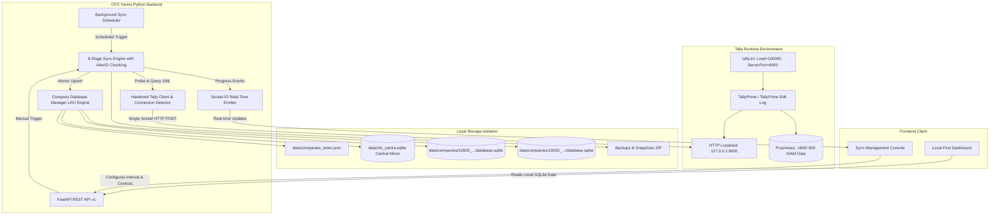

# CFO Yantra — Automatic Tally Data Fetching Architecture

## 1. Architectural Overview

CFO Yantra's automatic synchronization system bridges TallyPrime's proprietary accounting environment with a high-performance, local-first analytics dashboard.



---

## 2. Data Access Modes & Fallback Hierarchy

### Mode Hierarchy
1. **Primary Sync Channel (Mode B - Background / Active Connector):**
   - When Tally is running (whether visible on desktop or minimized in background) and port 9000 is open.
   - Scheduler executes non-blocking incremental sync queries using `AlterID` filtering and date chunking.
   - Upserts into dedicated `database.sqlite` per company.
2. **Offline Fallback Channel (Mode C - Local-First SQLite Serving):**
   - When Tally is closed or unreachable.
   - Sync engine detects connection refusal, halts without mutating records, logs error, and schedules retry with exponential backoff.
   - Dashboard serves previously synchronized data directly from `database.sqlite`.
   - API returns freshness metadata: `isStale: true`, `sourceStatus: "OFFLINE"`, `isLocalAvailable: true`, `lastSyncTime`.
3. **Direct File Reading (Mode A - Evaluated & Restricted):**
   - Direct access to proprietary `.900`/`.1800` binary files is strictly prohibited to prevent data corruption.
   - Local file access is exclusively used on CFO Yantra's own SQLite databases, snapshots, and JSON metadata.

---

## 3. Background Scheduler Architecture

### Core Responsibilities
- **Periodic Triggering:** Runs as an asynchronous background loop inside the FastAPI lifespan (`app/services/sync/scheduler.py`).
- **Interval Control:** Global default configured via `TALLY_AUTO_SYNC_INTERVAL_MINUTES` (default: 15 minutes), with per-company override support.
- **Concurrency & Overlap Prevention:** Uses per-company `asyncio.Lock()` to ensure that a company is never synced concurrently by multiple jobs.
- **Idempotent Retry Policy:**
  - On network/connection error: retries with exponential backoff (`30s`, `60s`, `120s`) up to `TALLY_AUTO_SYNC_MAX_RETRIES` (default: 3).
  - On non-retryable errors (e.g. malformed data), pauses retry and logs error.
- **State Persistence:**
  - Persists scheduler state, last run, and next scheduled execution to `sync_state.json` and `sync_states` table.
- **Control Interface:**
  - Endpoints to pause, resume, enable, disable, and trigger immediate synchronization.

---

## 4. Company-Wise Database Isolation & Transaction Design

### Database Layout
```text
data/
├── cfo_yantra.sqlite            # Central catalog mirror & index
├── companies_index.json         # Master registry
└── companies/
    └── {comp_num}_{comp_name}/
        ├── database.sqlite      # Physically isolated company database
        ├── sync_state.json      # Checkpoints, AlterID, status
        ├── sync_log.json        # Structured execution history
        ├── company.json         # Company metadata profile
        ├── sync/
        │   ├── sync-state.json
        │   └── sync-errors.log
        ├── sync_snapshots/      # Raw XML payloads preserved with timestamp
        └── backups/             # Automatic post-sync ZIP archives
```

### Transaction & Recovery Workflow
1. **Job Initialization:** Create run identifier (`run_id = sync_{cid}_{timestamp}`) and set status to `IN_PROGRESS`.
2. **Pre-flight Health Check:** Probe Tally connectivity. If port 9000 is closed, immediately abort without mutating database tables.
3. **Staged Extraction:** Run 8-stage pipeline (`CM`, `CMGRP`, `IM`, `IMGRP`, `SPCD`, `BPBR`, `LEDGER`, `COA`, `VOA`).
4. **Isolated Transactions:**
   - Execute bulk upserts inside dedicated transaction on `database.sqlite`.
   - If a batch fails, rollback the transaction on the company database.
   - Only after successful commit on the company database, update the central mirror.
5. **Durable Checkpointing:**
   - Update `maxAlterId` and `lastSuccessAt` only AFTER transaction commit.
   - If an unexpected crash occurs mid-sync, previous committed checkpoints remain valid; subsequent runs will resume from the last valid `maxAlterId`.

---

## 5. Security & Isolation Safeguards

1. **Company Scope Enforcement:** All routes validate `companyId` against directory traversal (`..`, slashes, absolute paths).
2. **Strict Read-Only XML Firewall:** Requests sent to Tally pass through `_validate_read_only()` to prevent any accidental write mutations.
3. **No Credential Leaks:** Database paths, internal stack traces, and system files are sanitized before returning API error responses.
4. **Backup Security:** ZIP restore validates manifest `companyId` to prevent restoring Company A's backup into Company B's directory.

---

## 6. Deployment & Service Configuration

### Unattended Tally Execution Configuration (`tally.ini`)
To allow automatic background synchronization without manual UI clicks:
```ini
;; TallyPrimeEditLog Configuration
[Tally]
User TDL=Yes
Load=100000
ShowDashboardOnCompanyLoad=No
Client Server=Both
ServerPort=9000
Enable ODBC Server=Yes
```

### Environment Variables (`.env`)
```bash
# Auto Sync Scheduler
TALLY_AUTO_SYNC_ENABLED=true
TALLY_AUTO_SYNC_INTERVAL_MINUTES=15
TALLY_AUTO_SYNC_MAX_RETRIES=3
TALLY_AUTO_SYNC_BACKOFF_SECONDS=30

# Tally Gateway Loopback
TALLY_HOST=127.0.0.1
TALLY_PORT=9000
TALLY_TIMEOUT_MS=120000
TALLY_PROBE_TIMEOUT_MS=5000
```
