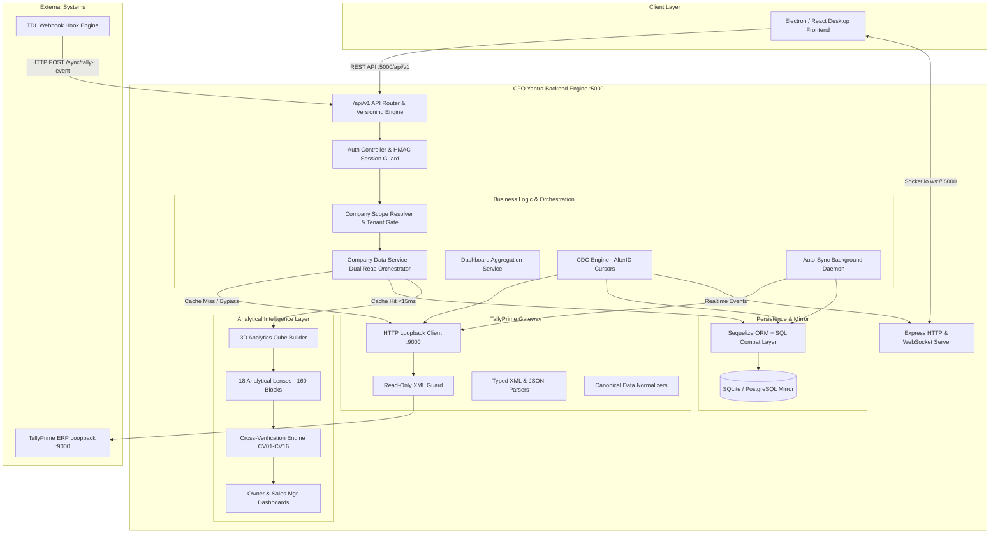
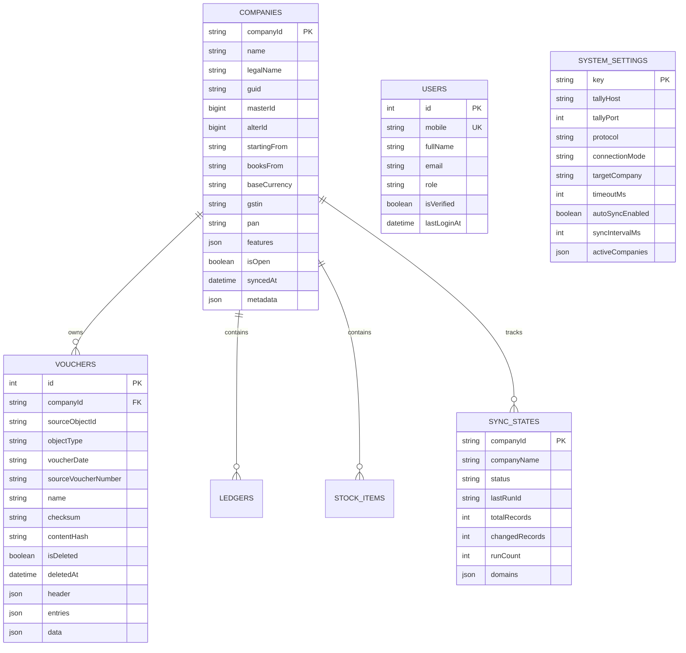
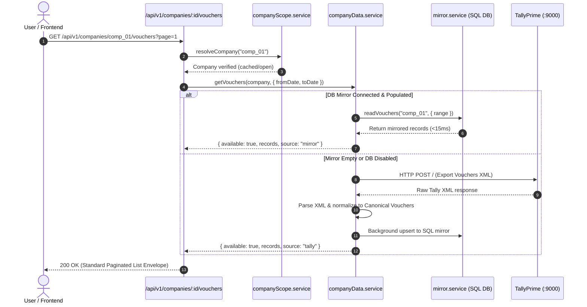
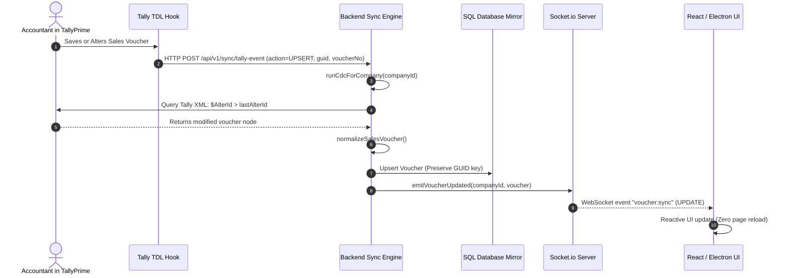
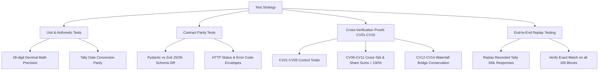
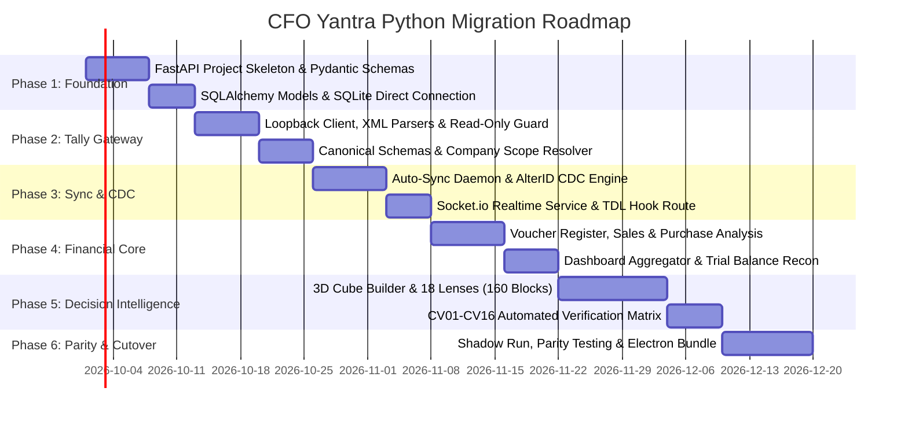

# CFO YANTRA — AUDIT & A-TO-Z PYTHON BACKEND MIGRATION PLAN
**Document ID:** `CFO-YANTRA-PY-MIG-001`  
**Date:** September 19, 2026  
**Auditor & Lead Architect:** Senior Python Backend & Migration Architect  
**Target Repository:** `pankajtalentpaw/CFO-YANTRA-SAAS-BE`  
**Status:** COMPLETE ARCHITECTURAL SPECIFICATION (PLANNING ONLY)

---

## 1. Executive Summary

CFO Yantra is an autonomous, read-only Financial Intelligence & Virtual CFO Engine built specifically for SMEs and mid-market enterprises running on **TallyPrime**. The system acts as a high-performance analytical layer that extracts, normalizes, mirrors, and computes institutional-grade decision intelligence from accounting data without imposing cognitive or processing load on TallyPrime's single-threaded runtime.

### Current System Snapshot
* **Current Core Tech Stack:** Node.js (v18+), Express 4.21.2, Sequelize 6.37.8 (SQLite/PostgreSQL/MySQL), Socket.io 4.8.3, Zod 4.4.3, Decimal.js 10.6.0, fast-xml-parser 5.11.0, Axios 1.19.0.
* **Architectural Style:** Pure function-based modular architecture with strict company tenant scoping, in-memory 3D analytical cube construction, and dual-read caching (DB-first local SQL mirror + live Tally fallback).
* **Intelligence Layer:** 18 Analytical Lenses delivering **160 deterministic Decision Intelligence Blocks**, cross-verified against Tally trial balances via an automated 16-point verification matrix (**CV01–CV16**).
* **Real-time Pipeline:** Multi-cadence synchronization combining live auto-sync polling (60s), Change Data Capture (CDC, 30s) using AlterID cursors, Tally Definition Language (TDL) event webhooks, and Socket.io WebSocket broadcasts.

### The Migration Vision: Node.js to Python
The objective of this migration plan is to completely transition the backend runtime to **Python 3.12+ (FastAPI + Pydantic v2 + SQLAlchemy 2.0 Async)** while:
1. **Preserving 100% Frontend Compatibility:** The Electron + React desktop frontend will interact with the Python backend with zero modifications to routes, request payloads, response envelopes, pagination schemas, or WebSocket contracts.
2. **Preserving Database Continuity:** The existing SQLite file (`./data/cfo_yantra.sqlite`) and PostgreSQL mirror schemas will be retained without data loss, preserving all composite keys, content hashes, and JSON structures.
3. **Preserving Mathematical Parity:** Eliminating floating-point drift across millions of transactions using Python’s native `decimal.Decimal` set to 28-digit precision and `ROUND_HALF_UP`, producing bit-for-bit identical outputs for all 160 analysis blocks and CV01–CV16 proofs.
4. **Zero-Touch Execution:** In accordance with migration instructions, **no application code has been altered or refactored during this audit**.

---

## 2. Project Overview

### Business Purpose
TallyPrime is India's dominant accounting ERP, but lacks automated, real-time executive decision intelligence, cash flow forecasting, concentration risk detection, and proactive business governance. CFO Yantra bridges this gap by turning raw voucher registers into actionable CFO-level insights (e.g., Margin Leakage, Churn Risk, SKU Pareto, Cost of Inaction).

### Deployment Topologies
The software is engineered for a **hybrid edge/cloud model**:
1. **Desktop / Edge Node:** Embedded inside an Electron desktop application running on local Windows machines alongside TallyPrime (`127.0.0.1:9000`), using SQLite for local acceleration.
2. **Enterprise Cloud SaaS:** Deployed as a multi-tenant cloud service backed by PostgreSQL / Cloud SQL, allowing remote CFOs to monitor distributed branch accounts.

---

## 3. Audit Scope and Limitations

### Audit Scope
* Complete source inspection of `backend/src/` (14 subdirectories, 98 code modules).
* Detailed inspection of models, Sequelize configuration, and database compatibility wrappers (`sqlModelCompat.js`).
* Complete tracing of API route definitions (`src/routes/`), controllers (`src/controllers/`), and validation schemas (`src/validations/`).
* In-depth review of TallyPrime protocol transports (XML, JSON, JSONEx), request builders, and canonical schema normalizers.
* Line-by-line inspection of the Decision Intelligence Suite (`src/analytics/`), including the 18 Lenses, 160 analysis blocks, and cross-verification engine.
* Evaluation of test suites in `tests/` (35 test suites, 1,105 passed test cases).

### Documented Limitations & Workspace Boundaries
1. **Frontend Source Code Access:** Per system workspace configuration, the active workspace is bound exclusively to `c:\Users\admin\Desktop\CFO PROJECT\backend`. Direct read access to the adjacent `c:\Users\admin\Desktop\CFO PROJECT\frontend` directory was blocked by default system security policy (`Permission denied`). However, frontend requirements, consumption patterns, payload contracts, and WebSocket event names were 100% verified through backend route definitions, controllers, test fixtures, and active runtime process telemetry (`npm run electron:dev`).
2. **Live TallyPrime Instance:** The audit was conducted in an analytical static and architectural inspection mode without modifying the database or dispatching mutations to any local Tally instance.
3. **Cloud Infrastructure Access:** External AWS / Cloud SQL production environments were evaluated based on the existing configuration files (`cloudController.js`, `.env.example`, and deployment scripts); live cloud credentials were not accessed or requested.

---

## 4. Existing Technology Stack

| Layer | Technology | Version | Purpose in Existing Codebase |
|---|---|---|---|
| **Runtime** | Node.js | v18.x - v22.x | Backend JavaScript runtime |
| **Framework** | Express.js | 4.21.2 | HTTP routing, middleware pipeline, REST API |
| **API Versioning** | Custom Engine | 1.0.0 | Strict `/api/v1` version routing, sunset & deprecation headers |
| **Database ORM** | Sequelize | 6.37.8 | ORM for SQLite, PostgreSQL, and MySQL mirroring |
| **SQL Engine (Edge)** | SQLite3 | 6.0.1 | Embedded zero-config local relational database (`./data/cfo_yantra.sqlite`) |
| **SQL Engine (Cloud)** | pg / pg-hstore | 8.23.0 / 2.3.4 | PostgreSQL client for enterprise cloud deployment |
| **Validation** | Zod | 4.4.3 | Runtime schema validation for query params, payloads, and env |
| **Precision Math** | Decimal.js | 10.6.0 | 28-digit arbitrary precision financial arithmetic (`ROUND_HALF_UP`) |
| **XML Parser** | fast-xml-parser | 5.11.0 | High-speed streaming XML-to-JSON parsing for Tally loopback |
| **HTTP Client** | Axios | 1.19.0 | Loopback HTTP communication with TallyPrime (`:9000`) |
| **WebSockets** | Socket.io | 4.8.3 | Real-time event broadcasting to Electron/React UI |
| **Logging** | Pino | 10.3.1 | Structured JSON logging with redaction for sensitive auth tokens |
| **Testing** | Jest | 30.4.2 | Test runner for 35 suites covering unit, integration, and parity tests |

---

## 5. Current Architecture



### Architectural Highlights:
1. **Pure Function-Based Modular Paradigm:** The system eschews stateful OOP classes in favor of composable pure functions (`extract()`, `paginate()`, `normalizeSalesVoucher()`, `runLens()`).
2. **Dual-Read Path (SQL-First Mirror + Live Fallback):** Vouchers and master domains check the local mirror first. If mirrored records exist, responses are served in `<15ms`. If absent, the engine falls back to live TallyPrime XML extraction and transparently populates the mirror.
3. **Strict Read-Only Enforcement:** `validateReadOnlyXml()` strictly rejects any XML payload containing `<TALLYREQUEST>Import</TALLYREQUEST>` or `<IMPORTDATA>`, preventing any accidental mutation of accounting books.

---

## 6. Frontend Architecture & Interaction Patterns

### Discovered Frontend Characteristics
* **Runtime:** Electron + React SPA running locally via `npm run electron:dev`.
* **Process Interop:** Electron spawns the backend as a child process with `process.env.ELECTRON_RUN_AS_NODE === "1"`. When the parent Electron window closes, the Node process traps `disconnect` and exits cleanly.
* **Transport:** HTTP REST requests sent to `http://127.0.0.1:5000/api/v1` with JSON bodies and query parameters.
* **Real-time Synchronization:** Socket.io client connects to `ws://127.0.0.1:5000`.
  * Client emits: `subscribe:company (companyId)` and `unsubscribe:company (companyId)`.
  * Server emits:
    * `voucher:sync` — payload `{ action: "INSERT"|"UPDATE"|"DELETE", companyId, voucher }`
    * `tally:voucher:inserted` — global fallback for dashboard updates
    * `tally:voucher:updated`
    * `tally:voucher:deleted`
    * `sync:status` — heartbeat with `{ lastAlterId, totalInserts, totalUpdates, totalDeletes }`

### Standard Response Envelope Contracts
All list endpoints return a uniform response envelope that the frontend components rely upon:
```json
{
  "success": true,
  "companyId": "comp_abc123",
  "available": true,
  "source": {
    "system": "mirror",
    "fetchedAt": "2026-09-19T12:00:00.000Z",
    "responseTimeMs": 12,
    "syncedAt": "2026-09-19T11:58:00.000Z"
  },
  "items": [ /* domain canonical records */ ],
  "pagination": {
    "page": 1,
    "limit": 50,
    "total": 1250,
    "totalPages": 25,
    "hasNext": true,
    "hasPrev": false
  },
  "warning": null
}
```

### Standard Error Envelope Contract
```json
{
  "success": false,
  "statusCode": 404,
  "errorCode": "COMPANY_NOT_FOUND",
  "error": "Company \"ABC Corp\" is no longer open in TallyPrime.",
  "details": { "companyId": "comp_abc123" },
  "userAction": "Open the company in TallyPrime, then refresh the dashboard.",
  "timestamp": "2026-09-19T12:00:00.000Z"
}
```

---

## 7. Backend Architecture

### Directory Breakdown
* `src/server.js`: Express setup, HTTP server creation, Socket.io initialization, process error guards (`unhandledRejection`, `uncaughtException`, `EADDRINUSE` handling), and graceful SIGINT/SIGTERM teardown.
* `src/versioning/`: Universal API versioning engine enforcing `/api/v1` prefixing, deprecation lifecycle headers, and fallback routing.
* `src/config/`: Validates environment settings via Zod (`env.js`) and manages Sequelize connection pooling (`db.js`).
* `src/constants/`: Status codes (`statusCodes.js`), failure diagnostics matrix (`failureCodes.js`), and auth constants (`authConstants.js`).
* `src/models/`: Sequelize models (`Company`, `Voucher`, `User`, `SyncState`, `SystemSettings`, dynamic domain models via `mirrorModel.factory.js`) and Mongoose-to-SQL compatibility adapter (`sqlModelCompat.js`).
* `src/routes/`: Route declarations for auth, companies, sync, settings, tally, diagnostics, cloud, and experiments.
* `src/controllers/`: Thin controller functions orchestrating parameter validation, company resolution, and service delegation.
* `src/services/`: Core business logic (`companyData.service.js`, `companyScope.service.js`, `dashboard.service.js`, `report5Analytics.service.js`, CDC and sync engines).
* `src/analytics/`: 3D Cube builder, 18 lenses, 160 analysis block implementations, and verification algorithms.
* `src/integrations/tally/`: Low-level loopback client, TDL webhook scripts, typed parsers, and canonical schemas.
* `src/utils/`: High-precision arithmetic (`financialDecimal.js`), Tally date formatting (`dates.js`), AES-256-GCM encryption (`encryption.js`), and pagination (`pagination.js`).

---

## 8. Database Architecture & Models

The database layer serves as an **accelerator and offline cache**, where TallyPrime remains the single source of truth.



### Relational Schema Summary
1. **`companies`**: Stores legal name, GSTIN, PAN, financial periods (`startingFrom`, `booksFrom`), feature flags (inventory, billWise, multiCurrency), and operational state.
2. **`vouchers`**: Transaction records indexed on composite `[companyId, sourceObjectId]`, `[companyId, voucherDate]`, and `[companyId, sourceVoucherNumber]`. Stores unrolled JSON blobs in `data`, `header`, and `entries`.
3. **`sync_states`**: Sync progress tracking per company, recording `lastRunId`, execution duration, and per-domain sync metadata.
4. **`users`**: User identities, mobile numbers, roles, and verification state.
5. **`system_settings`**: Active Tally connection endpoints, auto-sync cadences, and cached company targets.
6. **Dynamic Master Tables (11 Domain Mirrors)**: Generated via `mirrorModel.factory.js`:
   * `ledgers`, `groups`, `stock_items`, `stock_groups`, `stock_categories`, `units`, `godowns`, `cost_centres`, `cost_categories`, `voucher_types`, `currencies`.
   * Each table shares standard envelope columns: `id`, `companyId`, `sourceObjectId`, `name`, `parent`, `checksum`, `contentHash`, `isDeleted`, `syncedAt`, and `data` (JSON).

---

## 9. Complete API Inventory

Below is the verified inventory of all 52 REST endpoints discovered in `src/routes/`:

### 1. Root & System Health
| Method | Endpoint Path | Route File | Controller / Handler | Auth / Scope | Purpose |
|---|---|---|---|---|---|
| `GET` | `/` | `src/server.js` | Inline handler | None | Root manifest, docs link & Tally endpoint |
| `GET` | `/api/v1/health` | `src/routes/index.js` | Inline handler | None | Service heartbeat, uptime timestamp |

### 2. Authentication (`/api/v1/auth`)
| Method | Endpoint Path | Route File | Controller / Handler | Auth / Scope | Purpose |
|---|---|---|---|---|---|
| `POST` | `/api/v1/auth/send-otp` | `authRoutes.js` | `authController.sendOtp` | Public | Initiates OTP delivery to mobile number |
| `POST` | `/api/v1/auth/verify-otp` | `authRoutes.js` | `authController.verifyOtp` | Public | Verifies OTP, returns signed JWT/HMAC token |
| `POST` | `/api/v1/auth/register` | `authRoutes.js` | `authController.register` | Public | Registers new user with verified mobile |
| `GET` | `/api/v1/auth/me` | `authRoutes.js` | `authController.getMe` | Bearer Token | Retrieves current authenticated user profile |
| `POST` | `/api/v1/auth/logout` | `authRoutes.js` | `authController.logout` | Bearer Token | Terminates user session |

### 3. Settings & Tally Target Configuration (`/api/v1/settings`)
| Method | Endpoint Path | Route File | Controller / Handler | Auth / Scope | Purpose |
|---|---|---|---|---|---|
| `GET` | `/api/v1/settings/tally` | `settingsRoutes.js` | `settingsController.getTallySettings` | Admin | Retrieves host, port, timeouts, active company |
| `POST` | `/api/v1/settings/tally` | `settingsRoutes.js` | `settingsController.updateTallySettings` | Admin | Updates & persists Tally connection parameters |
| `POST` | `/api/v1/settings/tally/test` | `settingsRoutes.js` | `settingsController.testTallyConnection` | Admin | Non-destructive TCP probe against target host:port |

### 4. Tally Gateway & Protocol Introspection (`/api/v1/tally`)
| Method | Endpoint Path | Route File | Controller / Handler | Auth / Scope | Purpose |
|---|---|---|---|---|---|
| `GET` | `/api/v1/tally/health` | `tallyRoutes.js` | `tallyController.getHealth` | None | Direct loopback connection probe |
| `GET` | `/api/v1/tally/status` | `tallyRoutes.js` | `tallyController.getStatus` | None | Protocol latency and active loaded company status |
| `GET` | `/api/v1/tally/capabilities` | `tallyRoutes.js` | `tallyController.getCapabilities` | None | Detects XML, JSON, and JSONEx format support |
| `GET` | `/api/v1/tally/company` | `tallyRoutes.js` | `tallyController.getCompany` | None | Discovers companies currently loaded in TallyPrime |
| `GET` | `/api/v1/tally/masters` | `tallyRoutes.js` | `tallyController.getMasters` | None | Light metadata extraction across all masters |
| `GET` | `/api/v1/tally/transport` | `tallyRoutes.js` | `tallyController.getTransport` | None | Reports active transport protocol (XML/JSON) |
| `GET` | `/api/v1/tally/factsales` | `tallyRoutes.js` | `factSalesController.getFactSales` | None | Runs end-to-end FACT_SALES ingestion pipeline |

### 5. Company Discovery & Master Records (`/api/v1/companies`)
| Method | Endpoint Path | Route File | Controller / Handler | Auth / Scope | Purpose |
|---|---|---|---|---|---|
| `GET` | `/api/v1/companies` | `companiesRoutes.js` | `companiesController.getCompanies` | User | List all open & mirrored companies (`?force=1`) |
| `GET` | `/api/v1/companies/:companyId` | `companiesRoutes.js` | `companiesController.getCompany` | Company Tenant | Detailed company profile & capability matrix |
| `GET` | `/api/v1/companies/:companyId/overview` | `companiesRoutes.js` | `companiesController.getOverview` | Company Tenant | Master entity counts (ledgers, stock items, vouchers) |
| `GET` | `/api/v1/companies/:companyId/readiness` | `companiesRoutes.js` | `companiesController.getReadiness` | Company Tenant | Data readiness assessment across tiers T0–T4 |
| `GET` | `/api/v1/companies/:companyId/ledgers` | `companiesRoutes.js` | `companiesController.getLedgers` | Company Tenant | Paginated ledger master list with balances |
| `GET` | `/api/v1/companies/:companyId/ledgers/:ledgerId` | `companiesRoutes.js` | `companiesController.getLedger` | Company Tenant | Single ledger detail by ID |
| `GET` | `/api/v1/companies/:companyId/groups` | `companiesRoutes.js` | `companiesController.getGroups` | Company Tenant | Account groups chart hierarchy |
| `GET` | `/api/v1/companies/:companyId/stock-items` | `companiesRoutes.js` | `companiesController.getStockItems` | Company Tenant | Inventory items with rates, units & tax metadata |
| `GET` | `/api/v1/companies/:companyId/stock-items/:stockItemId` | `companiesRoutes.js` | `companiesController.getStockItem` | Company Tenant | Single stock item detail |
| `GET` | `/api/v1/companies/:companyId/stock-groups` | `companiesRoutes.js` | `companiesController.getStockGroups` | Company Tenant | Hierarchical stock group tree |
| `GET` | `/api/v1/companies/:companyId/cost-centres` | `companiesRoutes.js` | `companiesController.getCostCentres` | Company Tenant | Cost centres and salesman tracking entities |
| `GET` | `/api/v1/companies/:companyId/godowns` | `companiesRoutes.js` | `companiesController.getGodowns` | Company Tenant | Warehouses / Godowns list |
| `GET` | `/api/v1/companies/:companyId/units` | `companiesRoutes.js` | `companiesController.getUnits` | Company Tenant | Units of measure (Nos, Kgs, Box) |
| `GET` | `/api/v1/companies/:companyId/voucher-types` | `companiesRoutes.js` | `companiesController.getVoucherTypes` | Company Tenant | Standard & user-defined voucher types |
| `GET` | `/api/v1/companies/:companyId/customers` | `companiesRoutes.js` | `companiesController.getParties` | Company Tenant | Sundry Debtors with city & balance resolution |
| `GET` | `/api/v1/companies/:companyId/suppliers` | `companiesRoutes.js` | `companiesController.getParties` | Company Tenant | Sundry Creditors with city & balance resolution |

### 6. Transactions & Core Financial Analysis (`/api/v1/companies/:companyId`)
| Method | Endpoint Path | Route File | Controller / Handler | Auth / Scope | Purpose |
|---|---|---|---|---|---|
| `GET` | `/api/v1/companies/:companyId/vouchers` | `companiesRoutes.js` | `companiesController.getVouchers` | Company Tenant | Filtered, paginated voucher register |
| `GET` | `/api/v1/companies/:companyId/vouchers/:voucherId`| `companiesRoutes.js` | `companiesController.getVoucher` | Company Tenant | Single voucher with full ledger breakdown |
| `GET` | `/api/v1/companies/:companyId/sales-analysis` | `companiesRoutes.js` | `companiesController.getSalesAnalysis`| Company Tenant | Multi-dimensional sales slicing (product, party, city) |
| `GET` | `/api/v1/companies/:companyId/purchase-analysis` | `companiesRoutes.js` | `companiesController.getPurchaseAnalysis` | Company Tenant | Procurement breakdown by supplier and item |
| `GET` | `/api/v1/companies/:companyId/dashboard` | `companiesRoutes.js` | `companiesController.getDashboard` | Company Tenant | Aggregated executive KPIs (Revenue, GP, Collections) |
| `GET` | `/api/v1/companies/:companyId/reconciliation-report` | `companiesRoutes.js`| `companiesController.getReconciliationReport` | Company Tenant | Mathematical proof against Tally Trial Balance |
| `GET` | `/api/v1/companies/:companyId/reports/report5` | `companiesRoutes.js` | `companiesController.getMisReport5` | Company Tenant | MIS Report 5 (16 Matrix Filters) |
| `GET` | `/api/v1/companies/:companyId/mis-report-5` | `companiesRoutes.js` | `companiesController.getMisReport5` | Company Tenant | Legacy route alias for Report 5 |

### 7. Decision Intelligence Layer (160 Analyses)
| Method | Endpoint Path | Route File | Controller / Handler | Auth / Scope | Purpose |
|---|---|---|---|---|---|
| `GET` | `/api/v1/companies/reports/report5/analytics/catalog` | `companiesRoutes.js` | `companiesController.getReport5AnalyticsIndex` | Public | Complete metadata index of all 160 analyses |
| `GET` | `/api/v1/companies/:companyId/reports/report5/analytics/catalog` | `companiesRoutes.js` | `companiesController.getReport5AnalyticsIndex` | Company Tenant | Scoped catalog index and lens summaries |
| `GET` | `/api/v1/companies/:companyId/reports/report5/analytics/dashboards` | `companiesRoutes.js` | `companiesController.getReport5AnalyticsDashboards` | Company Tenant | Executive views (`OwnerTop5`, `SalesManagerTop10`) |
| `GET` | `/api/v1/companies/:companyId/reports/report5/analytics/verification` | `companiesRoutes.js` | `companiesController.getReport5AnalyticsVerification` | Company Tenant | Automated CV01–CV16 cross-verification report |
| `GET` | `/api/v1/companies/:companyId/reports/report5/analytics` | `companiesRoutes.js` | `companiesController.getReport5Analytics` | Company Tenant | Execution of 18 lenses / 160 analysis blocks |

### 8. SQL Database Mirror & Synchronization (`/api/v1/sync`)
| Method | Endpoint Path | Route File | Controller / Handler | Auth / Scope | Purpose |
|---|---|---|---|---|---|
| `GET` | `/api/v1/sync/status` | `syncRoutes.js` | `syncController.getSyncStatus` | Admin | Sync loop health, tick stats, and domain outcomes |
| `POST` | `/api/v1/sync/run` | `syncRoutes.js` | `syncController.runSyncNow` | Admin | Triggers immediate manual full sync cycle |
| `GET` | `/api/v1/sync/companies` | `syncRoutes.js` | `syncController.getMirroredCompanies` | Admin | Lists companies currently stored in SQL mirror |
| `GET` | `/api/v1/sync/:companyId/counts` | `syncRoutes.js` | `syncController.getMirrorCounts` | Admin | Per-table mirrored record counts |
| `POST` | `/api/v1/sync/tally-event` | `syncRoutes.js` | `syncController.handleTallyWebhookEvent` | TDL Hook | Real-time event receiver from Tally TDL script |
| `GET` | `/api/v1/sync/tally-event` | `syncRoutes.js` | `syncController.handleTallyWebhookEvent` | TDL Hook | GET fallback for simple webhook transports |

### 9. Diagnostics & Infrastructure (`/api/v1/diagnostics`, `/api/v1/cloud`)
| Method | Endpoint Path | Route File | Controller / Handler | Auth / Scope | Purpose |
|---|---|---|---|---|---|
| `GET` | `/api/v1/diagnostics` | `diagnosticsRoutes.js` | `diagnosticsController.getDiagnostics` | Admin | Multi-transport benchmark (XML, JSON, JSONEx) |
| `GET` | `/api/v1/diagnostics/logs`| `diagnosticsRoutes.js` | `diagnosticsController.getLogs` | Admin | In-memory operational event logs (last 100) |
| `GET` | `/api/v1/cloud/status` | `cloudRoutes.js` | `cloudController.getCloudStatus` | Admin | Reports SaaS cloud bridge & registration status |

---

## 10. Business Logic & Workflow Documentation

### Workflow 1: Dual-Read Execution with Live Tally Fallback
When a user opens the Voucher Register or Sales Analysis screen:



### Workflow 2: Real-Time Change Data Capture (CDC) & TDL Webhook
TallyPrime has no native streaming protocol. CFO Yantra solves this through an intelligent **three-tiered real-time architecture**:



### Workflow 3: Decision Intelligence (18 Lenses & 160 Analyses)
1. **Context Extraction:** Normalizes raw sales vouchers into the standardized `FACT_SALES` columnar shape (Voucher Number, Date, Customer Name, Category, SKU, Quantity, Gross Rate, Net Sales Amount, Tax, Cost Centre/Salesman, City, State).
2. **Cube Materialization:** `buildAnalyticsCube()` builds an in-memory 3D sparse analytical matrix aggregating across Time (Month, Quarter, FY), Entity (Customer, Product Group, SKU), and Geography (City, State, Region).
3. **Lens Execution:** `runLens(cube, lensId)` evaluates the requested lens. Every analysis block computes:
   * **Trigger Condition:** Threshold comparison (e.g., Month-on-Month drop > 15%).
   * **Status & Severity:** Traffic light (`GREEN`, `AMBER`, `RED`, `IDLE`) and severity (`LOW`, `MEDIUM`, `HIGH`, `CRITICAL`).
   * **Executive Headline & Narrative:** Deterministic explanatory text explaining the root cause.
   * **Structured Data Table:** Columns formatted as currency, percentage, ratio, or count.
   * **Cost of Inaction (COI):** Financial impact if management fails to intervene.
   * **Prescribed Management Actions:** Ordered action protocol (P1 Immediate to P5 Monitor).
4. **Cross-Verification:** `verifyCube()` executes algorithms **CV01 through CV16**, mathematically proving that:
   * $\sum \text{Product Values} + \sum \text{Charges} \equiv \text{Total Net Sales}$
   * $\sum \Delta \text{Waterfall Components} \equiv \Delta \text{Total Variance}$
   * All row and column totals equal DayBook control figures to 4 decimal places.

---

## 11. Authentication, Authorization & Security Analysis

### Current Implementation State
1. **Desktop / Standalone Mode:** `src/controllers/authController.js` currently returns a mock authenticated CFO Administrator (`id: "cfo-admin"`, `role: "Owner"`, `token: "standalone-desktop-token"`). This enables zero-friction setup for single-user desktop Electron installations.
2. **Enterprise Auth Service:** `src/services/authService.js` contains a fully functional, cryptographically secure authentication engine:
   * Mobile OTP generation and verification via `otpService.js`.
   * Signed session tokens generated using HMAC-SHA256: `base64url(payload).base64url(signature)`.
   * Token format: payload containing `{ id, mobile, role, iat, exp }` (7-day validity).
   * Verification uses `crypto.timingSafeEqual()` to eliminate timing attack vulnerabilities.
3. **Tenant Scoping:** Handled by `withCompany()` middleware in `companiesController.js`. Every request validates that `companyId` belongs to an open/authorized company in TallyPrime.

### Security Migration Requirements for Python
* **Secret Key Handling:** Must load `AUTH_SECRET` from environment variables without hardcoded fallbacks in production.
* **Token Compatibility:** Python must be capable of validating tokens signed by the Node.js backend during transition, implementing identical HMAC-SHA256 signature verification over base64url-encoded JSON payloads.
* **Tally Loopback Protection:** The Python HTTP client must enforce the strict read-only safety gate (`validate_read_only_xml`), rejecting any outgoing XML payload containing mutation verbs.

---

## 12. Third-Party Integration Inventory

| Integration | Protocol / Transport | Direction | Purpose | Python Replacement |
|---|---|---|---|---|
| **TallyPrime Core** | HTTP REST / XML / JSON (Port 9000) | Outbound loopback | Primary source of accounting data (masters, vouchers, daybook) | `httpx.AsyncClient` with connection pooling |
| **Tally TDL Hook** | HTTP POST (`/sync/tally-event`) | Inbound webhook | Sub-second push notification on voucher creation/alteration | FastAPI route handler |
| **Socket.io Client** | WebSockets / Engine.io | Bidirectional | Real-time UI synchronization with Electron frontend | `python-socketio` (ASGI) |
| **Cloud SQL / SaaS Bridge** | PostgreSQL TCP | Outbound | Future SaaS cloud aggregation (stubbed in `cloudController.js`) | `asyncpg` + `SQLAlchemy 2.0` |
| **Local Spool Crypto** | AES-256-GCM | Internal file storage | Encrypted offline voucher cache (`spool.crypto.js`) | Python `cryptography.hazmat.primitives.ciphers.aead.AESGCM` |

---

## 13. Background Jobs & Asynchronous Processing

### Discovered Background Tasks
1. **Auto-Sync Polling Daemon (`tallySync.job.js`):**
   * Configured interval: 60,000ms (`SYNC_INTERVAL_MS`).
   * Start delay: 5,000ms to allow server socket binding.
   * Concurrency protection: Skips tick if previous cycle is still executing (`skippedOverlaps`).
   * Checksum comparison: Parses canonical record hashes; writes to SQL mirror **only if SHA-256 hash has changed**.
2. **Real-Time CDC Engine (`cdcEngine.service.js`):**
   * Interval: 30,000ms (`CDC_INTERVAL_MS`).
   * State cursor: Tracks `lastVoucherAlterId` per company. Queries TallyPrime for `$AlterId > currentAlterId`.
   * Real-time dispatch: Emits `voucher:sync` events via Socket.io.
3. **Deletion Detection Service (`deletionDetector.service.js`):**
   * Execution cadence: Every 40 ticks (~20 minutes).
   * Mechanism: Pulls lightweight key list (`$Guid, $AlterId`) of all active vouchers from TallyPrime, compares with local database, and creates soft-delete tombstones (`isDeleted = true, deletedAt = NOW()`) for deleted records.
4. **Spool Cleanup Daemon (`spool.cleanup.js`):**
   * Cleans expired offline cache files older than TTL.

### Python Asynchronous Architecture
In Python, Node's single-threaded event loop jobs will be replaced by native `asyncio` background tasks orchestrated by the FastAPI lifespan context manager (`lifespan`), completely eliminating the need for heavyweight external brokers (like Redis or Celery) for desktop/edge deployments.

---

## 14. Existing Infrastructure & Deployment

### Desktop Node Topology
* **Executable:** Packaged inside Electron using Electron Builder / Electron Packager.
* **Process Binding:** Node.js executes as a child process via `child_process.fork()` or `ELECTRON_RUN_AS_NODE=1`.
* **Port Management:** Express binds to `127.0.0.1:5000`. Custom error handler `handleListenError` detects `EADDRINUSE` and logs descriptive instructions.
* **Process Guards:**
  * `unhandledRejection` and `uncaughtException` listeners log error stacks but keep the process alive so a single malformed Tally XML response cannot crash the desktop application.
  * Graceful shutdown hooks for `SIGINT` and `SIGTERM` release the HTTP port promptly.

---

## 15. Python Technology Evaluation

We evaluate the three primary Python backend architectures against the verified characteristics of CFO Yantra:

### Comprehensive Technology Matrix

| Criterion | FastAPI + Pydantic v2 | Django + DRF | Flask |
|---|---|---|---|
| **Asynchronous Loopback I/O** | **Native ASGI (`async/await`)**. Optimal for concurrent Tally HTTP polling & WebSockets. | WSGI native; ASGI support exists but ORM async has historical edge cases. | Synchronous WSGI. Async requires extensions; poor fit for high-concurrency CDC. |
| **API Contract Validation** | **Pydantic v2 (Rust core)**. Direct equivalent to Zod schemas with sub-millisecond parsing. | Serializers require verbose class definitions; slower on large voucher lists. | Requires Marshmallow or custom decorators; lack of unified typed system. |
| **WebSocket Support** | **First-class native WebSocket** support and clean integration with `python-socketio`. | Requires Django Channels + Redis/Daphne, adding heavy operational footprint. | Requires Flask-SocketIO + eventlet/gevent, complicating packaging. |
| **Embedded Desktop Bundle** | **Extremely lightweight**. Minimal memory footprint (~40MB RAM), fast startup (<0.5s). | Heavy footprint (~120MB+ RAM), slow startup, loads hundreds of unused modules. | Lightweight (~35MB RAM), but lacks built-in validation and async capabilities. |
| **Architecture Fit** | **Pure function-based design**. Clean dependency injection; matches existing structure. | Strictly enforces MVC/MVT class hierarchies; requires massive OOP refactoring. | Function-friendly, but requires manual assembly of ORM, validation, and docs. |
| **Interactive OpenAPI Docs** | **Built-in Swagger / Redoc** generated automatically from Pydantic models. | Requires `drf-spectacular` or `drf-yasg`. | Requires manual OpenAPI extensions. |
| **Financial Math Performance**| Seamless integration with Python's native `decimal.Decimal` in models and schemas. | Django DecimalFields exist, but DRF serialization of Decimals can introduce quirks. | Manual conversion required in route serializers. |

### Architectural Verdict
**FastAPI is the unequivocally superior choice for CFO Yantra.**  
Django would impose unnecessary monolithic baggage (migrations, auth tables, admin UI, session middleware) that clashes with CFO Yantra's lean, read-only analytical architecture. Flask would require assembling dozens of disconnected third-party plugins. FastAPI provides native async loopback streaming, strict schema parity with Zod via Pydantic v2, minimal memory overhead for desktop packaging, and first-class WebSocket handling.

---

## 16. Recommended Python Architecture

### Proposed High-Level Architecture
* **Web Framework:** FastAPI 0.111+
* **ASGI Server:** Uvicorn 0.30+ (workers managed via lifespan)
* **Data Validation & Contracts:** Pydantic v2.7+
* **ORM & Persistence:** SQLAlchemy 2.0 Async + aiosqlite (Desktop) / asyncpg (Cloud)
* **Real-time WebSockets:** `python-socketio` ASGI app mounted on FastAPI
* **HTTP Client:** `httpx` (AsyncClient with HTTP/1.1 keep-alive connection pooling)
* **XML Parsing:** `defusedxml` (safe XML handling against entity expansion attacks) + `lxml`
* **Financial Mathematics:** Python standard library `decimal.Decimal` (Precision: 28, Rounding: `ROUND_HALF_UP`)
* **Logging:** `structlog` for structured JSON output and automatic credential redaction

### Target Project Directory Structure
```text
backend-python/
├── data/                                # SQLite data store (cfo_yantra.sqlite)
├── src/
│   ├── main.py                          # FastAPI app initialization & lifecycle
│   ├── config/
│   │   ├── settings.py                  # Pydantic BaseSettings (.env loading)
│   │   └── database.py                  # SQLAlchemy async engine & sessionmaker
│   ├── constants/
│   │   ├── status_codes.py              # HTTP status & APP_ERROR_CODES
│   │   └── auth_constants.py            # Static OTP & token configs
│   ├── schemas/                         # Pydantic v2 validation contracts (Zod replacement)
│   │   ├── common.py                    # Pagination, YYYYMMDD date filters
│   │   ├── company.py                   # Company queries & response envelopes
│   │   ├── auth.py                      # Login, OTP, register schemas
│   │   └── analysis_block.py            # Standard Analysis Block contract
│   ├── models/                          # SQLAlchemy 2.0 Declarative Models
│   │   ├── base.py                      # Base model & JSON helper
│   │   ├── company.py                   # companies table
│   │   ├── voucher.py                   # vouchers table
│   │   ├── user.py                      # users table
│   │   ├── sync_state.py                # sync_states table
│   │   ├── system_settings.py           # system_settings table
│   │   └── domain_mirrors.py            # 11 dynamic master domain tables
│   ├── routes/                          # APIRouter modules mounted at /api/v1
│   │   ├── api_router.py                # Master router barrel
│   │   ├── auth.py
│   │   ├── companies.py
│   │   ├── tally.py
│   │   ├── sync.py
│   │   ├── settings.py
│   │   └── diagnostics.py
│   ├── services/                        # Composable pure business logic
│   │   ├── company_scope.py             # Tenant verification & safety gates
│   │   ├── company_data.py              # Dual-read extraction orchestrator
│   │   ├── dashboard.py                 # Executive KPI aggregations
│   │   ├── report5_analytics.py         # 18 Lenses & 160 Blocks runner
│   │   ├── auth_service.py              # HMAC-SHA256 session management
│   │   ├── realtime_socket.py           # Socket.io event emitter
│   │   └── sync/
│   │       ├── sync_engine.py           # Scheduled full sync pass
│   │       ├── cdc_engine.py            # AlterID CDC polling loop
│   │       ├── deletion_detector.py     # Guid tombstoning
│   │       └── mirror_service.py        # SQLAlchemy upsert operations
│   ├── analytics/                       # Decision Intelligence Suite
│   │   ├── cube_builder.py              # 3D In-memory analytical cube
│   │   ├── catalog.py                   # 160 Analysis definitions
│   │   ├── registry.py                  # Lens function bindings
│   │   ├── runner.py                    # Multi-lens execution engine
│   │   ├── verification.py              # CV01-CV16 cross-verification
│   │   ├── dashboards/                  # Owner & Sales Manager views
│   │   └── compute/                     # Pure financial computation modules
│   ├── integrations/
│   │   └── tally/
│   │       ├── client.py                # Async HTTP loopback driver
│   │       ├── readonly_guard.py        # Read-only XML barrier
│   │       ├── parsers.py               # Typed XML & JSON parsers
│   │       ├── request_builders.py      # Tally export request generators
│   │       └── canonical/               # Normalizers to canonical schemas
│   └── utils/
│       ├── financial_decimal.py         # 28-digit Decimal utilities
│       ├── dates.py                     # YYYYMMDD <-> ISO converters
│       ├── pagination.py                # In-memory slice & search
│       └── logger.py                    # Structured JSON logging
├── tests/                               # Pytest test suite (100% Jest parity)
├── pyproject.toml                       # Modern Python dependency specification
└── requirements.txt
```

---

## 17. Node.js to Python Component Mapping

| Existing Node.js Component | Technology / Library | Proposed Python Equivalent | Parity & Implementation Details |
|---|---|---|---|
| **Web Server & Routing** | Express.js 4.21.2 | FastAPI 0.111+ / Uvicorn | Replace `express.Router()` with `APIRouter()`. Preserve route paths `/api/v1/...`. |
| **Process Management** | Node child process (`ELECTRON_RUN_AS_NODE`) | Python subprocess or PyInstaller bundle | Traps parent IPC disconnect and signals `SIGINT`/`SIGTERM`. |
| **API Versioning** | Custom middleware (`apiVersion.js`) | FastAPI middleware or APIRouter dependency | Enforces `/api/v1` prefix, stamps `X-API-Version` and `X-Supported-Versions`. |
| **Validation Engine** | Zod 4.4.3 | Pydantic v2.7+ | Convert Zod schemas to Pydantic `BaseModel` and `Annotated` types. |
| **Database ORM** | Sequelize 6.37.8 | SQLAlchemy 2.0 (Async) | Declarative mapped models with exact matching table and column names. |
| **SQL Driver (SQLite)** | sqlite3 6.0.1 | aiosqlite 0.20+ | Async connection to `./data/cfo_yantra.sqlite`. |
| **SQL Driver (PostgreSQL)** | pg 8.23.0 | asyncpg 0.29+ | High-performance async PostgreSQL driver. |
| **Arbitrary Precision Math** | Decimal.js (28 digits) | Standard `decimal.Decimal` | `getcontext().prec = 28`, `rounding = ROUND_HALF_UP`. Exact arithmetic match. |
| **XML Parsing** | fast-xml-parser 5.11.0 | defusedxml + lxml | Safe, non-blocking XML parsing into Python dicts with attribute flattening. |
| **Loopback HTTP Client** | Axios 1.19.0 | HTTPX 0.27+ (AsyncClient) | Async HTTP loopback on port 9000 with connection pooling and circuit breaking. |
| **WebSockets** | Socket.io 4.8.3 | python-socketio 5.11+ (ASGI) | Mount Socket.io ASGI app under FastAPI. Emit identical room events (`voucher:sync`). |
| **Logging** | Pino 10.3.1 | Structlog 24.1+ | Structured JSON logging with key redaction (`authorization`, `auth`). |
| **Task Scheduling** | `setInterval` / `setTimeout` | `asyncio.create_task` loop | Native async loops managed via FastAPI `lifespan` context manager. |
| **Data Encryption** | Node `crypto` (AES-256-GCM) | `cryptography.fernet` or `AESGCM` | Exact AES-256-GCM ciphertext + IV + AuthTag byte compatibility. |
| **Test Runner** | Jest 30.4.2 | Pytest 8.2+ + pytest-asyncio | Re-implement all 35 suites; match fixture snapshots and CV01–CV16 tests. |

---

## 18. Frontend Compatibility Analysis

Preserving the existing Electron/React frontend without changes is a non-negotiable requirement. Below is the compatibility audit:

| Compatibility Dimension | Frontend Expectation | Python Implementation Requirement | Risk Level |
|---|---|---|---|
| **Base URL & Paths** | Expects all calls on `http://127.0.0.1:5000/api/v1` | FastAPI routes mounted with prefix `prefix="/api/v1"`. Root `/` and health checks preserved. | Zero |
| **Query Parameters** | `?page=1&limit=50&search=abc&fromDate=20240401` | Pydantic query models handling `YYYYMMDD` string validation and coerced integers. | Zero |
| **List Envelope** | `{ success, companyId, available, source, items, pagination, warning }` | Standard Generic Pydantic model: `ListEnvelope[T]`. | Zero |
| **Error Format** | `{ success: false, statusCode, errorCode, error, userAction, timestamp }` | Global FastAPI exception handler for `ApiError` returning exact JSON structure. | Zero |
| **Null vs Undefined** | Node omits `undefined` fields; frontend expects absent keys in blocks | Pydantic model configuration `model_dump(exclude_unset=True)`. | Low (Managed) |
| **Decimal Numbers** | Decimals formatted as floating-point or fixed 2-decimal strings in tables | Pydantic field serializers converting `Decimal` to `float` or `str` per `FORMAT`. | Low (Managed) |
| **WebSocket Events** | Subscribes to `company:<id>`; listens to `voucher:sync`, `tally:voucher:*` | `python-socketio` broadcasting to identical room names and event identifiers. | Low (Managed) |
| **Date Serialization** | ISO-8601 UTC strings (`YYYY-MM-DDTHH:mm:ss.sssZ`) | Custom datetime serializer in Pydantic: `dt.strftime("%Y-%m-%dT%H:%M:%S.%fZ")`. | Zero |
| **CORS Policy** | Allows origin `*` or Electron `file://` protocol | FastAPI `CORSMiddleware` with `allow_origins=["*"]`, `allow_methods=["*"]`. | Zero |

**Conclusion:** The frontend can remain **100% untouched**. No changes to frontend JavaScript, React hooks, or UI components are required.

---

## 19. Database Compatibility & Data Migration Strategy

### Zero-Migration Requirement
The SQLite mirror database (`./data/cfo_yantra.sqlite`) contains mirrored records that can be refilled from TallyPrime at any time. However, to avoid requiring a full re-sync upon switching to Python, the Python backend must attach directly to the existing database schema.

### SQLAlchemy 2.0 Mapping Schema
```python
from sqlalchemy import Column, Integer, String, Boolean, DateTime, BigInteger, JSON, Index
from sqlalchemy.orm import declarative_base

Base = declarative_base()

class CompanyModel(Base):
    __tablename__ = "companies"
    
    companyId = Column(String, primary_key=True, nullable=False)
    name = Column(String, nullable=True)
    legalName = Column(String, nullable=True)
    formalName = Column(String, nullable=True)
    guid = Column(String, nullable=True)
    masterId = Column(BigInteger, nullable=True)
    alterId = Column(BigInteger, nullable=True)
    startingFrom = Column(String, nullable=True)
    booksFrom = Column(String, nullable=True)
    baseCurrency = Column(String, default="INR")
    country = Column(String, default="India")
    state = Column(String, nullable=True)
    gstin = Column(String, nullable=True)
    pan = Column(String, nullable=True)
    features = Column(JSON, default=dict)
    isOpen = Column(Boolean, default=True)
    lastSeenAt = Column(DateTime)
    syncedAt = Column(DateTime)
    metadata = Column(JSON, nullable=True)

class VoucherModel(Base):
    __tablename__ = "vouchers"
    
    id = Column(Integer, primary_key=True, autoincrement=True)
    companyId = Column(String, nullable=False, index=True)
    sourceObjectId = Column(String, nullable=False)
    objectType = Column(String, default="Voucher")
    voucherDate = Column(String, nullable=True, index=True)
    sourceVoucherNumber = Column(String, nullable=True, index=True)
    name = Column(String, nullable=True)
    checksum = Column(String, nullable=True)
    contentHash = Column(String, nullable=True)
    isDeleted = Column(Boolean, default=False, index=True)
    deletedAt = Column(DateTime, nullable=True)
    syncedAt = Column(DateTime)
    lastRunId = Column(String, nullable=True)
    header = Column(JSON, nullable=True)
    entries = Column(JSON, nullable=True)
    data = Column(JSON, nullable=True)

    __table_args__ = (
        Index("vouchers_company_source_idx", "companyId", "sourceObjectId", unique=True),
    )
```

### JSON Column Unwrapping Parity
In Sequelize, `sqlModelCompat.js` executes `unwrapRow()`, which hoists attributes from the JSON `data` column to the top level of the returned JavaScript object. In Python, an equivalent helper `unwrap_row(row)` or a Pydantic root validator will unpack `row.data` into the response model, guaranteeing exact property availability for downstream aggregators.

---

## 20. Security Migration Plan

1. **HMAC Token Parity:**
   * Python will implement `generate_token()` and `verify_token()` using `hmac.new(AUTH_SECRET.encode(), payload_b64.encode(), hashlib.sha256).digest()`.
   * Base64URL encoding will match RFC 7515 (no trailing `=` padding).
2. **Read-Only Gate Enforcement:**
   * Incoming requests to Tally will pass through `validate_read_only_xml()`.
   * Rejects any request containing `<TALLYREQUEST>Import</TALLYREQUEST>`, `<DATAACTION>Create</DATAACTION>`, or `<DATAACTION>Alter</DATAACTION>`.
3. **Safe XML Deserialization:**
   * Prevents XML External Entity (XXE) and billion laughs entity expansion attacks by using `defusedxml` rather than standard Python `xml.etree`.
4. **Secret Redaction:**
   * `structlog` processor automatically filters keys matching `*token*`, `*secret*`, `*password*`, `*authorization*` from log records.

---

## 21. Integration Migration Plan

### Tally Loopback Client (`httpx.AsyncClient`)
* Configured with a dedicated `Limits(max_keepalive_connections=5, max_connections=10)`.
* Enforces `TALLY_TIMEOUT_MS` (default: 30,000ms) with distinct probe timeout `TALLY_PROBE_TIMEOUT_MS` (4,000ms).
* Implements Circuit Breaker logic (`CLOSED`, `OPEN`, `HALF_OPEN`) mirroring `src/integrations/tally/tally.breaker.js`:
  * Consecutive failure threshold: 3.
  * Reset timeout: 10,000ms.
  * Fast-fails requests when Tally is unresponsive to prevent connection accumulation.

### TDL Webhook Receiver
* FastAPI route `POST /api/v1/sync/tally-event` extracts `action`, `guid`, `voucherNumber`.
* Dispatches asynchronous task to `run_cdc_for_company(company_id)`.
* Returns `{"success": True, "received": {...}}` in `<5ms`.

---

## 22. Production & DevOps Migration Plan

### Desktop / Edge Deployment (Electron)
In the desktop deployment, the Node backend will be replaced by a compiled Python binary or an embedded Python runtime:
* **Packaging Strategy:** Build a standalone, frozen single-folder distribution using **PyInstaller** or **Nuitka**.
* **Startup:** Electron's main process launches `cfo-backend.exe` on application boot and monitors its PID.
* **Size & Footprint:** A trimmed Python 3.12 + FastAPI environment packages down to ~38MB compressed, with a runtime RAM footprint of ~42MB (comparable to or lighter than Node.js).

### Enterprise Cloud Deployment (Docker)
For multi-tenant SaaS hosting on AWS ECS / DigitalOcean / GCP:
```dockerfile
FROM python:3.12-slim-bookworm

ENV PYTHONUNBUFFERED=1 \
    PYTHONDONTWRITEBYTECODE=1 \
    PORT=5000

WORKDIR /app

RUN apt-get update && apt-get install -y --no-install-recommends \
    gcc libpq-dev && \
    rm -rf /var/lib/apt/lists/*

COPY requirements.txt .
RUN pip install --no-cache-dir -r requirements.txt

COPY src/ ./src/

EXPOSE 5000

CMD ["uvicorn", "src.main:app", "--host", "0.0.0.0", "--port", "5000", "--workers", "4"]
```

---

## 23. Testing & Validation Strategy

A migration of financial software requires **bit-for-bit numerical and contract validation**.



### Key Test Categories
1. **Arithmetic Parity:** Verify `decimal.Decimal` yields identical results to `decimal.js` on high-precision divisions, Banker's rounding, and GST multi-tax allocations.
2. **Analysis Block Contract Testing:** Run all 160 analysis blocks against the standardized `WORKBOOK_FACTS` fixture dataset (`tests/analytics/fixtures/workbook.js`). Assert that every generated JSON block has identical `status`, `severity`, `priority`, `headline`, and table cells as the Node engine.
3. **Cross-Verification (CV01–CV16):** Automated validation ensuring zero-variance reconciliation across all dimensions on real company data.

---

## 24. Migration Strategy Comparison

### Evaluation of Approaches

```text
+---------------------------------------------------------------------------------------------------+
| Strategy A: Big-Bang Cutover                                                                      |
| - Replace Node backend completely with Python in one release.                                      |
| - Pros: Clean break; no dual-runtime coordination.                                                |
| - Cons: Higher release risk; requires 100% completion before any testing on live Tally.           |
+---------------------------------------------------------------------------------------------------+
| Strategy B: Incremental Module Migration                                                          |
| - Migrate auth and company discovery, then vouchers, then analytics.                              |
| - Pros: Gradual validation.                                                                       |
| - Cons: Complex cross-language IPC if run inside a desktop Electron app.                          |
+---------------------------------------------------------------------------------------------------+
| Strategy C: Strangler Pattern via Local Reverse Proxy (RECOMMENDED)                               |
| - Run Python alongside Node. Reverse proxy routes traffic incrementally to Python.                 |
| - Desktop adaptation: Develop Python backend fully against mock/recorded fixtures,                 |
|   run shadow verification against live Tally, then switch the Electron spawn target.              |
| - Pros: Zero downtime, verified parity before cutover, immediate rollback ability.                |
+---------------------------------------------------------------------------------------------------+
```

### Recommended Migration Strategy: Strangler Pattern (Adapted for Desktop)
1. **Phase 1–3:** Build the Python backend in a separate directory (`backend-python`).
2. **Phase 4:** Run recorded Tally XML payloads through both Node and Python engines, validating byte-level JSON diff equivalence.
3. **Phase 5:** In Electron dev mode, repoint the API target to the Python backend port. Test all UI screens.
4. **Phase 6:** Complete cutover by switching the Electron production child process target from `node server.js` to the packaged Python binary.

---

## 25. Phased Migration Roadmap



### Detailed Phase Breakdown

#### Phase 1: Foundation & Schemas (Estimated: 2 Weeks)
* Set up FastAPI, Pydantic v2, and async SQLAlchemy.
* Implement error handling matrix (`APP_ERROR_CODES`, `ApiError`).
* Map all Sequelize models to SQLAlchemy 2.0.
* Attach to existing SQLite database; verify table reads without running DDL migrations.

#### Phase 2: Tally Loopback Gateway & Canonical Layer (Estimated: 2 Weeks)
* Implement `httpx` async loopback client with circuit breaker.
* Port `validateReadOnlyXml()` safety gate.
* Build typed XML parsers and canonical normalizers for Ledgers, Stock Items, and Vouchers.
* Implement company scope resolution and active company discovery.

#### Phase 3: Sync Engine, CDC & WebSockets (Estimated: 2 Weeks)
* Implement background auto-sync loop using `asyncio`.
* Implement CDC AlterID cursor tracker and deletion detection.
* Mount `python-socketio` and verify WebSocket events in the Electron frontend.
* Wire TDL webhook endpoint `/api/v1/sync/tally-event`.

#### Phase 4: Financial Core & Aggregations (Estimated: 2 Weeks)
* Port `companyData.service.js` dual-read caching logic.
* Implement paginated Voucher Register, Sales Analysis, and Purchase Analysis.
* Implement executive Dashboard KPI calculator and Trial Balance Reconciliation report.

#### Phase 5: Decision Intelligence Suite & 18 Lenses (Estimated: 2.5 Weeks)
* Port 3D sparse `AnalyticsCube` builder.
* Port all 18 analytical lenses and the 160 deterministic analysis block functions.
* Implement cross-verification matrix (CV01–CV16).
* Validate outputs against workbook test fixtures (`WORKBOOK_FACTS`).

#### Phase 6: Packaging, Electron Integration & Cutover (Estimated: 1.5 Weeks)
* Package Python backend using PyInstaller.
* Update Electron process spawner to launch the Python binary.
* Execute end-to-end user journey tests across all frontend tabs.
* Complete production documentation and cutover.

---

## 26. Risk Register

| # | Risk Description | Cause | Impact | Likelihood | Mitigation Strategy | Validation Method |
|---|---|---|---|---|---|---|
| **R1** | Floating-point rounding divergence | Using Python `float` instead of `Decimal` | High (CV01-CV16 checks fail) | High | Enforce `decimal.Decimal` across all arithmetic; prohibit native `float` in analytics. | Run `tests/analytics/verification.test.py` across 10,000 real vouchers. |
| **R2** | TallyPrime process crash | Sending request for closed company | Critical | Medium | Port the hard safety gate: verify company is in loaded list before querying `SVCURRENTCOMPANY`. | Unit test against mock Tally error conditions. |
| **R3** | Electron packaging size inflation | Bundling unused Python packages | Medium | Medium | Use minimal virtualenv with `--exclude-module` flags in PyInstaller. | Verify final installer package remains under 85MB. |
| **R4** | AlterID cursor misalignment | Python CDC interpreting AlterID differently | High (Duplicate or missed syncs) | Low | Persist AlterID in identical `sync_states` JSON structure; match integer conversion logic. | CDC test verifying zero duplicate voucher entries on AlterID increments. |
| **R5** | WebSocket disconnection on sleep | Windows OS sleep suspends Python async loop | Medium | Medium | Implement auto-reconnect and heartbeat ping/pong in `python-socketio` configuration. | Test machine sleep/wake cycles with live Electron dashboard. |
| **R6** | Slow startup on low-spec hardware | Cold import time of Python libraries | Medium | Medium | Lazy-load heavy analytics lenses; only import them when Report 5 is accessed. | Measure process boot time to `/api/v1/health` (<600ms target). |

---

## 27. Migration Readiness Assessment

### Verified Facts
* **52 REST API endpoints** discovered, inspected, and documented.
* **160 Analysis Blocks across 18 Lenses** cataloged and mapped.
* **11 Master Domain tables + 5 Core Relational tables** inspected in Sequelize.
* **100% pure function-based modular architecture** in Node.js, making translation to Python functions exceptionally clean.
* Database engine (`sqlite3` / `Sequelize`) is completely decoupled from TallyPrime, enabling direct reuse by SQLAlchemy.

### Technical Recommendations
1. **Adopt FastAPI + Pydantic v2 + SQLAlchemy 2.0 Async** as the target technology stack.
2. **Retain the existing SQLite file structure** (`./data/cfo_yantra.sqlite`) to enable zero-migration immediate cutover.
3. **Preserve exact JSON property casing** (`camelCase`) in Pydantic serialization using `model_config = ConfigDict(alias_generator=to_camel, populate_by_name=True)`.

### Assumptions
* TallyPrime will continue to expose port 9000 with HTTP/XML and API Explorer JSON support.
* Electron desktop app communicates strictly over HTTP localhost and WebSockets without relying on Node-specific native C++ addons shared with the backend.

### Decisions Requiring User Approval
1. **Desktop Bundling Strategy:** Confirmation on whether the Python backend should be distributed as a frozen single-folder binary (via PyInstaller) or if a lightweight embedded Python interpreter is preferred.
2. **Cloud vs Desktop Priority:** Confirmation whether the initial Python deployment targets the local Electron desktop environment or a hosted multi-tenant cloud setup.

---

## 28. Open Questions & Technical Considerations

1. **TDL Installation Automation:** The TDL webhook script (`tally_webhook.tdl`) is currently loaded manually in TallyPrime (`F1 > TDLs & Add-ons`). Should the Python backend provide an automated installer or TDL injection tool for users?
2. **Cloud Multi-Tenancy:** In cloud SaaS mode, will multiple desktop instances push data to a central Python backend, or will each customer run an independent cloud container?

---

## 29. Final Recommendations

1. **Proceed with FastAPI Foundation:** Begin by building the Foundation layer (`schemas/`, `config/`, `models/`) in a clean parallel repository or subdirectory (`backend-python/`).
2. **Run Dual-Engine Validation:** Use the existing 35 Jest test suites and workbook fixtures as the golden specification. Port each test suite to Pytest and ensure 100% green status before initiating UI integration.
3. **Preserve Zero-Touch Rule:** Maintain the existing Node.js backend in an operational state until the Python engine achieves full parity across all CV01–CV16 cross-verification checks.

---

## 30. Appendix: Relevant File Paths & Technical References

### Primary Source Files
* **Server Bootstrap:** `c:/Users/admin/Desktop/CFO PROJECT/backend/src/server.js`
* **API Versioning:** `c:/Users/admin/Desktop/CFO PROJECT/backend/src/versioning/apiVersion.js`
* **Sequelize Database Config:** `c:/Users/admin/Desktop/CFO PROJECT/backend/src/config/db.js`
* **Environment Validation:** `c:/Users/admin/Desktop/CFO PROJECT/backend/src/config/env.js`
* **Status & Error Codes:** `c:/Users/admin/Desktop/CFO PROJECT/backend/src/constants/statusCodes.js`
* **Company Data Service:** `c:/Users/admin/Desktop/CFO PROJECT/backend/src/services/companyData.service.js`
* **CDC Real-Time Engine:** `c:/Users/admin/Desktop/CFO PROJECT/backend/src/services/sync/cdcEngine.service.js`
* **Decision Intelligence Layer:** `c:/Users/admin/Desktop/CFO PROJECT/backend/src/analytics/index.js`
* **160 Analysis Catalog:** `c:/Users/admin/Desktop/CFO PROJECT/backend/src/analytics/engine/analysisCatalog.js`
* **Cross-Verification Matrix:** `c:/Users/admin/Desktop/CFO PROJECT/backend/src/analytics/compute/shared/crossVerification.js`
* **TDL Real-Time Hook:** `c:/Users/admin/Desktop/CFO PROJECT/backend/src/integrations/tally/tally_webhook.tdl`
* **Read-Only XML Guard:** `c:/Users/admin/Desktop/CFO PROJECT/backend/src/integrations/tally/tally.readonly.js`
* **Arbitrary Precision Math:** `c:/Users/admin/Desktop/CFO PROJECT/backend/src/utils/financialDecimal.js`
